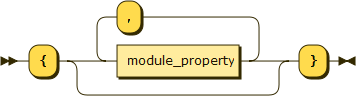
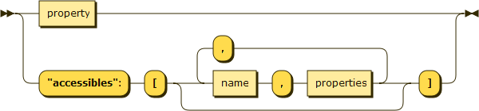

SECoP Issue 24: Mix Commands within Parameters in the Description (closed)
==========================================================================

Motivation
----------

A client can keep the order of parameters and the order of commands given by the SEC Node.
However, if a command is related to a parameter, it might be more reasonable to also
put the UI elements of a command near the parameter. This may be achieved by having
a common list of accessibles (commands and parameters).

Proposal
--------

In the module description object, instead of "commands" and "parameters" the is a
single entry "accessibles", containing the parameters and the commands.

module description
^^^^^^^^^^^^^^^^^^

module property
^^^^^^^^^^^^^^^

A command is an accessible with the datatype "command":

"command" Datatype
^^^^^^^^^^^^^^^^^^

.. list-table::
    :widths: 20 80
    :stub-columns: 1

    * - Datatype
      - | ["command"] *or*
        | ["command", <argumenttype>] *or*
        | ["command", <argumenttype>, <resulttype>]]
        |
        | if <argumenttype> is not given or null, the command has no argument
        | if <resulttype> is null or not given, the command returns no result
        | only one argument is allowed, several arguments SHOULD may be simulated by a struct, and not by a tuple
        | the meaning of result and arguments SHOULD be written down in the description of the command.

    * - Message examples
      - | do module:stop
        | done module:stop [null,{t:123456789}]
        |
        | do module:communicate "Hello"
        | done module:communicate ["World!",{t:123456789}]

Decided 2018-06-13 in Lund

