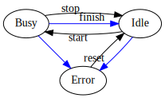

SECoP Issue 37: Clarification of status (under discussion)
==========================================================

Motivation
-----------
In the current specification the role of the status parameter is not explained fully.
Also, no value were predefined, hindering interoperability substantial.

Proposal
--------
Put the following sections (or a modified version of them) into the main specification.

States
~~~~~~
The status parameter is defined as a tuple of two independent values: a statuscode (from a predefined Enum) and
a human readable string.
The intent behind the statuscode is to give the ECS a cooked-down version of what is curently going on,
whereas the string is intended to displayed to users, so it may contain arbitrary text.

In its simplest form, 3 status codes seem sufficient:

    Simplest interaction diagram, using only ``Error``, ``Busy`` and ``Idle`` states.
    The blue line indicate status changes performed by the SEC-node, while black lines
    need an initiating action from the ECS. Here is the meaning of those:

start:
    for basic SECoP use, ``start`` is performed by an accepted ``change <module>:target`` message.
    a potential buffering extension may also initiate this after a buffering operation with the ``go`` command,
    i.e. a ``do <module>:go`` message. For details see SECoP Issue 28 + SECoP Issue 29.

stop:
    initiated by the ``do <module>:stop`` message, essentially calling the ``stop`` function of the module

reset:
    initiated by the ``do <module>:reset`` message, essentially calling the ``reset`` function of the module

finish:
    initiated by the SEC-Node upon reaching the target.

After collecting use cases it got clear, that 3 status\ **codes** wont suffice, so instead we are using groups
of codes. This keeps the diagram easy to understand, yet allows introduction of substates.

.. note::
    A special notation is used in this text to differentiate a statusgroup from a (named) statuscode.
    Both will be marked ``like this`` but differ in the used casing of the letters.

    statusgroup:
        Statusgroup names start with an uppercase letter und subsequent letters are lowercase.
        Examples: ``Idle``, ``Error``

    statuscode:
        Names for named statuscodes are all uppercase letters. Examples: ``IDLE``, ``DISABLED``.
        If the lowercased version of a statusgroup and a statuscode coincide, that code represents the whole group.

For example, the ``Idle`` state in the diagram above is actually a status group containing at
least the states ``IDLE`` and ``WARN``.
Both can be handled the same in the above diagrams, though WARN is intended to flag an abnormal,
but not critical condition. (If a module gets into a critical situation, a statuscode from the ``Error`` group MUST be used.)
Also, we needed to introduce a ``DISABLED`` state. This state is intended to signalise a
'parking' condition, i.e. the module can not assumed to be doing anything, except it may be *enabled* again.
``UNKNOWN`` is added for those cases where a valid state can not be derived.

**discuss if we should not use ``ERROR`` instead of ``UNKNOWN``**

This leads to the following, still simple, diagram.

.. figure:: ../images/status_normal.svg

The added actions have these meanings:

enable:
    enabling the module. This is not yet specified.
    It can be either done by a parameterless command ``enable`` (which would require a paired command to reverse the effect).
    or by some external event (enable switch on the rack) or
    by an 'enable module' switching several modules from ``DISABLED`` to ``Idle``.

disable:
    disabling the module. This is not yet specified and is supposed to be the opposite of `enable`.
    It can be either done by a parameterless command ``disable``.
    or by some external event (enable switch on the rack) or
    by an 'enable module' switching several modules from ``Idle`` to ``DISABLED``.

    *note:* ``disable`` is only allowed in a state from the ``Idle`` group!

*note:* see also `SECoP Issue 22: Enable Module instead of Shutdown Command`_.

*note:* a module is not required to implement all states. Only the actually used
states MUST be declared in the descriptive data. Also, the unused initiating actions
(connecting to or from unused states) MUST NOT be implemented, as ECS-clients may derive to support
for certain functionalities from the existence of selected commands (which they shouldn't do).

*note:* an ECS MUST support all defined state groups and the special states. Custom states, if not supported directly, MUST be treated like the state group they belong to.

Or, if including 'trampoline states':

where ``STOPPING``, ``PREPARING`` and ``WORKING`` are all custom states of the ``Busy`` state group.

An ECS MUST be aware, that a SEC-node may switch between states of the same group at any time.
Switching between the state groups, however, MUST follow the above diagrams with respect to the initiating actions.
Also an ECS must not rely on any custom substates.

Cooking it down it means, that in certain states, a module must display a certain behaviour and
the allowed interactions between ECS and SEC-node can be restricted.
However, an ECS may try at interaction at any time, though a SEC-node MUST repsond with an appropriate
error message if it can (temporarily) not perform a request.

DISABLED:
    A module is ``DISABLED``, when it is in a vendor defined suspended or initial state.
    In the ``DISABLED`` state an ECS may try to enable the module.
    All other initiating actions (potentially changing the state) are forbidden and the SEC-node MUST reply with an ``isDisabled`` error.

    *note:* reading or changing parameters may work, as long as this dos not trigger a status change.

Idle:
    A module is ``Idle``, when it is ready for any initiating actions. It is fully operational.
    To indicate suboptimal conditions, ``Warn`` is to be used insted of ``Idle``.
    So, ``Warn`` SHOULD be used if:

    * A soft limit is approaching (temperature 'a little high', Helium 'a little low', etc.)
    * A support media is missing, but currently not needed (pressurized air for airpads, helium for a magnet at B=0T).
    * lifetime of a sensor is approach, indicating a soon needed exchange.

    If a critical situation arise, use ``Error`` instead.

    In the ``Idle`` state an ECS may use the module as intended, there are no restrictions.
    However, ``Warn`` is also intented to signal the ECS, that an initating action MAY
    return an Error message. (e.g. trying to energize a magnet with not enough helium).

Busy:
    A module is ``Busy``, whenever an initiating action was triggered or when a future state change (by the module) is expected.
    This may be a triggered by target change as well as by commands, which take a while (e.g. a motor performing a homing operation).
    In the ``Busy`` state an ECS SHOULD not execute commands (other than ``stop`` to interrupt the current operation).
    The SEC-node (or the implementation of the module) must still be able to deliver updates/reads of parameters.
    Changes of parameters (incl. ``target``) MAY work or not, depending on the hardware.
    If they are not supported, an ``IsBusy`` Error reply MUST be sent.
    In this case the ECS is assumed to issue an ``stop`` command (if a target change was requested) and retry the action.
    Changing other parameters should not lead to the ECS issuing a ``stop``, it SHOULD instead retry after the ``Busy`` state went away.

    *note:* if something goes wrong (i.e. communication problems, sensor not reporting changes,
    support media suddenly missing or falling below,...), the operation must be aborted by the SEC-node.
    This is indicated by a status change to ``Error`` after nothing `moves` anymore and the system is in a safe state.
    This MAY mean, that heaters are switch off automatically (if the controller thinks somethings broken).

    *note:* initiating a `movement` as well as `stopping` may by implemented via trampoline BUSY-states as above.
    Since they need to belong to the BUSY-group, an ECS not understanding this extensions just sees the BUSY state.

Error:
    A module is ``Error``, when a previous operation was initiated and then aborted.
    It SHOULD also be in ``Error`` if the supporting hardware malfunctions or can not be communicated with.
    In any ``Error`` state an ECS MUST be able to request a ``reset`` command on the SEC-node.
    This SHOULD perform all necessary (re-)initialisation steps and then (if the module is ready for
    operation) set the module to a state from the ``Idle`` group.
    Otherwise the state sticks to ``Error``.

    Reading of parameters SHOULD, changing parameters MAY be supported by the SEC-node.
    If unsupported, an ``IsERROR`` error reply should be sent.

An ECS finding an unknown statuscode in the descriptive data, MUST be able to infer the proper Group of that state (check above table) and
treat it like the Group state defined above. The following diagram tries to visualize this:

Where ``Idle``, ``Warn``, ``Busy`` and ``Error`` are the main state groups (i.e. subgroups of ``State``).
All other nodes are States belonging to a state group (indicated by the arrows).

This means that if an ECS encounters an unknown state, it has to treat it like the group, that ste belongs to.
It also means, that an ECS supporting custom substate must still be able to handle a SEC-node correctly which only implements the main state groups.
This makes the encoding of the state/group information a vital design choise.

Encoding of state/group information
~~~~~~~~~~~~~~~~~~~~~~~~~~~~~~~~~~~
As the state is to be encoded as an Enum, i.e. a state is a named integer, the following assignments
are to be followed:

.. table:: proposed mapping of state-groups to status codes

    ============= ==================
     status code   Meaning
    ============= ==================
        100        ``IDLE``, base of group ``Idle``
        200        ``WARN``, base of subgroup``Warn``, belongs to ``Idle``
        300        ``BUSY``, base of group ``Busy``
        400        ``ERROR``, base of group ``Error``
    ============= ==================

Any state not coniciding with the state group gets a bigger number than the state group.
For this we reserved (at the moment) 9 codes per group, i.e.
custom ``Idle`` states are assigned to state codes 101..109. (same for ``Warn``, ``Busy``, ``Error``).
The base number itself stands for the state group and for the single predefined state of that group simulatenously.

However, ``UNKNOWN`` and ``DISABLED`` are not members of any state group and have to be handled special.

.. table:: proposed mapping of special states to status codes

    ============= ==================
     status code   Meaning
    ============= ==================
        -1          ``UNKNOWN``
        0         ``DISABLED``
    ============= ==================

**clarify, if ``UNKNOWN`` is really needed, or if it could be a substate of ``Error``**

Alternative Encoding of state/group information
~~~~~~~~~~~~~~~~~~~~~~~~~~~~~~~~~~~~~~~~~~~~~~~
Another way to map the state groups/codes to numerical values is digit-by-digit.
The Main state groups get assigned digits (1/2/3/4 for ``Idle``/``Warn``/``Busy``/``Error``).
Whenever a subgroup of that is needed, another digit is appended (which is specific to the state group).
To enumerate the final stete, another digit is appended (where 0 means the (sub)group and 1..9 are free to use).

This could result in codes like:

.. table:: examples for alternate state mapping

    ============= =====================
      code         Meaning
    ============= =====================
     1             ``Idle`` group (Should not be used)
     10            ``IDLE`` state
     11..19        custom ``Idle`` states
     2             ``Warn`` group (should not be used)
     20            ``WARN`` state
     21..29        custom ``warn`` states
     210           first subgroup of the ``Idle`` group
     211..219      custom states of the first subgroup of the ``Idle`` group
     3             ``Busy`` group
     30            ``BUSY`` state
     31..39        custom states of the `` Busy`` group
     40            ``Error`` state
     423           third substate of the second subgroup of ``Error``
    ============= =====================

In any case, an ECS not beeing able to handle all that complexits just needs to investigate the leftmost digit.

:note: an ECS MUST correctly drive an SEC-node which only handles the basic states!

Discussion
----------
No discussion of this issue in its current form yet.
Further clarifications + definitions may be needed to find a consensus.

**The assignment of the special states ``UNKNOWN`` and ``DISABLED`` is preliminary and needs discussion!**

video conference 2018-11-07
~~~~~~~~~~~~~~~~~~~~~~~~~~~~

Essentially he above proposal is seen as too complex.
Markus proposes that simple SEC-nodes use 100/200/300/400 for IDLE/WARN/BUSY/ERROR.
An ECS MUST treat 100..199/200..299/300..399/400.498 as IDLE/WARN/BUSY/ERROR.
If an ECS can't handle WARN, it should treat it like IDLE.

UNKNOWN is not needed. DISABLED gets (for now) assigned the special value 499.
This is to be discussed, as there are different opinions about whether DISABLED is an ERROR or an status of its own.
Enrico proposed to use 0 for DISABLED.

The difference between a WARN and a self-clearing ERROR are to be worked out by Klaus.
It may be needed to introduce self-clearing and persistent Errors (need to be 'reset'ed).
Until then, ERROR is sticky, i.e. it needs a ``reset``.

Common agreement about that if an Error occurs and some 'safety' actions are performed (leaving the module in a different state than it was prepared to be),
this always MUST be an sticky ERROR.

The Issue is kept open for discussion.

video conference 2018-12-03
~~~~~~~~~~~~~~~~~~~~~~~~~~~

- DISABLED has now the code 500 (first digits differs from ERROR, but code adjacent to ERROR)
- UNKNOWN not generally defined (an 4xx error might be used)
- x0y reserved for further usage by specification
- anything else? -> we might close this issue

.. DO NOT TOUCH --- following links are automatically updated by issue/makeissuelist.py
.. _`SECoP Issue 22: Enable Module instead of Shutdown Command`: issues/022%20Enable%20Module%20instead%20of%20Shutdown%20Command.rst
.. DO NOT TOUCH --- above links are automatically updated by issue/makeissuelist.py
