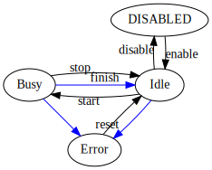

SECoP Issue 37: Clarification of status (preliminary)(WIP)(needs rework)
========================================================================

Motivation
-----------
In the current specification the role of the status parameter is not explained fully.
Also, no value were predefined, hindering interoperability substantial.

Proposal
--------
The status parameter is defined as a tuple of two independent values: a statuscode (from a predefined Enum) and
a human readable string.
The intent behind the statuscode is to give the ECS a cooked-down version of what is curently going on,
whereas the string is intended to displayed to users, so it may contain arbitrary text.

In its simplest form, 3 status codes seem sufficient:

.. figure:: ../images/status_simple.svg

    Simplest interaction diagram, using only ERROR, BUSY and Ready status.
    The blue line indicate status changes performed by the SEC-node, while black lines
    need an initiating action from the ECS. Here is the meaning of those:

    start:
        for basic SECoP use, ``start`` is performed by an accepted ``change <module>:target`` message.
        a potential buffering extension may also initiate this after a buffering operation with the ``go`` command,
        i.e. a ``do <module>:go`` message.

    stop:
        initiated by the ``do <module>:stop`` message, essentially calling the ``stop`` function of the module

    reset:
        initiated by the ``do <module>:reset`` message, essentially calling the ``reset`` function of the module

    finish:
        initiated by the SEC-Node upon reaching the target.

After collecting use cases it got clear, that 3 statuscodes wont suffice, instead we are using groups
of codes. This keeps the diagram easy to understand, but allows introduction of substates.
For example, the ``Ready`` stauscode in the diagram above is now a group containing at least the status ``IDLE`` and ``WARN``.
Both can be ahndled the same for above diagrams, though WARN is intended to flag an abnormal, but not critical condition.
Also, we needed to introduce a ``DISABLED`` state, by public request. This state is intended to signalise a
'parking' condition, i.e. the module can not assumed to be doing anything, except it may be *enabled* again.

This leads to the following, still simple, diagram.

    The added actions have these meanings:

    enable:
        enabling the module. This is not yet specified.
        It can be either done by a commend ``enable`` (which would require a paired command to reverse the effect).
        or by some external event (enable switch on the rack) or
        by an 'enable module' switching several modules from ``DISABLED`` to ``Ready``.

    disable:
        disabling the module. This is not yet specified and is supposed to be the opposite of `enable`.
        It can be either done by a commend ``disable``.
        or by some external event (enable switch on the rack) or
        by an 'enable module' switching several modules from ``Ready`` to ``DISABLED``.

        *note:* ``disable`` is only allowed in a state from the ``Ready`` group!

        *note:* a module is not required to support the ``DISABLED`` state. Only the actually used
        states MUST be declared in the descriptive data. Also, the unused initiating actions
        (connecting to or from unused states) MUST NOT be implemented, as ECS-clients may derive to support
        for certain functionalities from the existence of selected commands (which they shouldn't do).

Or, if including 'trampoline states':

.. figure:: ../images/status_complicated.svg

where ``Stopping``, ``Preparing`` and ``Working`` are all statuscodes of the BUSY status group.
(As before ``Ready`` contains both ``IDLE`` and ``WARN``.)

Custom implementations may want to use additional states per group.
For this purpose the 'number' of the group plus 1..9 can be used, i.e. if 100 is assigned to IDLE,
101..109 would be a custom state number belonging to the same group as IDLE.
Other numbers are reserved for the time beeing (i.e. 110..199, 210..299, etc.).

.. compound::
    .. table:: predefined status codes

        ============= ==================
         status code   Meaning
        ============= ==================
            100        IDLE-Group base, Ready-Group base
            200        WARN-Group base, belongs to Ready-Group
            300        BUSY-Group base
            400        ERROR-Group base
            500        DISABLE-Group base
        ============= ==================

    *note:* Enrico proposed using code 250 for UNSTABLE.

    *note:* ``DISABLE`` may also be assigned to 0. but that may also mean ``UNKNOWN`` status.

    *note:* Enrico proposed to use only the first digit the assign a Status-Group, allowing more flexibility.

    *note previous versions used only the values 100/200/300/400 for IDLE/WARN/BUSY/ERROR.*

Cooking it down it means, that in certain states, a module must display a certain behaviour and
the allowed interactions between ECS and SEC-node can be restricted.

DISABLED:
    A module is ``DISABLED``, when it is in a vendor defined suspended or initial state.
    In the ``DISABLED`` state an ECS may try to enable the module. All other initiating actions are forbidden and the
    SEC-node MUST reply with an ``isDisabled`` error.

    *note:* reading or changing parameters may work, as long as this dos not trigger a status change.

Ready:
    A module is ``Ready``, when it is ready for any initiating actions. It is fully operational.
    To indicate suboptimal conditions, ``WARN`` is to be used insted of ``IDLE`` (both belong to the ``Ready`` Group).
    So, ``WARN`` SHOULD be used if:

    * A soft limit is approaching (temperature 'a little high', Helium 'a little low', etc.)
    * A support media is missing, but currently not needed (pressurized air for airpads, helium for a magnet at B=0T).
    * lifetime of a sensor is approach, indicating a soon needed exchange.

    If a critical situation arise, use ``ERROR`` instead.

    In the IDLE state an ECS may use the module as intended, there are no restrictions.
    However, ``WARN`` is also intented to signal the ECS, that an initating action MAY
    return an Error message. (e.g. trying to energize a magnet with not enough helium).

UNSTABLE:
    A module is UNSTABLE, when it's main value no longer correspond to its target, after it
    moved to the target. i.e. a temperaturcontroller who reached the target temperature, but then the
    heater gets disconnected (or the system gets otherwise disturbed so much, that it cant maintain the
    wanted temperature anymore).
    As ``UNSTABLE`` is a member of the ``Ready`` group, the ECS may continue to use the module as wanted.

    *note:* a subsequent ``start`` of this module essentially erases the information that it went unstable.

BUSY:
    A module is BUSY, whenever an initiating action was triggered. This may be a target change as well
    as commands, which take a while (e.g. a motor performing a homing operation).
    In the BUSY state an ECS MUST not execute commands (other than ``stop`` to interrupt the current operation).
    The SEC-node (or the implementation of the module) must still be able to deliver updates/reads of parameters.
    Changes of parameters MAY work or not, depending on the hardware.
    If they are not supported, an ``IsBusy`` Error reply MUST be sent.

    *note:* if something goes wrong (i.e. communication problems, sensor not reporting changes,
    support media suddenly missing or falling below,...), the operation must be aborted by the SEC-node.
    This is indicated by a status change to ``ERROR`` after nothing `moves` anymore and the system is in a safe state.
    This MAY mean, that heaters are switch off automatically (if the controller thinks somethings broken).

    *note:* initiating a `movement` as well as `stopping` may by implemented via trampoline BUSY-states as above.
    Since they need to belong to the BUSY-group, an ECS not understanding this extensions just sees the BUSY state.

ERROR:
    A module is ``ERROR``, when a previous operation was initiated and then aborted.
    It SHOULD also be in ``ERROR`` if the supporting hardware malfunctions or can not be communicated with.
    In the ``ERROR`` state an ECS MUST be able to request a ``reset`` command on the SEC-node.
    This SHOULD perform all necessary (re-)initialisation steps and then (if the module is ready for
    operation) set the module to a state from the ``Ready`` group.
    Otherwise the state sticks to ``ERROR``.

    Reading of parameters SHOULD, changing parameters MAY be supported by the SEC-node.
    If unsupported, an ``IsERROR`` error reply should be sent.

An ECS finding an unknown statuscode in the descriptive data, MUST be able to infer the proper Group of that state (check above table) and
treat it like the Group state defined above.

Discussion
----------
No discussion of this issue in its current form yet.
Further clarifications + definitions may be needed to find a consensus.
