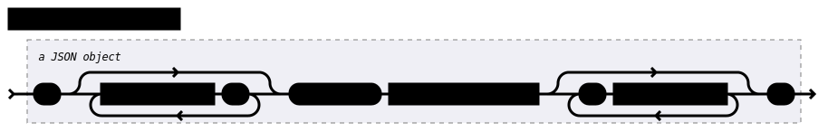

SECoP: Sample Environment Communication Protocol
################################################

V2019-09-16 v1.0

Introduction
============

The main goal of the "committee for the standardization of sample
environment communication" is to establish a common standard protocol
SECoP for interfacing sample environment equipment to experiment control
software.

Definition: Experiment Control Software ECS
     Software controlling the hardware for carrying out an experiment.
     Includes the user interface. Usually speaks several protocols with
     different parts of the instrument.
     Often also called short instrument control.

There is a task (7.1) within the European framework SINE2020 also
dealing with this subject. In its description we read::

    ... The standard should be defined in a way that it is compatible
    with a broad variety of soft- and hardware operated at the different
    large scale facilities. … The adoption of this standard will greatly
    facilitate the installation of new equipment and the share of
    equipment between the facilities. ...

This does also cover the aims of the committee.

The idea is, that a sample environment apparatus can easily be moved
between facilities and instruments/beamlines. As long as the facilities
have implemented a SECoP client within its ECS, and on the apparatus a
SECoP server is implemented as the SEC node, using the apparatus for an
experiment should be straightforward. An ECS can be built in a way, that
the configuration of a SEC node may be as short as entering a network
address, as the description can be loaded over the protocol.

Definition: Sample Environment Control Node (SEC node)
    Computing unit or process or task, connected to all control units (temperature controller,
    flow controller, pressure sensor ...) of a sample environment, bridge to the ECS.
    SECoP specifies how ECS speaks with the SEC node.
    The SEC node allows the ECS to access a set of modules (and their parameters/commands) via the SECoP.
    It also provides a list of accessible modules and parameters as well as descriptive meta data.

Other requirements
------------------

-  the protocol should be easy to use

-  it should be easy to implement in connection with existing ECSs and
   sample environment control software

-  it should be possible to be implemented on the most common platforms
   (operating systems and programming languages)

-  the protocol should be defined in way that allows a maximum
   **compatibility**: Newer and older versions of the syntax should
   be compatible

-  the protocol should be defined in such a way that it allows maximum 
   **flexibility**: A simple (= equipped with minimal functionality) ECS 
   implementation should be able to communicate with a complex SEC node 
   (with wide-ranging functionality), and an ECS with extensive 
   functionality should be able to deal with a simple SEC node that 
   implements only a minimum of functionality.

.. sectnum::
    :start: 0
    :depth: 2

.. contents:: Contents
    :depth: 1
    :backlinks: entry

Hardware Abstraction
====================

.. contents::
    :local:
    :depth: 1
    :backlinks: entry

Modules
-------

Definition: Module
    One logical component of an abstract view of the sample environment. Can at least be read.
    May be ’driven' (set new setpoint). May have parameters influencing how it achieves
    its function (e.g. PID parameters). May have some additional diagnostics (read-only) parameters.
    May provide some additional status information (temperature stable?, setpoint reached?)
    Reading a module returns the result of the corresponding physical measurement.

We intentionally avoid the term "device", which might
be misleading, as "device" is often used for an entire apparatus, like a
cryomagnet or humidity cell. In the context of SECoP, an apparatus in
general is composed of several modules. For example different
temperature sensors in one apparatus are to be seen as different modules.

An SEC node controls a set of named modules. Modules also have
some descriptive data (type, list-of-parameters, list-of-commands, ...).

Accessibles
-----------

A module has several accessibles associated with it. An accessible is
addressed by the combination of module and accessible name. Module names
have to be unique within an SEC node, accessible names have to be unique
within a module. There are two basic types of accessibles: parameters and commands.

Module and accessible names should be in English (incl. acronyms), using
only ASCII letters + digits and some additional characters (see section `Protocol`_).
The maximum name length is 63 characters.

Parameter:
    The main parameter of a module is its value. Writable parameters may influence the
    measurement (like PIDs). Additional parameters may give more information about its
    state (running, target reached), or details about its functioning (heater power) for
    diagnostics purposes. Parameters with a predefined meaning are listed in the standard,
    they must always be used in the same way. Custom parameters are defined by the
    implementation of the SEC node, the ECS can use them only in a general way, as their
    meaning is not known.

Command:
    Commands are provided to initiate specified actions of the module.
    They should generate an appropriate reply immediately after that action is initiated,
    i.e. should not wait until some other state is reached.
    However, if the command triggers side-effects, they MUST be communicated before the reply is sent.
    Commands may use an possibly structured argument and may return a possibly structured result.
    Commands with a predefined meaning are listed in the standard,
    they must always be used in the same way. Custom commands are defined by the implementation of
    the SEC node, the ECS can use them only in a general way, as their meaning is not known.

The following section describes the currently predefined accessibles, this list will
be extended continuously.

Basic Parameters
~~~~~~~~~~~~~~~~

parameter ``"value"``:
    a parameter representing the *main* value of a readable module.

.. _BUSY:

parameter ``"status"``:
    (a tuple_ of two elements: a status with predefined values
    from an enum_ as "IDLE","BUSY","ERROR", and a describing text).

    .. table:: assignment of status code groups

         ============ ============== =========================================
          statuscode   variant name   Meaning
         ============ ============== =========================================
            0           DISABLED      Module is not enabled
          1YZ           IDLE          Module is not performing any action
          2YZ           WARN          The same as IDLE, but something may not be alright, though it is not a problem (yet)
          3YZ           BUSY          Module is performing some action
          4YZ           ERROR         Module is in an error state, something turned out to be a problem.
         ============ ============== =========================================

    where YZ might be any combination of digits, in simple cases typically 00.

parameter ``"pollinterval"``:
    a hint to the module for the polling interval in seconds, type is always a double_.

parameter ``"target"``:
    present, if the modules main value is to be changeable remotely, i.e. it is at least a Writable

command ``"stop"``:
     mandatory command on a drivable.
     When a modules target is changed (or, if present, when the ``go`` command is sent),
     it is 'driving' to a new value until the target is reached or until its stop command
     is sent.
     When the ``stop`` command is sent, the SEC node SHOULD set the target parameter
     to a value close to the present one. Then it SHOULD act as if this value would have
     been the initial target.

command ``"go"``:
     optional command for starting an action. If the ``go`` command is present,
     changing any parameter (especially the 'target' parameter) does not yet initiate any
     action leading to a BUSY state.
     In contrast, if no 'go' command is present, changing the target will start an action
     trying to change the value to get closer to the target, which usually leads to a BUSY
     state. Changing any parameter, which has an impact on measured values, should
     be executed immediately.

Ramping
~~~~~~~

parameter ``"ramp"``:
    (writable parameter, desired ramp. Units: main units/min)

parameter ``"setpoint"``:
    (ramping setpoint, read only)

parameter ``"time_to_target"``:
    (read only double_, expected time to reach target in seconds)

Modes
~~~~~

parameter ``"mode"``:
    A parameter of datatype enum_, for selecting the operation mode of a module.
    The available operation modes can not be predefined in the specification, since
    they depend on the specific module.

    Maximum set of allowed modes:

    .. code::

        {"type": "enum", "members": {"DISABLED": 0, "STANDBY": 30, "PREPARED": 50}}

additional codes for parameter ``"status"``:
    The meaning of the operation modes SHOULD be described in the description.

    .. table:: assignment of sub status (state within the generic state machine)

         ============ ============== =========================================
           subcode     variant name   Meaning
         ============ ============== =========================================
           X0Z         Generic       used for generic modules not having a state machine
           X1Z         Disabling     intermediate state: Standby -> **Disabling** -> Disabled
           X2Z         Initializing  intermediate state: Disabled -> **Initializing** -> Standby
           X3Z         Standby       stable, steady state, needs some preparation steps,
                                     before a target change is effective
           X4Z         Preparing     intermediate state: Standby -> **Preparing** -> Prepared
           X5Z         Prepared      Ready for immediate target change
           X6Z         Starting      Target has changed, but continuous change has not yet started
           X7Z         Ramping       Continuous change, which might be used for measuring
           X8Z         Stabilizing   Continuous change has ended, but target value is not yet reached
           X9Z         Finalizing    Value has reached the target and any leftover cleanup operation
                                     is in progress. If the ECS is waiting for the value of this module
                                     being stable at target, it can continue.
         ============ ============== =========================================

    ``X=1,2,3 or 4`` as in `Basic Parameters`_ and ``Z=0`` for now. Future extensions may use different values for Y.

    Since not all combinations are sensible, the following list shows the so far defined codes:

    .. table:: Useful statuscodes

         ====== ================ ========== ============== =========================================
          code   name             generic    variant name   Meaning
         ====== ================ ========== ============== =========================================
             0   DISABLED         DISABLED   Generic        Module is not enabled
           100   IDLE             IDLE       Generic        Module is not performing any action
           130   STANDBY          IDLE       Standby        Stable, steady state, needs some preparation steps,
                                                            before a target change is effective
           150   PREPARED         IDLE       Prepared       Ready for immediate target change
           200   WARN             WARN       Generic        The same as IDLE, but something may not be alright,
                                                            though it is not a problem (yet)
           230   WARN_STANDBY     WARN       Standby        -''-
           250   WARN_PREPARED    WARN       Prepared       -''-
           300   BUSY             BUSY       Generic        Module is performing some action
           310   DISABLING        BUSY       Disabling      Intermediate state: Standby -> **DISABLING** -> Disabled
           320   INITIALIZING     BUSY       Initializing   Intermediate state: Disabled -> **INITIALIZING** -> Standby
           340   PREPARING        BUSY       Preparing      Intermediate state: Standby -> **PREPARING** -> PREPARED
           360   STARTING         BUSY       Starting       Target has changed, but continuous change has not yet started
           370   RAMPING          BUSY       Ramping        Continuous change, which might be used for measuring
           380   STABILIZING      BUSY       Stabilizing    Continuous change has ended, but target value is not
                                                            yet reached
           390   FINALIZING       BUSY       Finalizing     Value has reached the target and any leftover cleanup operation
                                                            is in progress. If the ECS is waiting for the value of this
                                                            module being stable at target, it can continue.
           400   ERROR            ERROR      Generic        An Error occurred, Module is in an error state,
                                                            something turned out to be a problem.
           430   ERROR_STANDBY    ERROR      Standby        An Error occurred, Module is still in Standby state,
                                                            even after ``clear_errors``.
           450   ERROR_PREPARED   ERROR      Prepared       An Error occurred, Module is still in PREPARED state,
                                                            even after ``clear_errors``.
         ====== ================ ========== ============== =========================================

    For the SEC node, it is recommended to use above names (second column) for the status enum_ type.
    For the ECS, the codes (and not the names) of the status enum_ are relevant for the meaning.

    The distinction between the status value 360 - 380 is important, if during a target change
    there is a period, where the value changes in a continuous way and measurements might be
    useful. If there is no such period, for example because the value performs some damped oscillation
    from the beginning of the movement, generic BUSY or STABILIZING should be used instead.

    Any undefined status code has to be treated like a generic subcode of the given code number,
    i.e. 376 should be treated as a BUSY_Ramping until it is defined otherwise in the specification.

    :related issues:
        `SECoP Issue 37: Clarification of status`_,
        `SECoP Issue 59: set_mode and mode instead of some commands`_

    :Note:
        the behavior of a module in each of the predefined states is not yet 100% defined.

    :Note:
        a module only need to declare the status values which it implements. i.e. an Readable module
        does not need a BUSY status.

    The interplay between the ``mode`` parameter and the status codes can be visualized
    in the following graph:

command ``"hold"``:
     optional command on a drivable. Stay more or less where you are, cease
     movement, be ready to continue soon, target value is kept. Continuation can be
     trigger with ``go``, or if not present, by putting the target parameter to its
     present value.

command ``"shutdown"``
     optional command for shutting down the hardware.
     When this command is sent, and the status is DISABLED,
     it is safe to switch off the related device.

:Note:
    Going to the DISABLED state, may also be triggered by changing the mode to DISABLED.
    If the implementor for security reason wants to prohibit any action after a shutdown,
    this should only be achieved by a shutdown command, as disabling the module should be
    reversible.

Error handling
~~~~~~~~~~~~~~

command ``"reset"``
     optional command for putting the module to a state predefined by the implementation.

command ``"clear_errors"``:
     This command tries to clear an error state. It may be called when status is ERROR,
     and the command will try to transform status to IDLE or WARN. If it can not
     do it, the status should not change or change to an other ERROR state before
     returning ``done <module>:clear_errors``

Coupled Modules
~~~~~~~~~~~~~~~

parameter ``"controlled_by"``:
   The control mechanism of a module might be coupled to another module (both modules are Drivable or Writable).
   This coupling is indicated by the ``controlled_by`` parameter (readonly).
   The datatype of the ``controlled_by`` parameter must be an enum_, with the names being
   module names or ``self``. The enum_ value of ``self`` must be 0.
   A module with a ``controlled_by`` parameter indicates, that it may be controlled
   by one of the named modules.

   This coupling of two modules influences in particular the behavior of the parameters ``target`` and ``value``.
   For example a module B (e.g. representing the power output of a temperature controller) might be
   controlled by an other module A (e.g. the temperature module related to the same temperature controller),
   linking the behavior of the ``value`` parameter of module B to the ``target`` of the module A.

   The coupling to the ``target`` parameter of module B can be realized in two ways:

   1) Module A is (constantly) altering the ``target`` parameter of module B.

   2) The ``target`` parameter of module B is not updated and the functional control
      of the ``target`` parameter of module B is switched off.

   This behavior must be signaled by the ``control_active`` parameter (see next section).

   Taking over control by a module is done by changing the ``target`` parameter or sending a ``go`` command to a module.
   I.e. module A takes over control when a ``target`` change or a ``go`` command is sent to the module A. In this case, before sending the reply,
   the ``controlled_by`` parameter of the module B must be set to the controlling module A.
   However, when the ``target`` change or a ``go`` command is sent to module B, the control
   switches over to module B and the ``controlled_by`` parameter of module B has to be set to ``self``.
   Please notice that in addition, the ``control_active`` parameters of module A and module B have
   to be set correctly (see next section) before sending the reply to a ``target``
   change or a ``go`` command as stated before.

   :remark: In case a module A controls several other modules, e.g. a temperature module of a liquid helium cryostat
            controlling the power output (module B) and the helium pressure for cooling (module C), additional parameters
            may be needed for selecting the control mode of module A. See for example the parameter
            ``"_automatic_nv_pressure_mode"`` in the example of a liquid helium cooled cryostat.

parameter ``"control_active"``:
   A readonly flag indicating whether a drivable or writable module is currently actively controlling.
   On a drivable without ``control_active`` parameter or with
   ``control_active`` =true, the system is trying to bring the ``value`` parameter to the ``target``.
   When ``control_active`` =false, this control mechanism is switched off, and the ``target`` value
   is not considered any more.
   In a typical example we have a module A controlling module B (e.g. temperature (A) and power output (B) as stated above) and with two possible
   states, as in the following example:

   =================== ====================== ======================
    state               module A               module B
   =================== ====================== ======================
    A controlling B     control_active=true    controlled_by="A",
                                               control_active=false
    B self controlled   control_active=false   controlled_by="self",
                                               control_active=true
   =================== ====================== ======================

   In another example we have two Writable modules (for example 'I' and 'V' in a power supply),
   which depend on each other in a system where not both may be active at the same time.

   =================== ====================== ======================
    state               module I               module V
   =================== ====================== ======================
    constant current    controlled_by="self",  controlled_by="I",
                        control_active=true    control_active=false
    constant voltage    controlled_by="V",     controlled_by="self",
                        control_active=false   control_active=true
   =================== ====================== ======================

   The module with ``control_active`` =false acts like a Readable, its ``target`` parameter is
   ignored. Changing the ``target`` value of the latter would switch control from one module
   to the other, toggling the ``control_active`` parameter of both modules.

command ``"control_off"``:
   A command to turn off active control (i.e setting the parameter ``control_active`` to false). 
   This command is needed for turning off control,
   when there is no controlled module, e.g. when there is no heater module for a temperature
   loop, or when the heater module is not a Writable.

   In a more general way, ``"control_off"`` puts the module into an 'enenergy saving state',
   switching off active heating and cooling for a temperature loop or in case of a motor
   switching current off.

   Setting the target of a module always turns on active control. It is explicitly allowed
   for a module to have a ``"control_off"`` command when a controlled module is available
   (i.e. a module with a ``"controlled_by"`` parameter with the name of the controlling module).

Limits and Offset
~~~~~~~~~~~~~~~~~

parameter ``"target_limits"``:
    In addition to the range given in the ``datainfo`` property of the ``target`` parameter,
    a SEC-Node might offer changeable limits restricting the allowed range even more.
    ``target_limits`` is structured as a tuple_ with two numeric members indicating
    the lower and upper end of a valid interval for the setting of the ``target`` parameter.
    The ``datainfo`` property of the ``target`` parameter must match the members of the
    ``datainfo`` property of ``target_limits``.
    The SEC node must reply with an error in case a given target value does not fit
    into the interval.

.. _offset:

parameter ``"offset"``:
    A storage for an offset to be applied when converting SECoP values to ECS values.
    See feature `HasOffset`_.

Communication
~~~~~~~~~~~~~

command ``"communicate"``:
     Used for direct communication with hardware, with proprietary commands. It is useful
     for debugging purposes, or if the implementor wants to give access to parameters not
     supported by the driver. The datatype might be string_, or any other datatype suitable
     to the protocol of the device. The ``communicate`` command  is meant to be used in
     module with the ``Communicator`` interface class.

Properties
----------

Definition: Properties
    The static information about parameters, modules and SEC nodes is
    constructed from properties with predefined names and meanings.

For a list of pre-defined properties see `Descriptive Data`_.

Data report
-----------
A JSON array with the value of a parameter as its first element,
and an JSON object containing the Qualifiers_ for this value as its second element.

See also: `Data-report`_.

:Remark:

    future revisions may append additional elements.
    These are to be ignored for implementations of the current specification

Error report
------------
An error report is used in a `error reply`_ indicating that the requested action could
not be performed as request or that other problems occurred.
The error report is a JSON-array containing the name of one of the `Error classes`_, a human readable string
and as a third element a JSON-object containing extra error information,
which may include the timestamp (as key "t") and possible additional
implementation specific information about the error (stack dump etc.).

See also: `Error-report`_.

Structure report
----------------
The structure report is a structured JSON construct describing the structure of the SEC node.
This includes the SEC-node properties, the modules, their module-properties and accessibles
and the properties of the accessibles.
For details see `descriptive data`_.

Value
-----
Values are transferred as a JSON-Value.

:Programming Hint:

    Some JSON libraries do not allow all JSON values in their (de-)serialization functions.
    Whether or not a JSON value is a valid JSON text, is controversial,
    see this `stackoverflow issue <https://stackoverflow.com/questions/19569221>`_
    and :rfc:`8259`.

    (clarification: a *JSON document* is either a *JSON object* or a *JSON array*,
    a *JSON value* is any of a *JSON object*, *JSON array*, *JSON number* or *JSON string*.)

    If an implementation uses a library, which can not (de-)serialize all JSON values,
    the implementation can add angular brackets around a JSON value, decode it
    and take the first element of the result. When encoding the reverse action might be
    used as a workaround. See also :RFC:`7493`

Qualifiers
----------

Qualifiers optionally augment the value in a reply from the SEC node,
and present variable information about that parameter.
They are collected as named values in a JSON-object.

Currently 2 qualifiers are defined:

``"t"``:
    The timestamp when the parameter has changed or was verified/measured (when no timestamp
    is given, the ECS may use the arrival time of the update message as the timestamp).
    It SHOULD be given, if the SEC node has a synchronized time,
    the format is that of a UNIX time stamp, i.e. seconds since 1970-01-01T00:00:00+00:00Z,
    represented as a number, in general a floating point when the resolution
    is better than 1 second.

    :Note:
        To check if a SEC node supports time stamping, a `ping` request can be sent.
        (See also `heartbeat`_).

``"e"``:
   the uncertainty of the quantity. MUST be in the same units
   as the value. So far the interpretation of "e" is not fixed.
   (sigma vs. RMS difference vs. ....)

other qualifiers might be added later to the standard.
If an unknown element is encountered, it is to be ignored.

.. _`Interface class`: #interface-classes

Interface Classes
-----------------

The idea is, that the ECS can determine the functionality of a module
from its class.

The standard contains a list of classes, and a specification of the
functionality for each of them. The list might be extended over time.
Already specified base classes may be extended in later releases of the
specification, but earlier definitions will stay intact, i.e. no
removals or redefinitions will occur.

The module class is in fact a list of classes (highest level class
first) and is stored in the module-property `interface_classes`.
The ECS chooses the first class from the list which is known to it.
The last one in the list must be one of the base classes listed below.

:Remark:

    The list may also be empty, indicating that the module in question does not even conform to the Readable class!

Base classes
~~~~~~~~~~~~

``"Communicator"``:
    The main purpose of the module is communication.
    It may have none of the predefined parameters of the other classes.

    The ``communicate`` command is used mainly for debugging reasons, or as a workaround
    for using hardware functionalities not implemented in the SEC node.

.. _Readable:

``"Readable"``:
    The main purpose is to represent readable values (i.e. from a Sensor).
    It has at least a ``value`` and a ``status`` parameter.

.. _Writable:

``"Writable"``:
    The main purpose is to represent fast settable values (i.e. a switch).
    It must have a ``target`` parameter in addition to what a `Readable`_ has.

.. _Drivable:

``"Drivable"``:
    The main purpose is to represent slow settable values (i.e. a temperature or a motorized needle valve).
    It must have a ``stop`` command in addition to what a `Writable`_ has.
    Also, the ``status`` parameter will indicate a `BUSY`_ state for a longer-lasting operations.

Features
--------

Features allow the ECS to detect if a SECoP module support a certain functionality.
A feature typically needs some predefined accessibles and/or module properties to be present.
However, it is not only a list of mandatory or optional accessibles, but
indicates to the ECS that it may handle this functionality in a specific way.

.. _HasOffset:

``"HasOffset"``:
    This feature is indicating that the ``value`` and ``target`` parameters of a module represent raw values, which
    need to be corrected by an offset. A module with the feature ``"HasOffset"`` must have
    a parameter ``offset``, which indicates to all clients that the transmitted raw values for the 
    parameters ``value`` and ``target`` are to be converted to corrected values (at the client side)
    by the following formulas:

    For reading the parameters ``value`` and ``target``:

          corrected value (client) = value (transmitted) + offset

          corrected target (client) = target (transmitted) + offset

    For changing the parameter ``target``:

          target (transmitted) = corrected target (client) - offset

    mandatory parameter: offset_

Protocol
========

.. contents::
    :depth: 1
    :local:
    :backlinks: entry

The basic element of the protocol are messages.

Message Syntax
--------------
The received byte stream which is exchanged via a connection is split into messages:

.. image:: images/messages.svg
   :alt: messages ::= (message CR? LF) +

A message is essentially one line of text, coded in ASCII (may be extended to UTF-8
later if needed). A message ends with a line feed character (ASCII 10), which may be preceded
by a carriage return character (ASCII 13), which must be ignored.

All messages share the same basic structure:

.. image:: images/message-structure.svg
   :alt: message_structure ::= action ( SPACE specifier ( SPACE data )? )?

i.e. message starts with an action keyword, followed optionally by one space and a specifier
(not containing spaces), followed optionally by one space and a JSON-value (see :RFC:`8259`) called data,
which absorbs the remaining characters up to the final LF.

:Note:
    numerical values and strings appear 'naturally' formatted in JSON-value, i.e. 5.0 or "a string".

The specifier consists of a module identifier, and for most actions, followed by a colon as separator
and an accessible identifier. In special cases (e.g. ``describe``, ``ping``), the specifier is just a token or may be empty:

.. image:: images/specifier.svg
   :alt: specifier ::= module | module ":" (parameter|command)

All identifiers (for properties, accessibles and modules) are composed by
ASCII letters, digits and underscore, where a digit may not
appear as the first character.

Identifiers starting with underscore ('custom-names') are
reserved for special purposes like internal use for debugging. The
identifier length is limited (<=63 characters).

:Note:
    Albeit names MUST be compared/stored case sensitive, names in each scope need to be unique when lowercased.
    The scopes are:

    - module names on a SEC Node (including the group entries of those modules)
    - accessible names of a module (including the group entries of those parameters) (each module has its own scope)
    - properties
    - names of elements in a struct_ (each struct has its own scope)
    - names of variants in an enum_ (each enum has its own scope)
    - names of qualifiers

SECoP defined names are usually lowercase, though that is not a restriction (esp. not for module names).

A SEC node might implement custom messages for debugging purposes, which are not
part of the standard. Custom messages start with an underscore or might just be
an empty line. The latter might be used as a request for a help text, when logged
in from a command line client like telnet or netcat. Messages not starting with
an underscore and not defined in the following list are reserved for future extensions.

When implementing SEC nodes or ECS-clients, a 'MUST-ignore' policy should be applied to unknown
or additional parts.
Unknown or malformed messages are to be replied with an appropriate ``ProtocolError`` by a SEC node.
An ECS-client must ignore the extra data in such messages. See also section `Future Compatibility`_.

Essentially the connections between an ECS and a SEC node can operate in one of two modes:

Synchronous mode:
   where a strict request/reply pattern is used

Async mode:
   where an update may arrive any time (between messages).

In both cases, a request from the ECS to the SEC node is to be followed by an reply from the SEC node to the ECS,
either indicating success of the request or flag an error.

:Note:
    an ECS may try to send a request before it received the reply to an earlier request.
    This has two implications: a SEC-node may serialize requests and fulfill them strictly in order.
    In that case the ECS should not overflow the input buffer of the SEC-node.
    The second implication is that an ECS which sends multiple requests, before the replies arrive,
    MUST be able to handle the replies arriving out-of-order. Unfortunately there is currently no indication
    if a SEC-node is operating strictly in order or if it can work on multiple requests simultaneously.

:Note:
    to improve compatibility, any ECS client SHOULD be aware of `update`_ messages at any time.

:Note:
    to clarify optionality of some messages, the following table is split into two:
    basic messages (which MUST be implemented like specified) and
    extended messages which SHOULD be implemented.

:Note:
    for clarification, the symbol "``␣``" is used here instead of a space character.
    <elem> refers to the element elem which is defined in another section.

.. table:: basic messages (implementation is mandatory, even if functionality seems not to be needed.)

    ======================= ============== ==================
     message intent          message kind   message elements
    ======================= ============== ==================
     `identification`_       request        ``*IDN?``
          \                  reply          ISSE\ **,SECoP,**\ *version,add.info*
     `description`_          request        ``describe``
          \                  reply          ``describing␣.␣``\ <`Structure Report`_>
     `activate updates`_     request        ``activate``
          \                  reply          ``active``
     `deactivate updates`_   request        ``deactivate``
          \                  reply          ``inactive``
     `heartbeat`_            request        ``ping␣<identifier>``
          \                  reply          ``pong␣<identifier>␣``\ <`Data Report`_>
     `change value`_         request        ``change␣<module>:<parameter>␣``\ <`Value`_>
          \                  reply          ``changed␣<module>:<parameter>␣``\ <`Data Report`_>
     `execute command`_      request        ``do␣<module>:<command>`` (**argumentless commands only**)
          \                  reply          ``done␣<module>:<command>␣``\ <`Data Report`_> (with null as value)
     `read request`_         request        ``read␣<module>:<parameter>``
        \                    reply          ``reply␣<module>:<parameter>␣``\ <`Data Report`_>
     value update_  event    event          ``update␣<module>:<parameter>␣``\ <`Data Report`_>
     `error reply`_          reply          ``error_<action>␣<specifier>␣``\ <`Error Report`_>
    ======================= ============== ==================

:note:
    This means that ``change`` needs to be implemented, even if only readonly accessibles are present.
    In this case, a ``change`` message will naturally be replied with an ``error_change``
    message with an `Error class`_ of "ReadOnly" and not with an "ProtocolError".

.. table:: extended messages (implementation is optional)

    ======================= ============== ==================
     message intent          message kind   message elements
    ======================= ============== ==================
     `logging`_              request        ``logging␣<module>␣``\ <loglevel>
         \                   reply          ``logging␣<module>␣``\ <loglevel>
         \                   event          ``log␣<module>:<loglevel>␣<message-string>``
     `activate updates`_     request        ``activate␣<module>``
       module-wise           reply          ``active␣<module>``
     `deactivate updates`_   request        ``deactivate␣<module>``
       module-wise           reply          ``inactive␣<module>``
     `heartbeat`_            request        ``ping``
      with empty identifier  reply          ``pong␣␣``\ <`Data Report`_>
     `execute command`_      request        ``do␣<module>:<command>␣``\ (\ Value_ | ``null``)
          \                  reply          ``done␣<module>:<command>␣``\ <`Data Report`_>
    ======================= ============== ==================

Theory of operation:
    The first messages to be exchanged after the a connection between an ECS and a SEC node is established
    is to verify that indeed the SEC node is speaking a supported protocol by sending an identification_ request
    and checking the answer from the SEC node to comply.
    If this check fails, the connection is to be closed and an error reported.
    The second step is to query the structure of the SEC node by exchange of description_ messages.
    After this step, the ECS knows all it needs to know about this SEC node and can continue to either
    stick to a request/reply pattern or `activate updates`_.
    In any case, an ECS should correctly handle updates, even if it didn't activate them,
    as that may have been performed by another client on a shared connection.

Correct handling of side-effects:
  To avoid difficult to debug race conditions, the following sequence of events should be followed,
  whenever the ECS wants to initiate an action:

  1) ECS sends the initiating message request (either ``change`` target or ``do`` go) and awaits the response.

  2) SEC-node checks the request and if it can be performed. If not, SEC-node sends an error-reply (sequence done).
     If nothing is actually to be done, continue to point 4)

  3) If the action is fast finishing, it should be performed and the sequence should continue to point 4.
     Otherwise the SEC-node 'sets' the status-code to BUSY and instructs the hardware to execute
     the requested action.
     Also an ``update`` status event (with the new BUSY status-code) MUST be sent
     to **ALL** activated clients (if any).
     From now on all read requests will also reveal a BUSY status-code.
     If additional parameters are influenced, their updated values should be communicated as well.

  4) SEC-node sends the reply to the request of point 2) indicating the success of the request.

     :Note:
         This may also be an error. In that case point 3) was likely not fully performed.

     :Note:
        An error may be replied after the status was sent to BUSY:
        if triggering the intended action failed (Communication problems?).

  5) when the action is finally finished and the module no longer to be considered BUSY,
     an ``update`` status event MUST be sent, also subsequent status queries
     should reflect the now no longer BUSY state. Of course, all other parameters influenced by this should also
     communicate their new values.

:Note:
     An ECS establishing more than one connection to the same sec-node and
     which **may** process the ``update`` event message from point 3)
     after the reply of point 4) MUST query the status parameter synchronously
     to avoid the race-condition of missing the (possible) BUSY status-code.

:Note:
     temporal order should be kept wherever possible!

Message intents
---------------

Identification
~~~~~~~~~~~~~~

The syntax of the identification message differs a little bit from other
messages, as it should be compatible with IEEE 488.2. The identification
request "\ **\*IDN?**\ " is meant to be sent as the first message after
establishing a connection. The reply consists of 4 comma separated
fields, where the second and third field determine the used protocol.

In this and in the following examples, messages sent to the SEC-node are marked with "> ",
and messages sent to the ECS are marked with "< "

Example:

.. code::

  > *IDN?
  < ISSE,SECoP,V2019-09-16,v1.0

As the first part of the message has changed, a SECoP client SHOULD allow also the previous
form "ISSE&SINE2020" and an erroneously used form "SINE2020&ISSE", but can assume that
the second part "SECoP" is given as defined.
So far the SECoP version is given like "V2019-09-16", i.e. a capital "V" followed by a date in
``year-month-day`` format with 4 and 2 digits respectively.
The ``add.info`` field was used to differentiate between draft, release candidates (rc1, rc2,...) and final.
It is now used to indicate a release name.

Description
~~~~~~~~~~~

The next messages normally exchanged are the description request and
reply. The reply contains the `Structure report`_ i.e. a structured JSON object describing the name of
modules exported and their parameters, together with the corresponding
properties.

Example:

.. code::

  > describe
  < describing . {"modules":{"t1":{"interface_classes":["TemperatureSensor","Readable"],"accessibles":{"value": ...

The dot (second item in the reply message) is a placeholder for extensibility reasons.
A client implementing the current specification MUST ignore it.

:Remark:

    this reply might be a very long line, no raw line breaks are allowed in the
    JSON part! I.e. the JSON-part should be as compact as possible.

:Note:
    The use of a single dot for the specifier is a little contrary to the other messages addressing the
    SEC-node. It may be changed in a later revision. ECS-clients are advised to ignore the specifier part
    of the describing message. A SEC-node SHOULD use a dot for the specifier.

Activate Updates
~~~~~~~~~~~~~~~~

The parameterless "activate" request triggers the SEC node to send the
values of all its modules and parameters as update messages (initial updates). When this
is finished, the SEC node must send an "active" reply. (*global activation*)

:Note:
    the values transferred are not necessarily read fresh from the hardware, check the timestamps!

:Note:
    This initial update is to help the ECS establish a copy of the 'assumed-to-be-current' values.

:Note:
    An ECS MUST be able to handle the case of an extra update occurring during the initial phase, i.e.
    it must handle the case of receiving more than one update for any valid specifier.

A SEC node might accept a module name as second item of the
message (*module-wise activation*), activating only updates on the parameters of the selected module.
In this case, the "active" reply also contains the module name.

A SEC Node not implementing module-wise activation MUST NOT sent the module
name in its reply to an module-wise activation request,
and MUST activate all modules (*fallback mode*).

Update
~~~~~~

When activated, update messages are delivered without explicit request
from the client. The value is a `Data report`_, i.e. a JSON array with the value as its first
element, and an JSON object containing the `Qualifiers`_ as its second element.

If an error occurs while determining a parameter, an ``error_update`` message has to be sent,
which includes an <`Error Report`_> stating the problem.

Example:

.. code::

  > activate
  < update t1:value [295.13,{"t":150539648.188388,"e":0.01}]
  < update t1:status [[400,"heater broken or disconnected"],{"t":1505396348.288388}]
  < active
  < error_update t1:_heaterpower ["HardwareError","heater broken or disconnected",{"t":1505396349.20}]
  < update t1:value [295.14,{"t":1505396349.259845,"e":0.01}]
  < update t1:value [295.13,{"t":1505396350.324752,"e":0.01}]

The example shows an ``activate`` request triggering an initial update of two values:
t1:value and t1:status, followed by the ``active`` reply.
Also, an ``error_update`` for a parameter ``_heaterpower`` is shown.
After this two more updates on the ``t1:value`` show up after roughly 1s between each.

:Note:
    it is vital that all initial updates are sent, **before** the 'active' reply is sent!
    (an ECS may rely on having gotten all values)

:Note:
    to speed up the activation process, polling + caching of all parameters on the SEC-node is advised,
    i.e. the parameters should not just be read from hardware for activation, as this may take a long time.

Another Example with a broken Sensor:

.. code::

  > activate
  < error_update t1:value ["HardwareError","Sensor disconnected", {"t":1505396348.188388}]}]
  < update t1:status [[400,"Sensor broken or disconnected"],{"t":1505396348.288388}]
  < active

Here the current temperature can not be obtained. An ``error_update`` message is used
instead of ``update``.

Deactivate Updates
~~~~~~~~~~~~~~~~~~

A parameterless message. After the "inactive" reply no more updates are
delivered if not triggered by a read message.

Example:

.. code::

  > deactivate
  < update t1:value [295.13,{"t":1505396348.188388}]
  < inactive

:Remark:

    the update message in the second line was sent before the deactivate message
    was treated. After the "inactive" message, the client can expect that no more untriggered
    update message are sent, though it MUST still be able to handle (or ignore) them, if they still
    occur.

The deactivate message might optionally accept a module name as second item
of the message for module-wise deactivation. If module-wise deactivation is not
supported, the SEC-node should ignore a deactivate message which contains a module name
and send an ``error_deactivate`` reply.
This requires the ECS being able to handle update events at any time!

:Remark:

    it is not clear, if module-wise deactivation is really useful. A SEC Node
    supporting module-wise activation does not necessarily need to support module-wise
    deactivation.

Change Value
~~~~~~~~~~~~

The change value message contains the name of the module or parameter
and the value to be set. The value is JSON formatted.
As soon as the set-value is read back from the hardware, all clients,
having activated the parameter/module in question, get an "update" message.
After all side-effects are communicated, a "changed" reply is then send, containing a
`Data report`_ of the read-back value.

:Remarks:

    * If the value is not stored in hardware, the "update" message can be sent immediately.
    * The read-back value should always reflect the value actually used.
    * an client having activated updates may get an ``update`` message before the ``changed`` message, both containing the same data report.

Example on a connection with activated updates. Qualifiers are replaced by {...} for brevity here.

.. code::

  > read mf:status
  < reply mf:status [[100,"OK"],{...}]
  > change mf:target 12
  < update mf:status [[300,"ramping field"],{...}]
  < update mf:target [12,{...}]
  < changed mf:target [12,{...}]
  < update mf:value [0.01293,{...}]

The status changes from "idle" (100) to "busy" (300).
The ECS will be informed with a further update message on mf:status,
when the module has finished ramping.
Until then, it will get regular updates on the current main value (see last update above).

:Note:
    it is vital that all 'side-effects' are realized (i.e. stored in internal variables) and be communicated, **before** the 'changed' reply is sent!

Read Request
~~~~~~~~~~~~

With the read request message the ECS may ask the SEC node about a reasonable recent value 'current' value.
In most cases this means, that the hardware is read to give a fresh value.
However, there are uses case where either an internal control loop is running anyway
in which case it is perfectly fine to returned the internally cached value.
In other cases (ls370+scanner) it may take a long time to actually obtain a fresh value,
in which case it is also fine to return the most recently obtained value.
In any way, the timestamp qualifier should indicate the time the value was **obtained**.

Example:

.. code::

  > read t1:value
  < reply t1:value [295.13,{"t":1505396348.188}]
  > read t1:status
  > reply t1:status [[100,"OK"],{"t":1505396348.548}]

Execute Command
~~~~~~~~~~~~~~~

Actions can be triggered with a command.
If an action needs significant time to complete (i.e. longer than a fraction of a second),
the information about the duration and success of such an action has to be
transferred via the ``status`` parameter.

If a command is specified with an argument, the actual argument is given in
the data part as a JSON-value. This may be also a JSON-object if the datatype of
the argument specifies that
(i.e. the type of the single argument can also be a struct_ or tuple_, see `data types`_).
The types of arguments must conform to the declared datatypes from the datatype of the command argument.

A command may also have a return value, which may also be structured.
The "done" reply always contains a `Data report`_ with the return value.
If no value is returned, the data part is set to "null".
The "done" message should be returned quickly, the time scale should be in the
order of the time needed for communications. Still, all side-effects need to be realized
and communicated before sending the ``done`` message.

.. important:: If a command does not require an argument, an argument MAY still be transferred as JSON-null.
 A SEC node MUST also accept the message, if the data part is empty and perform the same action.
 More precisely, any SEC-node MUST treat the following two messages the same:

 - ``do <module>:<command>``
 - ``do <module>:<command> null``

 An ECS SHOULD only generate the shorter version.

Example:

.. code::

  > do t1:stop
  < done t1:stop [null,{"t":1505396348.876}]

  > do t1:stop null
  < done t1:stop [null,{"t":1505396349.743}]

Error Reply
~~~~~~~~~~~

Contains an error class from the list below as its second item (the specifier).
The third item of the message is an `Error report`_, containing the request message
(minus line endings) as a string in its first element, a (short) human readable text
as its second element. The third element is a JSON-Object, containing possibly
implementation specific information about the error (stack dump etc.).

Example:

.. code::

  > read tx:target
  < error_read tx:target ["NoSuchModule","tx is not configured on this SEC node", {}]
  > change ts:target 12
  < error_change ts:target ["NoSuchParameter","ts has no parameter target", {}]
  > change t:target -9
  < error_change t:target ["RangeError","requested value (-9) is outside limits (0..300)", {}]
  > meas:volt?
  < error_meas:volt?  ["ProtocolError","unknown action", {}]

.. _`error-class`: #error-classes

_`Error Classes`:
    Error classes are divided into two groups: persisting errors and retryable errors.
    Persisting errors will yield the exact same error message if the exact same
    request is sent at any later time without other interactions inbetween.
    A retryable error may give different results if the exact same message is sent at a later time, i.e.
    they depend on state information internal to either the SEC-node, the module or the connected hardware.

    .. list-table:: persisting errors
        :widths: 20 80

        * - ProtocolError
          - A malformed Request or on unspecified message was sent.
            This includes non-understood actions and malformed specifiers. Also if the message exceeds an implementation defined maximum size.
            *note: this may be retryable if induced by a noisy connection. Still that should be fixed first!*

        * - NoSuchModule
          - The action can not be performed as the specified module is non-existent.

        * - NoSuchParameter
          - The action can not be performed as the specified parameter is non-existent.

        * - NoSuchCommand
          - The specified command does not exist.

        * - ReadOnly
          - The requested write can not be performed on a readonly value.

        * - WrongType
          - The requested parameter change or Command can not be performed as the argument has the wrong type.
            (i.e. a string where a number is expected.)
            It may also be used if an incomplete struct is sent, but a complete struct is expected.

        * - RangeError
          - The requested parameter change or Command can not be performed as the argument value is not
            in the allowed range specified by the ``datainfo`` property.
            This also happens if an unspecified Enum variant is tried to be used, the size of a Blob or String
            does not match the limits given in the descriptive data, or if the number of elements in an array_
            does not match the limits given in the descriptive data.

        * - BadJSON
          - The data part of the message can not be parsed, i.e. the JSON-data is no valid JSON.

        * - NotImplemented
          - A (not yet) implemented action or combination of action and specifier was requested.
            This should not be used in productive setups, but is very helpful during development.

        * - HardwareError
          - The connected hardware operates incorrect or may not operate at all due to errors inside or in connected components.

    .. list-table:: retryable errors
        :widths: 20 80

        * - CommandRunning
          - The command is already executing. request may be retried after the module is no longer BUSY.

        * - CommunicationFailed
          - Some communication (with hardware controlled by this SEC node) failed.

        * - TimeoutError
          - Some initiated action took longer than the maximum allowed time.

        * - IsBusy
          - The requested action can not be performed while the module is Busy or the command still running.

        * - IsError
          - The requested action can not be performed while the module is in error state.

        * - Disabled
          - The requested action can not be performed while the module is disabled.

        * - Impossible
          - The requested action can not be performed at the moment.

        * - ReadFailed
          - The requested parameter can not be read just now.

        * - OutOfRange
          - The value read from the hardware is out of sensor or calibration range

        * - InternalError
          - Something that should never happen just happened.

    :Remark:

        This list may be extended, if needed. clients should treat unknown error classes as generic as possible.

.. Zwischenüberschrift: extended messages? optionale messages?

Logging
~~~~~~~

Logging is an optional message, i.e. a sec-node is not enforced to implement it.

``logging``:
  followed by a specifier of <modulename> and a string in the JSON-part which is either "debug", "info", "error" or is the JSON-value false.
  This is supposed to set the 'logging level' of the given module (or the whole SEC-node if the specifier is empty) to the given level:

  This scheme may also be extended to configure logging only for selected parameters of selected modules.

  :"off":
    Remote logging is completely turned off.
  :"error":
    Only errors are logged remotely.
  :"info":
    Only 'info' and 'error' messages are logged remotely.
  :"debug":
    All log messages are logged remotely.

  A SEC-node should reply with an `error-report`_ (``ProtocolError``) if it doesn't implement this message.
  Otherwise it should mirror the request, which may be updated with the logging-level actually in use.
  i.e. if an SEC-node does not implement the "debug" level, but "error" and "info" and an ECS request "debug" logging, the
  reply should contain "info" (as this is 'closer' to the original request than "error") or ``false``).
  Similarly, if logging of a too specific item is requested, the SEC-node should activate the logging on the
  least specific item where logging is supported. e.g. if logging for <module>:<param> is requested, but the SEC-node
  only support logging of the module, this should be reflected in the reply and the logging of the module is to be influenced.

  :Note: it is not foreseen to query the currently active logging level. It is supposed to default to ``"off"``.

``log``:
  followed by a specifier of <modulename>:<loglevel> and the message to be logged as JSON-string in the datapart.
  This is an asynchronous event only to be sent by the SEC-node to the ECS which activated logging.

example::

  > logging  "error"           ; note: empty specifier -> select all modules
  < logging  "error"           ; SEC-node confirms
  < log mod1:debug "polling value"
  < log mod1:debug "sending request..."
  ...

another example::

  > logging mod1 "debug"       ; enable full logging of mod1
  < logging mod1 "error"       ; SEC-node can only log errors, logging of errors of mod1 is now active
  < log mod1:error "value par1 can not be determined, please refill read-out liquid"
  ...
  > logging mod1 false
  < logging mod1 false

Heartbeat
~~~~~~~~~

In order to detect that the other end of the communication is not dead,
a heartbeat may be sent. The second part of the message (the id) must
not contain a space and should be short and not be re-used.
It may be omitted. The reply will contain exactly the same id.

A SEC node replies with a ``pong`` message with a `Data report`_ of a null value.
The `Qualifiers`_ part SHOULD only contain the timestamp (as member "t") if the
SEC node supports timestamping.
This can be used to synchronize the time between ECS and SEC node.

:Remark:

    The qualifiers could also be an empty JSON-object, indicating lack of timestamping support.

For debugging purposes, when *id* in the ``ping`` request is omitted,
in the ``pong`` reply there are two spaces after ``pong``.
A client SHOULD always send an id. However, the client parser MUST treat two
consecutive spaces as two separators with an empty string in between.

Example:

.. code::

  > ping 123
  < pong 123 [null, {"t": 1505396348.543}]

:Related SECoP Issues: `SECoP Issue 3: Timestamp Format`_ and `SECoP Issue 7: Time Synchronization`_

Handling timeout Issues
~~~~~~~~~~~~~~~~~~~~~~~

If a timeout happens, it is not easy for the ECS to decide on the best strategy.
Also there are several types of timeout: idle-timeout, reply-timeout, etc...
Generally speaking: both ECS and SEC side needs to be aware that the other
side may close the connection at any time!
On reconnect, it is recommended, that the ECS does send a ``*IDN?`` and a ``describe`` message.
If the responses match the responses from the previous connection, the ECS should continue
without any internal reconfiguring, as if no interruption happened.
If the response of the description does not match, it is up to the ECS how to handle this.

Naturally, if the previous connection was activated, an ``activate``
message has to be sent before it can continue as before.

:Related SECoP Issues: `SECoP Issue 4: The Timeout SEC Node Property`_ and `SECoP Issue 6: Keep Alive`_

Multiple Connections
--------------------

A SEC node may restrict the number of simultaneous connections.
However, each SEC node should support as many connections as technically
feasible.

Descriptive Data
================

.. contents::
    :depth: 1
    :local:
    :backlinks: entry

Format of Descriptive Data
--------------------------

The format of the descriptive data is JSON, as all other data in SECoP.

:note:
    all names on each hierarchy level needs to unique (i.e. not repeated) when lowercased.

SEC Node Description
--------------------

.. compound::

    property:

    .. image:: images/property.svg

Mandatory SEC Node Properties
~~~~~~~~~~~~~~~~~~~~~~~~~~~~~

``"modules"``:
    contains a JSON-object with names of modules as key and JSON-objects as
    values, see `Module Description`_.

    :Remark:

        Be aware that some JSON libraries may not be able to keep the order of the
        items in a JSON objects. This is not required by the JSON standard, and not needed
        for the functionality of SECoP. However, it might be an advantage
        to use a JSON library which keeps the order of JSON object items.

``"equipment_id"``:
     worldwide unique id of an equipment as string. Should contain the name of the
     owner institute or provider company as prefix in order to guarantee worldwide uniqueness.

     example: ``"MLZ_ccr12"`` or ``"HZB-vm4"``

``"description"``:
     text describing the node, in general.
     The formatting should follow the 'git' standard, i.e. a short headline (max 72 chars),
     followed by ``\n\n`` and then a more detailed description, using ``\n`` for linebreaks.

Optional SEC Node Properties
~~~~~~~~~~~~~~~~~~~~~~~~~~~~

``"firmware"``:
     short string naming the version of the SEC node software.

     example: ``"frappy-0.6.0"``

``"implementor"``:
     Is an optional string.
     The implementor of a SEC-node, defining the meaning of custom modules, status values, custom
     properties and custom accessibles. The implementor **must** be globally unique, for example
     'sinq.psi.ch'. This may be achieved by including a domain name, but it does not need
     to be a registered name, and other means of assuring a global unique name are also possible.

``"timeout"``:
     value in seconds, a SEC node should be able to respond within
     a time well below this value. (i.e. this is a reply-timeout.)
     Default: 10 sec, *see* `SECoP Issue 4: The Timeout SEC Node Property`_

Module Description
------------------

.. image:: images/module-description.svg
   :alt: module_description ::= '{' ( property ',' )* '"accessibles":' accessibles ( ',' property )* '}'

Mandatory Module Properties
~~~~~~~~~~~~~~~~~~~~~~~~~~~

``"accessibles"``:
    a JSON-object containing the accessibles and their properties, see `Accessible Description`_.

    :Remark:

        Be aware that some JSON libraries may not be able to keep the order of the
        items in a JSON objects. This is not required by the JSON standard, and not needed
        the functionality of SECoP. However it might be an advantage
        to use a JSON library which keeps the order of JSON object items.

``"description"``:
    text describing the module, formatted like the node-property description

``"interface_classes"``:
    list of matching classes for the module, for example ``["Magnet", "Drivable"]``

Optional Module Properties
~~~~~~~~~~~~~~~~~~~~~~~~~~

``"visibility"``:
     string indicating a hint for UIs for which user roles the module should be
     displayed, hidden or allow read access only.
     MUST be one of the values on the two visibility columns. The default is "www".

     .. table:: possible combinations of access hints

         ================ ========== ======== ============ =============
          expert access    advanced   user     visibility   visibility
                           access     access   new style    old style
         ================ ========== ======== ============ =============
          rd/wr            rd/wr      rd/wr    "www"        "user"
          rd/wr            rd/wr      rd       "wwr"
          rd/wr            rd/wr      no       "ww-"        "advanced"
          rd/wr            rd         rd       "wrr"
          rd/wr            rd         no       "wr-"
          rd/wr            no         no       "w--"        "expert"
          rd               rd         rd       "rrr"
          rd               rd         no       "rr-"
          rd               no         no       "r--"
         ================ ========== ======== ============ =============

     The 3 characters in new style form indicate the access on the levels
     "expert", "advanced" and "user", in this order.
     "w" means full (read and write) access, "r" means restricted read only access on
     any parameter of the module and "-" means, the module should be hidden.
     The old style notion must also be accepted by new SECoP clients.

     A SECoP client SHOULD ignore any value not listed in the last two columns of
     above table.

     :Note:
         The access is NOT controlled on the SECnode side! The visibility property is just a
         hint to the UI (client) what should be exposed to (or better hidden from) the users having different levels of expertise. 
         The UI (client) should implement the different access levels.

``"group"``:
     identifier, may contain ":" which may be interpreted as path separator between path components.
     The ECS may group the modules according to this property.
     The lowercase version of a path component must not match the lowercase version of any module name on
     the same SEC node.

     :related issue: `SECoP Issue 8: Groups and Hierarchy`_

``"meaning"``:
    tuple, with the following two elements:

    1.  a string from an extensible list of predefined meanings:

        * ``"temperature"``   (the sample temperature)
        * ``"temperature_regulation"`` (to be specified only if different from 'temperature')
        * ``"magneticfield"``
        * ``"electricfield"``
        * ``"pressure"``
        * ``"rotation_z"`` (counter clockwise when looked at 'from sky to earth')
        * ``"humidity"``
        * ``"viscosity"``
        * ``"flowrate"``
        * ``"concentration"``

        This list may be extended later.

        ``_regulation`` may be postfixed, if the quantity generating module is different from the
        (closer to the sample) relevant measuring device. A regulation device MUST have an
        `interface classes`_ of at least ``Writable``.

        :related issue: `SECoP Issue 26: More Module Meanings`_

    2.  a value describing the importance, with the following values:

        - 10 means the instrument/beamline (Example: room temperature sensor always present)
        - 20 means the surrounding sample environment (Example: VTI temperature)
        - 30 means an insert (Example: sample stick of dilution insert)
        - 40 means an addon added to an insert (Example: a device mounted inside a dilution insert)

        Intermediate values might be used. The range for each category starts at the indicated value minus 5
        and ends below the indicated value plus 5.

        :related issue: `SECoP Issue 9: Module Meaning`_

.. _implementor:

``"implementor"``:
     Is an optional string.
     The implementor of a module, defining the meaning of custom status values, custom
     properties and custom accessibles. The implementor must be globally unique, for example
     'sinq.psi.ch'. This may be achieved by including a domain name, but it does not need
     to be a registered name, and other means of assuring a global unique name are also possible.

``"implementation"``:
     A string indicating information about the implementation of the module, like a python class.

     example: ``"secop_psi.ppms.Field"``

``"features"``:
     A list of supported features of a module.

     example: ``["HasOffset"]``

Accessible Description
----------------------

.. image:: images/accessible-description.svg
   :alt: accessible_description ::= '{' property+ '}'

Mandatory Accessible Properties
~~~~~~~~~~~~~~~~~~~~~~~~~~~~~~~

``"description"``:
    string describing the accessible, formatted as for module-description
    or node-description

Mandatory Parameter Properties
~~~~~~~~~~~~~~~~~~~~~~~~~~~~~~

``"readonly"``:
    mandatory boolean value.
    Indicates whether this parameter may be changed by an ECS, or not.

``"datainfo"``:
    mandatory datatype of the accessible, see `Data Types`_.
    This is always a JSON-Object with a single entry mapping the name of the datatype as key to
    a JSON-object containing the datatypes properties.

    :Note:
        commands and parameters can be distinguished by the datatype.

Optional Accessible Properties
~~~~~~~~~~~~~~~~~~~~~~~~~~~~~~

``"group"``:
    identifier, may contain ":" which may be interpreted as path separator between path components.
    The ECS may group the accessibles according to this property.
    The lowercase version of a path component must not match the lowercase version of any module name or accessible on
    the same SEC node.

    :related issue: `SECoP Issue 8: Groups and Hierarchy`_

    :Remark:

        The accessible-property ``group`` is used for grouping of accessibles within a module,
        the module-property ``group`` is used for grouping of modules within a node.

``"visibility"``:
    A string indicating a hint for a GUI about the accessibility of the accessible.
    MUST be one of the values on the two visibility columns. The default is "www".

    .. table::

         ================ ========== ======== ========== ============ =============
          expert access    advanced   user                visibility   visibility
                           access     access   readonly   new style    old style
         ================ ========== ======== ========== ============ =============
          rd/wr            rd/wr      rd/wr    false      "www"        "user"
          rd/wr            rd/wr      rd       false      "wwr"
          rd/wr            rd/wr      no       false      "ww-"        "advanced"
          rd/wr            rd         rd       false      "wrr"
          rd/wr            rd         no       false      "wr-"
          rd/wr            no         no       false      "w--"        "expert"
          rd               rd         rd       true       "rrr"        "user"
          rd               rd         no       true       "rr-"        "advanced"
          rd               no         no       true       "r--"        "expert"
         ================ ========== ======== ========== ============ =============

    The access for a parameter on a certain access level is determined by the strongest
    restriction for the combination of module visibility, parameter visibility at the
    given access level and the readonly flag.
    The old style notion must also be accepted by new SECoP clients.

    A SECoP client SHOULD ignore any value not listed in the last two columns of the above
    table.

    :Remark:

        There are redundant possibilities for expressing the same access levels,
        best practice for a SEC node is:

        - avoid explicit "w" on parameters with readonly=true
        - omit the parameter visibility, when it does not influence the result
        - it is recommended to consistently use the same style for all
          "visibility" properties

Optional Parameter Properties
~~~~~~~~~~~~~~~~~~~~~~~~~~~~~

``"constant"``:
    Optional, contains the constant value of a constant parameter.
    If given, the parameter is constant and has the given value.
    Such a parameter can neither be read nor written, and it will **not** be transferred
    after the activate command.

    The value given here must conform to the Datatype of the accessible.

Custom Properties
-----------------
Custom properties may further augment accessibles, modules or the SEC-node description.

As for all custom extensions, the names must be prefixed with an underscore. The meaning
of custom properties is dependent on the implementor, given by the `implementor`_
module property. An ECS not knowing the meaning of a custom property MUST ignore it.
The datatype of a custom property is not pre-defined,
an ECS should be prepared to handle anything here.

:note:
    An ECS which is not programmed to be aware about a specific custom property
    must ignore it.

.. _`Data Types`: #data-info

Data info
=========

SECoP defines a very flexible data typing system. Data info structures are used to describe
the possible values of parameters and how they are serialized.
They may also impose restrictions on the usable values or amount of data.
The data info structure consists of the name of the datatype augmented by data-properties to pinpoint the exact meaning of the data to be described.

SECoP defines some basic data types for numeric quantities, like double_ and integer_.
An enum_ is defined for convenience of not having to remember the meaning of values from a reduced set.
A bool_ datatype is similar to a predefined enum_, but uses the JSON-values ``true`` and ``false``.
(Of course 0 should be treated as ``false`` and 1 as ``true`` if a bool value isn't using the JSON literals.)
For non-numeric types, a string_ and a blob_ are defined as well.

Furthermore, SECoP not only defines basic data types but also structured datatypes.
A tuple_ allows to combine a fixed amount of values with different datatypes in an ordered way to be used as one.
An array_ stores a given number of data elements having the same datatype.
A struct_ is comparable to a tuple_, with the difference of using named entries whose order is irrelevant during transport.

The limits, which have to be specified with the data info, are always inclusive,
i.e. the value is allowed to have one of the values of the limits.
Also, both limits may be set to the same value, in which case there is just one allowed value.

All data info structures are specified in the descriptive data in the following generic form:

Here is an overview of all defined data types:

.. contents::
    :depth: 1
    :local:
    :backlinks: entry

Depending on the data type, there are different sets of data-properties available.

.. _double: #floating-point-numbers-double

Floating Point Numbers: ``double``
----------------------------------

Datatype to be used for all physical quantities.

:Note:
    The ECS SHOULD use internally IEEE-754 double floating point values and MUST support AT LEAST
    the full IEEE-754 single float value range and precision. However, NaN, infinite and
    denormalized numbers do not need to be supported, as JSON can't transport those 'values'.

    If the relative resolution is not given or not better than 1.2e-7, single precision floats
    may be used in the ECS.

    :related issue: `SECoP Issue 42: Requirements of datatypes`_

Optional Data Properties
~~~~~~~~~~~~~~~~~~~~~~~~

``"min"``:
    lower limit. if min is omitted, there is no lower limit

``"max"``:
    upper limit. if max is omitted, there is no upper limit

:Note:
    When a SEC Node receives a ``"change"`` or ``"do"`` message with a value outside
    the allowed range [``"min"``, ``"max"``], it MUST reply with an error message.
    For readonly parameters, [``"min"``, ``"max"``] indicate a trusted range.
    A SEC-Node might send ``"update"`` or ``"reply"`` messages with values outside
    the trusted range, for example when the value is an extrapolation of the
    calibrated range. The idea behind this relaxed rule is, that it is better
    for a SEC-node to send an acquired value outside the range as it is - rather
    than change its value just to comply with the specified range.
    The decision, how to treat such values is left to the ECS.

``"unit"``:
    string giving the unit of the parameter.

    SHOULD be given, if meaningful. Unitless if omitted or empty string.
    Preferably SI-units (including prefix) SHOULD be used.

    :related: `SECoP Issue 43: Parameters and units`_

``"absolute_resolution"``:
    JSON-number specifying the smallest difference between distinct values.
    default value: 0

``"relative_resolution"``:
    JSON-number specifying the smallest relative difference between distinct values:

    ``abs(a-b) <= relative_resolution * max(abs(a),abs(b))``

    default value: 1.2e-7 (enough for single precision floats)

    if both ``absolute_resolution`` and ``relative_resolution`` are given, the expected
    resolution is:

    ``max(absolute_resolution, abs(value) * relative_resolution)``

    :related: `SECoP Issue 49: Precision of Floating Point Values`_

``"fmtstr"``:
    string as a hint on how to format numeric parameters for the user.
    default value: "%.6g"

    The string must obey the following syntax:

    .. image:: images/fmtstr.svg
        :alt: fmtstr ::= "%" "." [1-9]? [0-9] ( "e" | "f" | "g" )

Example
~~~~~~~

``{"type": "double", "min": 0, "max": 100, "fmtstr": "%.3f"}``

Transport
~~~~~~~~~
as JSON-number

example: ``3.14159265``

.. _scaled: #scaled-integer-scaled

Scaled Integer: ``scaled``
--------------------------

Scaled integers are to be treated as 'double' in the ECS, they are just transported
differently. The main motivation for this datatype is for SEC nodes with limited
capabilities, where floating point calculation is a major effort.

Mandatory Data Properties
~~~~~~~~~~~~~~~~~~~~~~~~~

``"scale"``:
    a (numeric) scale factor to be multiplied with the transported integer

``"min"``, ``"max"``:
    The limits of the transported integer. ``<min>`` <= ``<max>``.
    The limits of the represented floating point value are ``<min>*<scale>, <max>*<scale>``
    See also the note on the ``"min"`` and ``"max"`` properties of the  datatype.

Optional Data Properties
~~~~~~~~~~~~~~~~~~~~~~~~

``"unit"``:
    string giving the unit of the parameter. (see datatype )

``"absolute_resolution"``:
    JSON-number specifying the smallest difference between distinct values.

    default value: ``<scale>``

``"relative_resolution"``:
    JSON-number specifying the smallest relative difference between distinct values:

    ``abs(a-b) <= relative_resolution * max(abs(a),abs(b))``

    default value: 1.2e-7 (enough for single precision floats)

    if both ``absolute_resolution`` and ``relative_resolution`` are given, the expected
    resolution is:

    ``max(absolute_resolution, abs(value) * relative_resolution)``

    :related: `SECoP Issue 49: Precision of Floating Point Values`_

``"fmtstr"``:
    string as a hint on how to format numeric parameters for the user.
    default value: "%.<n>f" where <n> = max(0,-floor(log10(scale)))

    The string must obey the same syntax as above for .

Example
~~~~~~~
``{"type": "scaled", "scale": 0.1, "min": 0, "max": 2500}``
i.e. a value between 0.0 and 250.0

Transport
~~~~~~~~~
an integer JSON-number

for example ``1255`` meaning 125.5 in the above example.

:related issue: `SECoP Issue 44: Scaled integers`_.

.. _int: #integer-int
.. _integer: #integer-int

Integer: ``int``
----------------

Datatype to be used for integer numbers.
For any physical quantity double_ or scaled_ **SHOULD** be used.
An int_ SHOULD have no unit and it SHOULD be representable with signed 24 bits (i.e. all integers SHOULD fit
inside -2\ :sup:`24` ... 2\ :sup:`24`), as some JSON libraries might parse JSON-numbers
with 32bit float too.

Mandatory Data Properties
~~~~~~~~~~~~~~~~~~~~~~~~~
``"min"``, ``"max"``:
   integer limits, ``<min>`` <= ``<max>``

Optional Data Properties
~~~~~~~~~~~~~~~~~~~~~~~~

``"unit"``:
    string giving the unit of the parameter. (see datatype Double_)

Example
~~~~~~~
``{"type": "int", "min": 0, "max": 100}``

Transport
~~~~~~~~~
as JSON-number

example: ``-55``

.. _bool: #boolean-bool
.. _boolean: #boolean-bool

Boolean: ``bool``
-----------------

Syntax
~~~~~~
``{"type": "bool"}``

Transport
~~~~~~~~~
``true`` or ``false``

.. _enum: #enumerated-type-enum

Enumerated Type: ``enum``
-------------------------

Mandatory Data Property
~~~~~~~~~~~~~~~~~~~~~~~
``"members"``:
    a JSON-object: ``{<name>: <value>, ...}``

    ``name``\ s are strings, ``value``\ s are (small) integers, both ``name``\ s and ``value``\ s MUST be unique

Example
~~~~~~~
``{"type": "enum", "members": {"IDLE": 100, "WARN": 200, "BUSY": 300, "ERROR": 400}}``

Transport
~~~~~~~~~
as JSON-number, the client may perform a mapping back to the name

example: ``200``

.. _string: #string-string

String: ``string``
------------------

Optional Data Properties
~~~~~~~~~~~~~~~~~~~~~~~~

``"maxchars"``:
    the maximum length of the string in UTF-8 code points, counting the number of characters (**not** bytes!)

    :note:
        an UTF-8 encoded character may occupy up to 4 bytes.
        Also the end-of-string marker may need another byte for storage.

``"minchars"``:
    the minimum length, default is 0

``"isUTF8"``:
    boolean, if UTF8 character set is allowed for values, or if the value is allowed only
    to contain 7-bit ASCII characters (i.e. only code points < 128), each occupying a single byte.
    Defaults to **false** if not given.

Example
~~~~~~~
``{"type": "string", "maxchars": 80}``

Transport
~~~~~~~~~
as JSON-string

example: ``"Hello\n\u2343World!"``

.. _blob: #binary-large-object-blob

Binary Large Object: ``blob``
-----------------------------

Mandatory Data Property
~~~~~~~~~~~~~~~~~~~~~~~
``"maxbytes"``:
    the maximum length, counting the number of bytes (**not** the size of the encoded string)

Optional Data Property
~~~~~~~~~~~~~~~~~~~~~~
``"minbytes"``:
   the minimum length, default is 0

Example
~~~~~~~
``{"type": "blob", "min": 1, "max": 64}``

Transport
~~~~~~~~~
as single-line base64 (see :RFC:`4648`) encoded JSON-string

example: ``"AA=="`` (a single, zero valued byte)

.. _array: #sequence-of-equally-typed-items-array

Sequence of Equally Typed Items : ``array``
-------------------------------------------

Mandatory Data Properties
~~~~~~~~~~~~~~~~~~~~~~~~~

``"members"``:
    the datatype of the elements

``"maxlen"``:
    the maximum length, counting the number of elements

Optional Data Property
~~~~~~~~~~~~~~~~~~~~~~

``"minlen"``:
    the minimum length, default is 0

Example
~~~~~~~
``{"type": "array", "min": 3, "max": 10, "members": {"type": "int", "min": 0, "max": 9}}``

Transport
~~~~~~~~~
as JSON-array

example: ``[3,4,7,2,1]``

.. _tuple: #finite-sequence-of-items-with-individually-defined-type-tuple

Finite Sequence of Items with Individually Defined Type: ``tuple``
------------------------------------------------------------------

Mandatory Data Property
~~~~~~~~~~~~~~~~~~~~~~~
``"members"``:
    a JSON array listing the datatypes of the members

Example
~~~~~~~
``{"type": "tuple", "members": [{"type": "int", "min": 0, "max": 999}, {"type": "string", "maxchars": 80}]}``

Transport
~~~~~~~~~
as JSON-array

``[300,"accelerating"]``

.. _Struct: #collection-of-named-items-struct

Collection of Named Items: ``struct``
-------------------------------------

Mandatory Data Property
~~~~~~~~~~~~~~~~~~~~~~~
``"members"``:
    a JSON object containing the names and datatypes of the members

Optional Data Property
~~~~~~~~~~~~~~~~~~~~~~
``"optional"``:
    The names of optional struct elements. When "optional" is omitted, all struct elements are optional.
    This means that a SEC node not implementing partial structs has to specify ``optional=[]`` in all structs.

    In 'change' and 'do' commands, the ECS might omit these elements,
    all other elements must be given.
    The effect of a 'change' action with omitted elements should be the same
    as if the current values of these elements would have been sent with it.
    The effect of a 'do' action with omitted elements is defined by the implementation.

    In all other messages (i.e. in replies and updates), all elements have to be given.

Example
~~~~~~~
``{"type": "struct", "members": {"y": {"type": "double"}, "x": {"type": "enum", "members": {"On": 1, "Off": 0}}}}``

Transport
~~~~~~~~~
as JSON-object

example: ``{"x": 0.5, "y": 1}``

:related issue: `SECoP Issue 35: Partial structs`_

.. _command: #command-flag-for-accessibles

Command-flag for Accessibles
----------------------------

If an accessible is a command, its argument and result is described by the ``command`` datatype.

Optional Data Properties
~~~~~~~~~~~~~~~~~~~~~~~~

``"argument"``:
    the datatype of the single argument, or ``null``.

    only one argument is allowed, though several arguments may be used if
    encapsulated in a structural datatype (struct_ or tuple_).
    If such encapsulation or data grouping is needed, a struct SHOULD be used.

``"result"``:
    the datatype of the single result, or ``null``.

    In any case, the meaning of result and argument(s) SHOULD be written down
    in the description of the command.

Example
~~~~~~~
``{"type": "command", "argument": {"type": "bool"}, "result": {"type": "bool"}}``

Transport Example
~~~~~~~~~~~~~~~~~
Command values are not transported as such. But commands may be called (i.e. executed) by an ECS.
Example:

.. code::

    > do module:invert true
    < done module:invert [false,{t:123456789.2}]

.. _`future compatibility`: #future-compatibility-notes-for-implementors

Future Compatibility - notes for implementors
=============================================

notes for implementors of current specification
-----------------------------------------------

# As JSON can not handle non-numerical quantities like 'Inf' or 'NaN',
  either an appropriate error message should be generated, or the closest representable
  numerical value (+/- double_max?) should be used.

# all values transferred between ECS and sec-node should be validated on both sides.
  This may be relaxed in future specifications.
  Errors, which arise from the validation of SEC-node values on the ECS-side should not crash the ECS
  and should inform the user about this violation of specification along with the data, the validator and why validation failed.

Data transfer
-------------

SECoP relies on a stream transport of 8-bit bytes. Most often this will be TCP.
In those cases the SEC-node SHOULD support several simultaneous connections.

RS232 style connections may also be used. Here, only a single connection can be used.
If several connections are needed, a 'multiplexer' is needed.
This should offer multiple TCP connections and contain the necessary logic to map requests/replies from/to those
network connections onto/from the serial connection to the actual SEC-node.

Foreseen extension mechanisms
-----------------------------

The herein specified protocol has foreseen some extension mechanisms in its design:

* add actions, keeping the 'triple' structure of action/specifier/data

  :Note:
      That is why custom actions MUST be prefixed with an underscore.

* extent specifier with ':' separated identifiers, getting more and more specific

  An empty string as specifier addresses the SEC-node, ``<module>`` addresses a module,
  and ``<module>:<accessible>`` addresses an accessible of a module.

  If there will ever be such things as node-accessibles, they will be addressed as ``:<accessible>``.
  Also properties may be addressed like ``<module>:<accessible>:<property>``.

  In the same sense as an empty string selects the whole SEC-node, ``<module>:`` may select ALL parameters of a module.

* define additional parameter/command/property names

* extend reports (only append to them, never changing the already defined fields)

  :Note:
      The structure report may need to be nested inside a JSON-array in the future, should we need to extend that.

* use so far unused datafields (there are not so many).

* define additional status groups or statuscodes

* define additional interface classes

* define additional features, being listed in an additional property

Message handling
----------------

This specification defines a set of requests and replies above.
Only those messages are ALLOWED to be generated by any software complying to this specification:

.. compound::
    Any ECS is allowed to generate the following messages:

    .. image:: images/defined-requests.svg
       :alt: defined_requests

.. compound::
    Any SEC-node is allowed to generate the following messages:

    .. image:: images/defined-replies.svg
       :alt: defined_replies

The specification is intended to grow and adopt to new needs. (related issue `SECoP Issue 38: Extension mechanisms`_)
To future proof the the communication the following messages MUST be parsed and treated correctly
(i.e. the ignored_value part is to be ignored).

.. compound::
    Any SEC-node **MUST** accept the following messages and handle them properly:

    .. image:: images/must-accept-requests.svg
       :alt: must_accept_requests

.. compound::
    Any ECS **MUST** accept the following messages and handle them accordingly:

    .. image:: images/must-accept-replies.svg
       :alt: must_accept_replies

As a special case, an argumentless command may also by called without specifying the data part.
In this case an argument of null is to be assumed.
Also, an argumentless ping is to be handled as a ping request with an empty token string.
The corresponding reply then contains a double space. This MUST also be parsed correctly.

Similarly, the reports need to be handled like this:

.. _`data-report`:

.. compound::
    Data report:

    .. image:: images/data-report.svg
       :alt: data_report ::= "[" JSON-value "," qualifiers ("," ignored_value)* "]"

.. _`error-report`:

.. compound::
    Error report:

    .. image:: images/error-report.svg
       :alt: error_report ::= '["' errorclass '","' error_msg '",' error_info ("," ignored_value)* "]"

Essentially this boils down to:
  1) ignore additional entries in the list-part of reports
  #) ignore extra keys in the qualifiers, structure report and error report mappings
  #) ignore message fields which are not used in the definition of the messages (i.e. for `describe`)
  #) treat needed, but missing data as null (or an empty string, depending on context)
  #) if a specifier contains more ":" than you can handle, use the part you understand, ignore the rest
     (i.e. treat ``activate module:parameter`` as ``activate module``, ignoring
     the ``:parameter`` part)
  #) same for error class
     (i.e. treat ``WrongType:MustBeInt`` as ``WrongType``, ignoring the ``:MustBeInt`` part)
  #) upon parsing a value, when you know it should be one element from an enum_ (which SHOULD be transported as integer),
     if you find a string instead and that string is one of the names from the Enum, use that entry.
  #) check newer versions of the specification and check the issues as well, as the above may change.

Complying to these rules maximize to possibility of future + backwards compatibility.

:Note:
    also check `SECoP Issue 36: Dynamic units`_ *as it may have implications for a certain implementation.*

Binary representations of the protocol
--------------------------------------

so far only the above described, textual protocol is defined.
Since this is not optimal for bandwidth limited connections (e.g. RS232), a shorter, binary representation
may be developed. This will essentially keep the structure of the messages, but replace the components
of a message with shorter, binary representations.

Good candidates for this are CBOR (see :RFC:`7049`) and MessagePack (see https://msgpack.org/).

Security and access control
===========================

SECoP does not handle security of transferred data nor access control and relies on support by other means.

Licenses
========

The above diagrams were generated using a modified copy of https://github.com/EnricoFaulhaber/railroad_dsl.

Changes
=======

Draft
-----

* ``ìmplementation`` module property

.. _`Interface Classes and Features`: Interface%20Classes%20and%20Features.rst
.. DO NOT TOUCH --- following links are automatically updated by issue/makeissuelist.py
.. _`SECoP Issue 3: Timestamp Format`: issues/003%20Timestamp%20Format.rst
.. _`SECoP Issue 4: The Timeout SEC Node Property`: issues/004%20The%20Timeout%20SEC%20Node%20Property.rst
.. _`SECoP Issue 6: Keep Alive`: issues/006%20Keep%20Alive.rst
.. _`SECoP Issue 7: Time Synchronization`: issues/007%20Time%20Synchronization.rst
.. _`SECoP Issue 8: Groups and Hierarchy`: issues/008%20Groups%20and%20Hierarchy.rst
.. _`SECoP Issue 9: Module Meaning`: issues/009%20Module%20Meaning.rst
.. _`SECoP Issue 26: More Module Meanings`: issues/026%20More%20Module%20Meanings.rst
.. _`SECoP Issue 35: Partial structs`: issues/035%20Partial%20Structs.rst
.. _`SECoP Issue 36: Dynamic units`: issues/036%20Dynamic%20units.rst
.. _`SECoP Issue 37: Clarification of status`: issues/037%20Clarification%20of%20status.rst
.. _`SECoP Issue 38: Extension mechanisms`: issues/038%20Extension%20mechanisms.rst
.. _`SECoP Issue 42: Requirements of datatypes`: issues/042%20Requirements%20of%20datatypes.rst
.. _`SECoP Issue 43: Parameters and units`: issues/043%20Parameters%20and%20units.rst
.. _`SECoP Issue 44: Scaled integers`: issues/044%20Scaled%20integers.rst
.. _`SECoP Issue 49: Precision of Floating Point Values`: issues/049%20Precision%20of%20Floating%20Point%20Values.rst
.. _`SECoP Issue 59: set_mode and mode instead of some commands`: issues/059%20set_mode%20and%20mode%20instead%20of%20some%20commands.rst
.. DO NOT TOUCH --- above links are automatically updated by issue/makeissuelist.py
