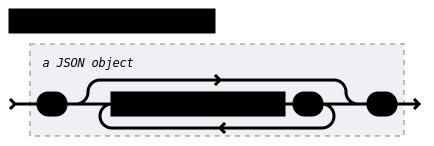

.. raw:: html

   <h1>THIS DOCUMENT IS WORK IN PROGRESS AND MAY CONTAIN HORRIBLE BUGS!</h1>

SECoP: Sample Environment Communication Protocol
################################################

V2018-10-04

Introduction
============

The main goal of the "committee for the standardization of sample
environment communication" is to establish a common standard protocol
SECoP for interfacing sample environment equipment to experiment control
software.

  Definition: Experiment Control Software ECS
     Software controlling the hardware for carrying out an experiment. Includes the user
     interface. Usually speaks several protocols with different parts of the instrument.
     Often also called instrument control.

There is a task (7.1) within the European framework SINE2020 also
dealing with this subject. In its description we read:

    ... The standard should be defined in a way that it is compatible
    with a broad variety of soft- and hardware operated at the different
    large scale facilities. … The adoption of this standard will greatly
    facilitate the installation of new equipment and the share of
    equipment between the facilities. ...

This does also cover the aims of the committee.

The idea is, that a sample environment apparatus can easily be moved
between facilities and instruments/beamlines. As long as the facilities
have implemented a SECoP client within its ECS, and on the apparatus a
SECoP server is implemented as the SEC node, using the apparatus for an
experiment should be straightforward. An ECS can be built in a way, that
the configuration of a SEC node may be as short as entering a network
address, as the description can be loaded over the protocol.

  Definition: Sample Environment Control Node (SEC node)
    Computing unit or process or task, connected to all control units (temperature controller,
    flow controller, pressure sensor ...) of a sample environment, bridge to the ECS.
    SECoP specifies how ECS speaks with the SEC node.
    The SEC node allows the ECS to access a set of modules (and their parameters/commands) via the SECoP.
    It also provides a list of accessible modules and parameters as well as descriptive meta data.

Other requirements
------------------

-  the protocol should be easy to use

-  it should be easy to implement in connection with existing ECSs and
   sample environment control software

-  it should be possible to be implemented on the most common platforms
   (operating systems and programming languages)

-  the protocol should be defined in way that allows a maximum
   **compatibility**: Newer and older versions of the syntax should
   be compatible

-  the protocol should be defined in a way, which allows a maximum
   **flexibility**: A simple (= with minimal features) ECS
   implementation should be able to communicate with a complex SEC
   node (with a lot of features), and an ECS with a rich number of
   features should be able to cope with a simple SEC node,
   implementing only a minimum number of features/functionality

.. sectnum::
    :start: 0
    :depth: 2

.. contents:: Contents
    :depth: 1
    :backlinks: entry

Hardware Abstraction
====================

.. contents::
    :local:
    :depth: 1
    :backlinks: entry

Modules
-------

  Definition: Module
    One logical component of an abstract view of the sample environment. Can at least be read.
    May be ’driven' (set new setpoint). May have parameters influencing how it achieves
    its function (e.g. PID parameters). May have some additional diagnostics (read-only) parameters.
    May provide some additional status information (temperature stable?, setpoint reached?)
    Reading a module returns the result of the corresponding physical measurement.

In earlier discussion we used the term "device" for module, which might
be misleading, as "device" is often used for an entire apparatus, like a
cryomagnet or humidity cell. In the context of SECoP, an apparatus in
general is composed of several modules. For example different
temperature sensors in one apparatus can be seen as different modules.

An SEC node controls several (or one or no) modules. Modules also have
some descriptive data (name, type, list\_of\_parameters,
list-of\_commands,...).

Accessibles
-----------

A module has several accessibles associated with it. An accessibles is
addressed by the combination of module and accessible name. Module names
have to be unique within an SEC node, accessible names have to be unique
within a module. There are two basic types of accessibles: parameters and commands.

Module and accessible names should be in english (incl. acronyms), using
only ascii letters + digits and some additional characters (see section `Protocol`_).
A maximum name length might be imposed by the SEC node.

Parameter:
    The main parameter of a module is its value. Writable parameters may influence the
    measurement (like PIDs). Additional parameters may give more information about its
    state (running, target reached), or details about its functioning (heater power) for
    diagnostics purposes. Parameters with a predefined meaning are listed in the standard,
    they must always be used in the same way. Custom parameters are defined by the
    implementation of the SEC node, the ECS can use them only in a general way, as their
    meaning is not known.

The following parameters are predefined (this list will be extended):

-  **value**
     represents the *main* value of a module.

-  **status**
     (a tuple of two elements: a status with predefined values
     from an Enum_ as "idle","busy","error", and a describing text).

     *Remark: it is proposed to add additional states (starting,
     started, pausing, paused, stopping, warning). It has to be
     discussed, if this (and therefore a start and pause command)
     makes sense. Generally we want to keep the number of states as
     small as possible here.*

     *Note: The amount of predefined status codes, their value and meaning is still under discussion.*
     *See also:* `SECoP Issue 37: Clarification of status`_

     .. table:: preliminary status codes

         ============= =========== ===========
          status code   Enum name   Meaning
         ============= =========== ===========
            tbd.         IDLE        module is ready for new requests, is not moving, no abnormal condition
            tbd.         WARN        like IDLE, but an abnormal condition is to be signaled, may be changed back to IDLE
            tbd.         BUSY        module is Busy due to a target change or other command
            tbd.         ERROR       module is not ready for new requests, the ``reset`` command must be called
            \           DISABLED    the module is disabled
            \           UNSTABLE    after the module reached it's target, it is now no longer 'there'
         ============= =========== ===========

     *note: the behaviour of a module in each of the predefined states is not yet 100% defined.*

     *note: the numerical value of the statuscodes are intentionally spaced apart.
     If an implemenmtation wants to differentiate similiar states,
     values* ``?01`` ... ``?99`` *are free for custom implementations essentially meaning the same
     as the basic value* ``?00``\ *.
     An ECS unaware of custom usage MUST treat them the same as* ``?00``\ *, i.e. 137 is IDLE, 373 is BUSY, etc.
     In any case, all used values are the be declared in the descriptive data!*

-  **target**
     present, if the modules main value is to be changeable remotely, i.e. it is at least a Writable

-  **pollinterval**
     a hint to the module for the polling interval in seconds, type is always an double.

The following parameters were discussed at a meeting.

-  **ramp**
     (writable parameter, desired ramp. Units: main units/min)

-  **use_ramp**
     (writable, 1 means: use given ramp, 0 means: go as fast as possible)

-  **setpoint**
     (ramping setpoint, read only)

-  **time_to_target**
     (read only double, expected time to reach target in seconds)

*note: ``use_ramp`` is under discussion.*

Command:
    Commands are provided to initiate specified actions of the module.
    They should generate an appropriate reply immediately after that action is initiated,
    i.e. should not wait until some other state is reached.
    However, if the command triggers side-effects, they MUST be communicated before the reply is sent.
    Commands may use an possibly structured argument and may return a possibly structured result.
    Commands with a predefined meaning are listed in the standard,
    they must always be used in the same way.

Custom commands are defined by the implementation of the SEC node, the
ECS can use them only in a general way, as their meaning is not known.

So far the only command defined (for driveable modules) is ‘stop’ (no
argument, no result). When a modules target is changed, it is 'driving'
to a new value until the target is reached or until its stop command
is sent.
It is still to be discussed, what this exactly means for temperature
devices (heater off vs. ‘stay at current temp’).

The following commands are predefined (extensible):

-  **stop**
     mandatory command on a drivable. Cease movement, set the target parameter
     to a value close to the present one. Act as if this value would have been the initial target.

-  **reset**
     optional command for putting the module to a state predefined by the implementation.

The following commands are foreseen, but are still under discussion (i.e. not 100% fixed yet):

-  **go**
     optional on a drivable. If present, the 'go' command is used to start the
     module. If not present the module is started upon a change on the target
     parameter.

-  **hold**
     optional command on a drivable. Stay more or less where you are, cease
     movement, be ready to continue soon, target value is kept. Continuation can be
     trigger with 'go', or if not present, by putting the target parameter to its
     present value.

-  **abort**
     optional command. Stops the running module in a safe way (for example
     switches the heater off).

-  **shutdown**
     optional command for shuting down the hardware.
     When this command is sent, and the triggered action is finished (status in idle mode),
     it is safe to switch off the related device.

*remark: there is an alternative proposal for
implementing the shutdown function, see* `SECoP Issue 22: Enable Module instead of Shutdown Command`_

*remark: The mechanics for buffering values and the semantics for the above commands except ``stop`` and ``reset``
are not yet finalised. see also discussion in* `SECoP Issue 28: Clarify buffering mechanism`_

Properties
----------

Definition: Properties
    The static information about parameters, modules and SEC nodes is
    constructed from properties with predefined names and meanings.

For a list of pre-defined properties see `Descriptive Data`_.

Data report
-----------
A JSON array with the value of a parameter as its first element,
and an JSON object containing the Qualifiers_ for this value as its second element.

*remark: future revisions may append additional elements.
These are to be ignored for implementations of the current specification*

Error report
------------
An error report is only used in a `error reply`_ indicating that the requested action could
not be performed as request or that other problems occured.
The Error report is a JSON-array containing the request message leading to the report error
(minus line endings) as a string in its first element, a (short) human readable text
as its second element. The third element is a JSON-Object, containing possibly
implementation specific information about the error (stack dump etc.).

*note: errors can only be reported 'for' a request. They contain a copy of the request,
so that a client may sort out, which of the requests it sent got an error.*

*remark: There is no way for a SEC node the report some general error information without
a client sending a request.*

Structure report
----------------
The structure report is a structured JSON construct describing the structure of the SEC node.
This includes the SEC-node properties, the modules, their module-properties and accessibles
and the properties of the accessibles.
For details see `descriptive data`_.

Qualifiers
----------

Qualifiers optionally augment the value in a reply from the SEC node,
and present variable information about that parameter.
They are collected as named values in a JSON-object.

Currently 2 qualifiers are defined:

- "t"
   The timestemp when the parameter has changed or was verified/measured (when no timestamp
   is given, the ECS may use the arrival time of the update message as the timestamp).
   It SHOULD be given, if the SEC node has a synchronized time,
   the format is that of a UNIX time stamp, i.e. fractional seconds since 1970-01-01T00:00:00+00:00Z,
   represented as a number, in general a floating point when the resolution
   is better than 1 second.

  *See also* `SECoP Issue 3:Timestamp Format`_

- "e"
   the uncertainity of the quantity. MUST be in the same units
   as the value. So far the interpretation of "e" is fnot fixed.
   (sigma vs. RMS difference vs. ....)

other qualifiers might be added later to the standard.
If an unknown element is encountered, it is to be ignored (for now).

*See also:* `SECoP Issue 28: Clarify buffering mechanism`_ and `SECoP Issue 36: Dynamic units`_

.. note:: To check if a SEC node supports time stamping, a `ping` request can be sent.
          (See also `heartbeat`_).

Interface Classes
-----------------

The idea is, that the ECS can determine the functionality of a module
from its class.

Base classes:

-  Readable (has at least a value and a status parameter)

-  Writable (must have a target parameter to a Readable)

-  Drivable (a Writable, must have a stop command, the status parameter will indicate
   Busy for a longer-lasting operation)

For examples of interface classes see the separate document `Interface Classes and Features`_.
*Note: these examples are not yet part of the standard!*

The standard contains a list of classes, and a specification of the
functionality for each of them. The list might be extended over time.
Already specified base classes may be extended in later releases of the
specification, but earlier definitions will stay intact, i.e. no
removals or redefinitions will occur.

The module class is in fact a list of classes (highest level class
first) and is stored in the module-property `interface_class`.
The ECS chooses the first class from the list which is known to it.
The last one in the list must be one of the base classes listed above.

*remark: The list may also be empty, indicating that the module in question does not even conform to the Readable class!*

.. _`Interface Classes and Features`: Interface%20Classes%20and%20Features.rst

Features
--------

*Note: this is not yet part of the standard*

As the list of interface classes would risk to increase a lot with possible
combinations, *features* come into place. A feature is a modular functionality,
with some predefined parameters and commands.

For examples of features see the separate document "Interface Classes and Features".

Protocol
========

.. contents::
    :depth: 1
    :local:
    :backlinks: entry

The basic element of the protocol are messages.

Message Syntax
--------------
The received byte stream which is exchanged via a connection is split into messages:

.. image:: images/messages.svg
   :alt: messages ::= (message CR? LF) +

A message is essentially one line of text, coded in ASCII (may be extended to UTF-8
later if needed). A message ends with a line feed character (ASCII 10), which may be preceded
by a carriage return character (ASCII 13), which must be ignored.

All messages share the same basic structure:

i.e. message starts with an action keyword, followed optionally by one space and a specifier
(not containing spaces), followed optionally by one space and a JSON-text
formatted value (see :RFC:`8259`) called data, which absorbs the remaining characters up to the
final LF.

.. Note:: numerical values and strings appear 'naturally' formatted in JSON-text, i.e. 5.0 or "a string".

The specifier consists of a module identifier and for most actions followed by a colon as separator
and a parameter or command identifier:

All identifiers (for properties, accessibles and modules) are composed by
ascii letters, digits and underscore, where a digit may not
appear as the first character.

.. image:: images/name.svg
   :alt: name ::= [a-zA-Z_] [a-zA-Z0-9_]*

Identifiers starting with underscore are
reserved for special purposes like internal use for debugging. The
identifier length is limited (<=63 characters). Module names on a SEC Node
and parameter names within a module must not differ when uppercase letters
are replaced by their lowercase counterparts, i.e. though names may contain uppercase letters,
they need to be unique, when lowercased.

A SEC node might implement custom messages for debugging purposes, which are not
part of the standard. Custom messages start with an underscore or might just be
an empty line. The latter might be used as a request for a help text, when logged
in from a command line client like telnet or netcat. Messages not starting with
an underscore and not defined in the following list are reserved for future extensions.

When implementing SEC nodes or ECS-clients, a 'MUST-ignore' policy should be applied to unknown
or additional parts.
Unknown messages are to be replied with an appropriate ProtocolError by a SEC node.
An ECS-client must ignore such messages. See also section `Future Compatibility`_.

Essentially the connections between an ECS and a SEC node can operate in one of two modes:

Synchroneous mode:
   where a strict request/reply pattern is used

Async mode:
   where an update may arrive any time (between messages).

In both cases, a request from the ECS to the SEC node is to be followed by an reply from the SEC node to the ECS,
either indicating success of the request or flag an error.

*note: to improve compatibility, any ECS client SHOULD always be aware of updates.*

*note: to clarify optionality of some messages, the following table is split into two:
basic messages (which MUST be implemented like specified) and extended messages which SHOULD be implemented.*

*note: for clarification, the symbol ``␣`` is used here instead of a space character. <elem> refers to the element elem which is defined in another section.*

.. table:: basic messages

    ======================= ============== ==================
     message intent          message kind   message elements
    ======================= ============== ==================
     `identification`_       request        ``*IDN?``
          \                  reply          ISSE&SINE2020\ **,SECoP,**\ *version,add.info*
     `description`_          request        ``describe``
          \                  reply          ``describing␣.␣``\ <`Structure Report`_>
     `activate updates`_     request        ``activate``
          \                  reply          ``active``
     `deactivate updates`_   request        ``deactivate``
          \                  reply          ``inactive``
     `heartbeat`_            request        ``ping␣<identifier>``
          \                  reply          ``pong␣<identifier>␣``\ <`Data Report`_>
     `change value`_         request        ``change␣module:parameter␣value``
          \                  reply          ``changed␣module:parameter␣``\ <`Data Report`_>
     `execute command`_      request        ``do␣module:command`` *note: only for argumentless commands!*
          \                  reply          ``done␣module:command␣``\ <`Data Report`_>
     `read request`_         request        ``read␣module:parameter`` *note: triggers an update*
     value update_  event    update         ``update␣module:parameter␣``\ <`Data Report`_>
     `error reply`_          reply          ``error␣errorclass␣``\ <`Error Report`_>
    ======================= ============== ==================

.. table:: extended messages

    ======================= ============== ==================
     message intent          message kind   message elements
    ======================= ============== ==================
     `activate updates`_     request        ``activate␣<module>``
       module-wise           reply          ``active␣<module>``
     `deactivate updates`_   request        ``deactivate␣<module>``
       module-wise           reply          ``inactive␣<module>``
     `heartbeat`_            request        ``ping``
      with empty identifier  reply          ``pong␣␣``\ <`Data Report`_>
     `execute command`_      request        ``do␣module:command␣``\ (<argument> | ``null``)
    ======================= ============== ==================

*Remark: We tried to keep this list small. However a possible extension is discussed in*
`SECoP Issue 29: New messages for buffering`_

Theory of operation:
    The first messages to be exchanged after the a connection between an ECS and a SEC node is established
    is to verify that indeed the SEC node is speaking an supported protocol by sending an identification_ request
    and checking the answer from the SEC node to comply.
    If this check fails, the connection is to be closed and an error reported.
    The second step is to query the structure of the SEC node by exchange of description_ messages.
    After this step, the ECS knows all it needs to know about this SEC node and can continue to either
    stick to a request/reply pattern or `activate updates`_.
    In any case, an ECS should correctly handle updates, even if it didn't activate them,
    as that may have been performed by another client on a shared connection.

Message intents
---------------

Identification
~~~~~~~~~~~~~~

The syntax of the identification message differs a little bit from other
messages, as it should be compatible with IEEE 488.2. The identification
request "\ **\*IDN?**\ " is meant to be sent as the first message after
establishing a connection. The reply consists of 4 comma separated
fields, where the second and third field determine the used protocol.

In this and in the following examples, messages sent to the server are marked with "> ",
and messages sent to the client are marked with "< "

Example:

.. code::

  > *IDN?
  < ISSE&SINE2020,SECoP,V2018-10-04,draft

So far the SECoP version is given like "V2018-10-04", i.e. a capital "V" followed by a date in
``year-month-day`` format with 4 and 2 digits respectively.
The ``add.info`` field is used to differentiate between draft, release candidates (rc1, rc2,...) and final.

Description
~~~~~~~~~~~

The next messages normally exchanged are the description request and
reply. The reply contains the `Structure report`_ i.e. a structured JSON object describing the name of
modules exported and their parameters, together with the corresponding
properties.

Example:

.. code::

  > describe
  < describing . {"modules":["t1",["interface_class",["TemperatureSensor","Readable"],"accessibles",["value", ...

The dot (second item in the reply message) is a placeholder for extensibility reasons.
A client implementing the current specification MUST ignore it.

*Remark:
this reply might be a very long line, no raw line breaks are allowed in the
JSON part! I.e. the JSON-part should be as compact as possible.*

Activate Updates
~~~~~~~~~~~~~~~~

The parameterless "activate" request triggers the SEC node to send the
values of all its modules and parameters as update messages (initial updates). When this
is finished, the SEC node must send an "active" reply. (*global activation*)

*note: the values transferred are not necessarily read fresh from the hardware, check the timestamps!*

*note: This initial update is to help the ECS establish a copy of the 'assumed-to-be-current' values*

A SEC node might accept a module name as second item of the
message (*module-wise activation*), activating only updates on the parameters of the selected module.
In this case, the "active" reply also contains the module name.

A SEC Node not implementing module-wise activation MUST NOT sent the module
name in its reply to an module-wise activation request,
and MUST activate all modules (*fallback mode*).

*remark: This mechanism may be extended to specify modulename:parametername for a parameter-wise activation.
A SEC node capable of module-wise activation SHOULD NOT fallback to global activation
if it encounters such a request. Instead it SHOULD fallback to module-wise activation,
i.e. ignore anything after (including the) colon in the specifier.*

Update
~~~~~~

When activated, update messages are delivered without explicit request
from the client. The value is a `Data report`_, i.e. a JSON array with the value as its first
element, and an JSON object containing the `Qualifiers`_ as its second element.

An update may also be triggered by an `read request`_, in which case the value reported in the data report is fresh (i.e. just obtained from a hw).

Example:

.. code::

  > activate
  < update t1:value [295.13,{"t":150539648.188388,"e":0.01}]
  < update t1:status [[400,"heater broken or disconnected"],{"t":1505396348.288388}]
  < active
  < update t1:value [295.14,{"t":1505396349.259845,"e":0.01}]
  < update t1:value [295.13,{"t":1505396350.324752,"e":0.01}]

The example shows an ``activate`` request triggering an initial update of two values:
t1:value and t1:status, followed by the ``active`` reply.
After this two more updates on the t1:value show up after roughly 1s between each.

Deactivate Updates
~~~~~~~~~~~~~~~~~~

A parameterless message. After the "inactive" reply no more updates are
delivered if not triggered by a read message.

Example:

.. code::

  > deactivate
  < update t1:value [295.13,{"t":1505396348.188388}]
  < inactive

*remark: the update message in the second line was sent before the deactivate message
was treated. After the "inactive" message, the client can expect that no more untriggered
update message are sent, though it MUST still be able to handle (or ignore) them, if they still
occur.*

The deactivate message might optionally accept a module name as second item
of the message for module-wise deactivation. If module-wise deactivation is not
supported, it should ignore a deactivate message which contains a module name.

*Remark: it is not clear, if module-wise deactivation is really useful. A SEC Node
supporting module-wise activation does not necessarily need to support module-wise
deactivation.*

Change Value
~~~~~~~~~~~~

the change value message contains the name of the module or parameter
and the value to be set. The value is JSON formatted.
As soon as the set-value is read back from the hardware, all clients,
having activated the parameter/module in question, get an "update" message.
After all side-effects are communicated, a "changed" reply is then send, containing a
`Data report`_ of the read-back value.

remarks:
  * If the value is not stored in hardware, the "update" message can be sent immediately.*
  * The read-back value should always reflect the value actually used.*
  * an client having activated updates may get an ``update`` message before the ``changed`` message, both containing the same data report.

Example on a connection with activated updates. Qualifiers are replaced by {...} for brevity here.

.. code::

  > read mf:status
  < update mf:status [[100,"OK"],{...}]
  > change mf:target 12
  < update mf:status [[300,"ramping field"],{...}]
  < update mf:target [12,{...}]
  < changed mf:target [12,{...}]
  < update mf:value [0.01293,{...}]

The status changes from "idle" (100) to "busy" (300).
The ECS will be informed with a further update message on mf:status,
when the module has finished ramping.
Until then, it will get regular updates on the current main value (see last update above).

**note:** it is vital that all 'side-effects' are realised (i.e. stored in internal variables) and be communicated, **before** the 'changed' reply is sent!

Read Request
~~~~~~~~~~~~

With the read request message the ECS may ask the SEC node to update a
value as soon as possible, without waiting for the next regular update.
The reply is an update message.
If updates are not activated, the update message can also be treated like a reply request
to the read request.

Example:

.. code::

  > read t1:value
  < update t1:value [295.13,{"t":1505396348.188}]
  > read t1:status
  > update t1:status [[100,"OK"],{"t":1505396348.548}]

*remark: If a client has activated the module/parameter for which it sent a ``read`` request,
it may receive more than one 'update' message, especially if SEC node side polling is active.
There is no indication, which message was sent due to polling (or other clients requesting a 'read')
and or due to a specific read. An ECS-client may just use the first matching message and treat it
as 'the reply'.*

_`Execute Command`
~~~~~~~~~~~~~~~~~~

If a command is specified with an argument, the actual argument is given in
the data part as a json-text. This may be also a json-object if the datatype of
the argument specifies that
(i.e. the type of the single argument can also be a struct, tuple or an array, see `data types`_).
The types of arguments must conform to the declared datatypes from the datatype of the command argument.

A command may also have a return value, which may also be structured.
The "done" reply always contains a `Data report`_ with the return value.
If no value is returned, the data part is set to "null".
The "done" message should be returned quickly, the time scale should be in the
order of the time needed for communications. Still, all side-effects need to be realised
and communicated before.
Actions which have to wait for physical changes, can be triggered with a command, but not be waited upon.
The information about the duration and success of such an action has to be transferred via the status parameter.

.. important:: If a command does not require an argument, the argument SHOULD be transferred as json-null.
 A SEC node MUST also accept the message, if the data part is emtpy and perform the same action.

Example:

.. code::

  > do t1:stop
  < done t1:stop [null,{"t":1505396348.876}]

  > do t1:stop null
  < done t1:stop [null,{"t":1505396349.743}]

Error Reply
~~~~~~~~~~~

Contains an error class from the list below as its second item.
The third item of the message is an `Error report`_, containing the request message
(minus line endings) as a string in its first element, a (short) human readable text
as its second element. The third element is a JSON-Object, containing possibly
implementation specific information about the error (stack dump etc.).

Example:

.. code::

  > read tx:target
  < error NoSuchModule ["read tx:target", "tx is not configured on this SEC node", {}]
  > read ts:target
  < error NoSuchParameter ["read ts:target", "ts has no parameter target", {}]
  > meas:volt?
  < error ProtocolError ["meas:volt?", "unknown keyword", {}]

Error Classes

.. list-table::
    :widths: 20 80

    * - NoSuchModule
      - The action can not be performed as the specified module is non-existent.

    * - NoSuchParameter
      - The action can not be performed as the specified parameter is non-existent.

    * - NoSuchCommand
      - The specified command does not exist.

    * - CommandFailed
      - The command failed to execute.

    * - CommandRunning
      - The command is already executing.

    * - ReadOnly
      - The requested write can not be performed on a readonly value..

    * - BadValue
      - The requested write or Command can not be performed as the value is malformed or of wrong type.

    * - CommunicationFailed
      - Some communication (with hardware controlled by this SEC node) failed.

    * - IsBusy
      - The requested write can not be performed while the module is Busy

    * - IsError
      - The requested action can not be performed while the module is in error state.

    * - Disabled
      - The requested action can not be performed at the moment. (Interlocks?)

    * - ProtocolError
      - A malformed Request or on unspecified message was sent

    * - InternalError
      - Something that should never happen just happened.

*remark: This list may be extended, if needed. clients should treat unknown error classes as generic as possible.*

*note: CommandRunning may not be needed, as IsBusy essentially covers that case.*

*note: BadValue may need sub-categories to differentiate between: wrong_type, illegal_value or partial_struct_not_allowed_here.
A natural way would be to specify those like e.g. BadValue:WrongType, but this is not yet discussed yet.*

Heartbeat
~~~~~~~~~
In order to detect that the other end of the communication is not dead,
a heartbeat may be sent. The second part of the message (the id) must
not contain a space and should be short and not be re-used.
It may be omitted. The reply will contain exactly the same id.

A SEC node replies with a ``pong`` message with a `Data report`_ of a null value.
The `Qualifiers`_ part SHOULD only contain the timestamp (as member "t") if the
SEC node supports timestamping.
This can be used to synchronize the time between ECS and SEC node.
*remark: The qualifiers could also be an empty JSON-object, indicating lack of timestamping support.*

For debugging purposes, when *id* in the ``ping`` request is omitted,
in the ``pong`` reply there are two spaces after ``pong``.
A client SHOULD always send an id. However, the client parser MUST treat two
consecutive spaces as two separators with an empty string in between.

Example:

.. code::

  > ping 123
  < pong 123 [null, {"t": 1505396348.543}]

*Related SECoP Issues:* `SECoP Issue 3:Timestamp Format`_ and `SECoP Issue 7:Time Synchronization`_

Handling timeout Issues
~~~~~~~~~~~~~~~~~~~~~~~

If a timeout happens, it is not easy for the ECS to decide on the best strategy.
Also there are several types of timeout: idle-timeout, reply-timeout, etc...
Generally speaking: both ECS and SEC side needs to be aware that the other
side may close the connection at any time!
On reconnect, it is recommended, that the ECS does send a ``*IDN?`` and a ``describe`` message.
If the reponses match the responses from the previous connection, the ECS should continue
as if no interruption happend.
If the response of the description does not match, it is up to the ECS how to handle this.
Naturally, if the previous connection was activated, an ``activate``
message has to be sent before it can continue as before.

*Related SECoP Issues:* `SECoP Issue 4: The Timeout SEC Node Property`_ and `SECoP Issue 6: Keep Alive`_

Multiple Connections
--------------------

A SEC node restrict the number of simultaneous connections, downto 1.
However, each SEC node should support as many connections as technically
feasible.

Details about how to multiplex multiple connections onto one are to be
discussed.

Descriptive Data
================

.. contents::
    :depth: 1
    :local:
    :backlinks: entry

Format of Descriptive Data
--------------------------

The format of the descriptive data is JSON, as all other data in SECoP.

.. for creating the railroad diagrams see: http://bottlecaps.de/rr/ui
.. source EBNF:
.. SEC_node_description ::= '{' (SEC_node_property ( ',' SEC_node_property)* )? '}'
.. SEC_node_property ::= property |  ( '"modules":' '[' (name ',' module_description (',' name ',' module_description)*)? ']')
.. module_description ::= '{' (module_property ( ',' module_property)* )? '}'
.. module_property ::= property |  ( '"parameters":' '[' (name ',' properties (',' name ',' properties)*)? ']') |  ( '"commands":' '[' (name ',' properties (',' name ',' properties)*)? ']')
.. module_property_v2 ::= property |  ( '"accessibles":' '[' (name ',' properties (',' name ',' properties)*)? ']')
.. properties ::=  '{' (property ( ',' property)* )? '}'
.. property ::= (name ":" property_value)

SEC node description
~~~~~~~~~~~~~~~~~~~~

.. image:: images/sec-node-description.svg
   :alt: SEC_node_description ::= '{' (SEC_node_property ( ',' SEC_node_property)* )? '}'

SEC node property
~~~~~~~~~~~~~~~~~

.. image:: images/sec-node-property.svg
   :alt: SEC_node_property ::= property |  ( '"modules":' '[' (name ',' module_description (',' name ',' module_description)*)? ']')

module description
~~~~~~~~~~~~~~~~~~

.. image:: images/module-description.svg
   :alt: module_description ::= '{' (module_property ( ',' module_property)* )? '}'

module property
~~~~~~~~~~~~~~~

.. image:: images/module-property.svg
   :alt: module_property ::= property |  ( '"accessibles":' '[' (name ',' properties (',' name ',' properties)*)? ']') ']')

accessible description
~~~~~~~~~~~~~~~~~~~~~~

accessible property
~~~~~~~~~~~~~~~~~~~

.. image:: images/accessible-property.svg
   :alt: property ::= (name ":" property_value)

custom-property
~~~~~~~~~~~~~~~

.. image:: images/custom-property.svg
   :alt: property ::= ("_" name ":" property_value)

SEC Node Properties
-------------------

there might be properties such as a timeout which are relevant for the
communication of a SEC node.

-  equipment_id
     mandatory, worldwide unqiue id of an equipment as string. Should contain the name of the
     owner institute or provider company as prefix in order to guarantee worldwide uniqueness.

     example: ``"MLZ_ccr12"`` or ``"HZB-vm4"``

-  description
     mandatory text describing the node, in general.
     The formatting should follow the 'git' standard, i.e. a short headline (max 72 chars),
     followed by ``\n\n`` and then a more detailed description, using ``\n`` for linebreaks.

-  firmware
     optional, short, string naming the version of the SEC node software.

     example: ``frappy-0.6.0``

-  timeout
     optional value in seconds, a SEC node should be able to respond within
     a time well below this value. (i.e. this is a reply-timeout.)
     Default: 10 sec, *see* `SECoP Issue 4: The Timeout SEC Node Property`_)

Module Properties
-----------------

-  description
     mandatory text describing the module, formatted like the node-property description

-  visibility
     optional string indicating a hint for UI's for which user roles the module should be display or hidden.
     MUST be one of "expert" (3), "advanced" (2) or "user" (1) (default).
     *Note: this does not imply that the access is controlled. It is just a
     hint to the UI for the amount of exposed modules. A visibility of "advanced" (2) means
     that the UI should hide the module for users, but show it for experts and
     advanced users.*

-  interface_class
     mandatory list of matching classes for the module, for example ``["Magnet", "Drivable"]``

     *note: as this is a list it SHOULD actually have been called ``interface_classes`` or ``interfaces``*

-  features
     optional list of features for the module, for example ``["HasRamp", "HasTolerance"]``
     *this is not yet part of the standard, see also:* `SECoP Issue 18: Interface classes`_)

-  group
     optional identifier, may contain ":" which may be interpreted as path separator.
     The ECS may group the modules according to this property.
     The lowercase version of a group must not match any lowercase version of a module name on
     the same SEC node. (*see:* `SECoP Issue 8: Groups and Hierarchy`_)

-  meaning
     optional tuple, with the following two elements:

     1. a string from an extensible list of predefined meanings:

        * 'temperature'   (the sample temperature)
        * 'temperature_regulation' (to be specified only if different from 'temperature')
        * 'magneticfield'
        * 'electricfield'
        * 'pressure'
        * 'rotation_z' (counter clockwise when looked at 'from sky to earth')
        * 'humidity'
        * 'viscosity'
        * 'flowrate'
        * 'concentration'

        This list may be extended later. (*see:* `SECoP Issue 26: More Module Meanings`_).

        '_regulation' may be postfixed, if the quantity generating module is different from the
        (closer to the sample) relevant measuring device. A regulation device MUST have an
        ``interface_class`` of at least ``Writable``.

     2. a value describing the importance, with the following values:

        - 10 means the instrument/beamline (Example: room temperature sensor always present)
        - 20 means the surrounding sample environemnt (Example: VTI temperature)
        - 30 means an insert (Example: sample stick of dilution insert)
        - 40 means an addon added to an insert (Example: a device mounted inside a dilution insert)

        Intermediate values might be used. The range for each category starts at the indicated value minus 5
        and ends below the indicated value plus 5. (*see also:* `SECoP Issue 9: Module Meaning`_)

Accessible Properties
---------------------

-  description
     mandatory string describing the accessible, formatted as for module-description
     or node-description

-  readonly
     mandatory boolean value indiciation if this parameter may be changed by an ECS, or not

-  datatype
     mandatory datatype of the accessible, see `Data Types`_.
     This is always a JSON-Array containing at least one element: a string naming the datatype.

     *note: commands and parameters can be distinguisehd by the datatype.*

-  unit
     optional string giving the unit of the parameter.
     (default: unitless, SHOULD be given, if meaningfull, empty string: unit is one)
     Only SI-units (including prefix) SHOULD be used for SECoP units preferrably.

-  visibility
     optional, the visibility of the accessible. values and meaning as for module-visibility above.
     *remark: this 'inherits' from the module property. i.e. if it is not specified, the
     value of the module-property (if given) should be used instead*

-  group
     optional identifier, may contain ":" which may be interpreted as path separator.
     The ECS may group the parameters according to this property.
     The lowercase version of a group must not match any lowercase version of an accessible name
     of the same module.
     (*see:* `SECoP Issue 8: Groups and Hierarchy`_)

*remark: the parameter-property ``group`` is used for grouping of parameters within a module,
the module-property ``group`` is used for grouping of modules within a node.*

*remark: commands do not have ``readonly`` and ``unit`` properties, as they make no sense for commands.*

Data Types
==========
SECoP defines a very flexible data typing system. Data types are used to describe
the possible values of parameters and how they are serialised.
They may also impose restrictions on the useable values or amount of data.
Like the integer or fractional data types SECoP defines.
Also an Enum is defined for convenience of not having to remember the meaning of values from a reduced set.
A Bool datatype is similiar to a predefined Enum, but uses the JSON-values true and false.
(Of course 0 should be treated as False and 1 as True if a bool value isn't using the JSON literals.)

Furthermore, SECoP not only defines basic data types but also structured datatypes.
Tuples allow to combine a fixed amount of values with different datatypes in an ordered way to be used as one.
Arrays store a given number of dataelements having the same datatype.
Structs are comparable to tuples, with the difference of using named entries whose order is irrelevant during transport.

All datatypes are specified in the descriptive data in the following generic form:

.. image:: images/datatype-generic.svg

Here is an overview of all defined datatypes:

.. image:: images/datatype.svg

.. contents::
    :depth: 1
    :local:
    :backlinks: entry

double
------

.. list-table::
    :widths: 20 80
    :stub-columns: 1

    * - Datatype
      - | ``["double"]`` *or*
        | ``["double", <min>]`` *or*
        | ``["double", <min>, <max>]``
        |
        | if ``<max>`` is not given or ``null``, there is no upper limit
        | if ``<min>`` is not given or ``null``, there is no lower limit
        | ``<max>`` and ``<min>`` are numbers with ``<min>`` <= ``<max>``

    * - Example
      - ``["double", 0, 100]``

    * - Transport example
      - | as JSON-number:
        | ``3.14159265``

int
---

.. list-table::
    :widths: 20 80
    :stub-columns: 1

    * - Datatype
      - | ``["int"]`` *or*
        | ``["int", <min>]`` *or*
        | ``["int", <min>, <max>]``
        |
        | if ``<max>`` is not given or ``null``, there is no upper limit
        | if ``<min>`` is not given or ``null``, there is no lower limit
        | ``<max>`` and ``<min>`` are integers with ``<min>`` <= ``<max>``

    * - Example
      - ``["int", 0, 100]``
    * - Transport example
      - | as JSON-number:
        | ``-55``

bool
----

.. list-table::
    :widths: 20 80
    :stub-columns: 1

    * - Datatype
      - | ``["bool"]``

    * - Transport example
      - | as JSON-boolean: true or false
        | ``true``

enum
----

.. list-table::
    :widths: 20 80
    :stub-columns: 1

    * - Datatype
      - | ``["enum", {<name> : <value>, ....}]``
        | ``name``\ s are strings, ``value``\ s are (small) integers, both ``name``\ s and ``value``\ s MUST be unique

    * - Example
      - ``["enum", {"IDLE":100,"WARN":200,"BUSY":300,"ERROR":400}]``

    * - Transport example
      - | as JSON-number, the client performs the mapping back to the name:
        | ``2``

string
------

.. list-table::
    :widths: 20 80
    :stub-columns: 1

    * - Datatype
      - | ``["string"]`` *or*
        | ``["string", <max len>]`` *or*
        | ``["string", <max len>, <min len>]``
        |
        | if ``<max len>`` is not given or ``null``, it is assumed to be 255.
        | if ``<min len>`` is not given or ``null``, it is assumed to be 0.
        | ``<max len>`` and ``<min len>`` are integers with ``<min len>`` <= ``<max len>`` (if both given)
        | the length is counting the number of bytes used when the string is utf8 encoded, not characters

    * - Example
      - ``["string", 80]``

    * - Transport example
      - | as JSON-string:
        | ``"Hello\n\u2343World!"``

blob
----

.. list-table::
    :widths: 20 80
    :stub-columns: 1

    * - Datatype
      - | ``["blob", <max len>]`` *or*
        | ``["blob", <max len>, <min len>]``
        |
        | if ``<min len>`` is not given, it is assumed as 1.
        | ``<max len>`` and ``<min len>`` are integers with ``<min len>`` <= ``<max len>`` (if both given)

    * - Example
      - ``["blob", 64]``

    * - Transport example
      - | as single-line base64 (see :RFC:`4648`) encoded JSON-string:
        | ``"AA=="``

array
-----

.. list-table::
    :widths: 20 80
    :stub-columns: 1

    * - Datatype
      - | ``["array", <basic type>, <max len>]`` *or*
        | ``["array", <basic type>, <max len>, <min len>]``
        |
        | if ``<min len>`` is not given or ``null``, it is assumed as 0.
        | if ``<max len>`` is not given or ``null``, the array is unrestricted! (**avoid this !**)
        | ``<max len>`` and ``<min len>`` are integers with ``<min len>`` <= ``<max len>`` (if both given)
        | the length is the number of elements

    * - Example
      - ``["array", ["int"], 10]``

    * - Transport example
      - | as JSON-array:
        | ``[3,4,7,2,1]``

tuple
-----

.. list-table::
    :widths: 20 80
    :stub-columns: 1

    * - Datatype
      - | ``["tuple", [<datatype>, <datatype>, ...]]``

    * - Example
      - | ``["tuple", [["int"], ["string"]]]``
        |
        | *note: may reduce nesting level by one without probs.*

    * - Transport example
      - | as JSON-array:
        | ``[300,"accelerating"]``

struct
------

.. list-table::
    :widths: 20 80
    :stub-columns: 1

    * - Datatype
      - | ``["struct", {<name> : <datatype>, <name>: <datatype>, ....}]``

    * - Example
      - ``["struct", {"y":["int"], "x":["enum",{"On":1, "Off":0}]}]``

    * - Transport example
      - | as JSON-object:
        | ``{"x": 0, "y": 1}``

*remark: see also* `SECoP Issue 35: Partial structs`_

command
-------

.. list-table::
    :widths: 20 80
    :stub-columns: 1

    * - Datatype
      - | ``["command"]`` *or*
        | ``["command", <argumenttype>]`` *or*
        | ``["command", <argumenttype>, <resulttype>]]``
        |
        | if ``<argumenttype>`` is not given or ``null``, the command has no argument
        | if ``<resulttype>`` is not given or ``null``, the command returns no result
        | only one argument is allowed, though several arguments may be used if
        | encapsulated in a structural datatype (struct, tuple or array).
        | If such encapsulation or data grouping is needed, a struct SHOULD be used.
        | In any case, the meaning of result and argument(s) SHOULD be written down
        | in the description of the command.

    * - Example
      - ``["command", ["string"], ["string"]]``

    * - Transport examples
      - | > do module:communicate "Hello"
        | < done module:communicate ["World!",{t:123456789.2}]

*remark: see also* `SECoP Issue 35: Partial structs`_

Future Compatibility
====================
This specification defines a set of requests and replies above.
Only those messages are ALLOWED to be generated by any software complying to this specification:

.. compound::
    Requests:

    .. image:: images/defined-requests.svg
       :alt: defined_requests

.. compound::
    Replies:

    .. image:: images/defined-replies.svg
       :alt: defined_replies

The specification is intended to grow and adopt to new needs. (see also `SECoP Issue 38: Extension mechanisms`_)
To future proof the the communication the following messages MUST be parsed and treated correctly
(i.e. the ignored_value part is to be ignored).

.. compound::
    Requests:

    .. image:: images/must-accept-requests.svg
       :alt: must_accept_requests

.. compound::
    Replies:

    .. image:: images/must-accept-replies.svg
       :alt: must_accept_replies

As a special case, an argumentless command may also by called without specifying the data part.
In this case an argument of null is to be assumed.
Also an argumentless ping is to be handled as a ping request with an empty token string.
The corresponding reply then contains a double space. This MUST also be parsed correctly.

Similiarly, the reports need to be handled like this:

.. compound::
    Data report:

    .. image:: images/data-report.svg
       :alt: data_report ::= "[" json-value "," qualifiers ("," ignored_value)* "]"

.. compound::
    Error report:

    .. image:: images/error-report.svg
       :alt: error_report ::= '["' copy_of_request '","' error_msg '",' error_info ("," ignored_value)* "]"

Essentially this boils down to:
  1) ignore additional entries in the list-part of reports
  #) ignore extra keys in the qualifiers, structure report and error report mappings
  #) ignore message fields which are not used in the definition of the messages (i.e. for `describe`)
  #) treat needed, but missing data as null (or an empty string, depending on context)
  #) if a specifier contains more ":" than you can handle, use the part you understand, ignore the rest.
     (i.e. treat ``activate module:parameter`` as ``activate module``, ignoring the ``:parameter`` part)
     (i.e. treat ``error BadValue:WrongType`` as ``error BadValue``, ignoring the ``:WrongType`` part)
  #) upon parsing a value, when you know it should be one element from an Enum (which SHOULD be transported as integer),
     if you find a string instead and that string is one of the names from the Enum, use that entry.
  #) check newer versions of the specification and check the issues as well, as the above may change.

Complying to these rules maximise to possibility of future + backwards compatibility.

*note: also check* `SECoP Issue 36: Dynamic units`_ *as it may have implications for a certain implementation.*

Licences
========

The above diagrams were generated using the library from http://github.com/birkenfeld/railroad_dsl.git.

.. _`SECoP Issue 3:Timestamp Format`: issues/003c%20Timestamp%20Format.rst
.. _`SECoP Issue 4: The Timeout SEC Node Property`: issues/004c%20The%20Timeout%20SEC%20Node%20Property.rst
.. _`SECoP Issue 6: Keep Alive`: issues/006c%20Keep%20Alive.rst
.. _`SECoP Issue 7:Time Synchronization`: issues/007c%20Time%20Synchronization.rst
.. _`SECoP Issue 8: Groups and Hierarchy`: issues/008c%20Groups%20and%20Hierarchy.rst
.. _`SECoP Issue 9: Module Meaning` : issues/009c%20Module%20Meaning.rst
.. _`SECoP Issue 18: Interface classes`: issues/018d%20Interface%20Classes.rst
.. _`SECoP Issue 22: Enable Module instead of Shutdown Command`: issues/022u%20Enable%20Module%20instead%20of%20Shutdown%20Command.rst
.. _`SECoP Issue 26: More Module Meanings`: issues/026d%20More%20Module%20Meanings.rst
.. _`SECoP Issue 28: Clarify buffering mechanism`: issues/028p%20Clarify%20buffering%20mechanism.rst
.. _`SECoP Issue 29: New messages for buffering`: issues/029p%20New%20messages%20for%20buffering.rst
.. _`SECoP Issue 35: Partial structs`: issues/035p%20Partial%20structs.rst
.. _`SECoP Issue 36: Dynamic units`: issues/036p%20Dynamic%20units.rst
.. _`SECoP Issue 37: Clarification of status`: issues/037p%20Clarification%20of%20status.rst
.. _`SECoP Issue 38: Extension mechanisms`: issues/038p%20Extension%20mechanisms.rst
