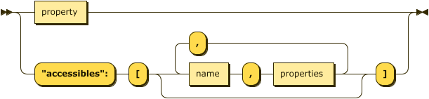

SECoP: Sample Environment Communication Protocol
################################################

V2018-06-16

Goal
====

The main goal of the "committee for the standardization of sample
environment communication" is to establish a common standard protocol
SECoP for interfacing sample environment equipment to experiment control
software.

  Definition: Experiment Control Software ECS                                                                                                                          
     Software controlling the hardware for carrying out an experiment. Includes the user
     interface. Usually speaks several protocols with different parts of the instrument.
     Often also called instrument control.                                              

There is a task (7.1) within the European framework SINE2020 also
dealing with this subject. In its description we read:

    ... The standard should be defined in a way that it is compatible
    with a broad variety of soft- and hardware operated at the different
    large scale facilities. … The adoption of this standard will greatly
    facilitate the installation of new equipment and the share of
    equipment between the facilities. ...

This does also cover the aims of the committee.

The idea is, that a sample environment apparatus can easily be moved
between facilities and instruments/beamlines. As long as the facilities
have implemented a SECoP client within its ECS, and on the apparatus a
SECoP server is implemented as the SEC node, using the apparatus for an
experiment should be straightforward. An ECS can be built in a way, that
the configuration of a SEC node may be as short as entering a network
address, as the description can be loaded over the protocol (in
addition, the electronic communication link, electricity and may be
cooling water or pressurized air etc. have to be connected, but that is
out of scope …)

  Definition: Sample Environment Control Node (SEC node)
    Computing unit or process or task, connected to all control units (temperature controller, flow controller, pressure sensor ...) of a sample environment, bridge to the ECS. SECoP specifies how ECS speaks with the SEC node.
    The SEC node allows the ECS to access a set of modules (and their parameters) via the SECoP. It also provides a list of accessible modules and parameters.

Other requirements
------------------

-  the protocol should be easy to use

-  it should be easy to implement in connection with existing ECSs and
   sample environment control software

-  it should be possible to be implemented on the most common platforms
   (operating systems and programming languages)

-  the protocol should be defined in way that allows a maximum
   **compatibility**: Newer and older versions of the syntax should
   be compatible

-  the protocol should be defined in a way, which allows a maximum
   **flexibility**: A simple (= with minimal features) ECS
   implementation should be able to communicate with a complex SEC
   node (with a lot of features), and an ECS with a rich number of
   features should be able to cope with a simple SEC node,
   implementing only a minimum number of features

Hardware Abstraction
====================

Modules
-------

  Definition: Module
    One logical component of an abstract view of the sample environment. Can at least be read.
    May be ’driven' (set new setpoint). May have parameters influencing how it achieves
    its function (e.g. PID parameters). May have some additional diagnostics (read-only) parameters.
    May provide some additional status information (temperature stable?, setpoint reached?)
    Reading a module returns the result of the corresponding physical measurement.

In earlier discussion we used the term "device" for module, which might
be misleading, as "device" is often used for an entire apparatus, like a
cryomagnet or humidity cell. In the context of SECoP, an apparatus in
general is composed of several modules. For example different
temperature sensors in one apparatus can be seen as different modules.

An SEC node controls several (or one or no) modules. Modules also have
some descriptive data (name, type, list\_of\_parameters,
list-of\_commands,...).

Parameters
----------

A module has several parameters associated with it. A parameter is
addressed by the combination of module and parameter name. Module names
have to be unique within an SEC node, parameter names have to be unique
within a module.

Module and parameter names should be in english (incl. acronyms), using
only ascii letters and some additional characters (see section "Message
Syntax"). A maximum name length might be imposed.

  Definition: Parameter
    The main parameter of a module is its value. Writable parameters may influence the
    measurement (like PIDs). Additional parameters may give more information about its
    state (running, target reached), or details about its functioning (heater power) for
    diagnostics purposes. Parameters with a predefined meaning are listed in the standard,
    they must always be used in the same way. Custom parameters are defined by the
    implementation of the SEC node, the ECS can use them only in a general way, as their
    meaning is not known.

The following parameters are predefined (extensible):

-  **value**

-  **status** (consists of two elements: a status with predefined values
   as "idle","busy","error", and a describing text).
   *Remark: it is proposed to add additional states (starting,
   started, pausing, paused, stopping, warning). It has to be
   discussed, if this (and therefore a start and pause command)
   makes sense. Generally we want to keep the number of states as
   small as possible here.*

-  **target** (not present, if the module is not writable)

-  **pollinterval** (double, a hint for the module for the polling interval in seconds)

The following parameters were discussed at the meeting in 

-  **ramp** (writable parameter, desired ramp. Units: main units/min)

-  **use\_ramp** (writable, 1 means: use given ramp, 0 means: go as fast as possible)

-  **setpoint** (ramping setpoint, read only)

-  **time\_to\_target** (read only, expected time to reach target)

Commands
--------

A module may also have commands associated with it. A command is
addressed by the combination of module and parameter name. Like
parameters, command names have to be unique within a module, and should
be in english (incl. acronyms), using only ascii letters and some
additional characters (see section "Message Syntax"). A maximum name
length might be imposed.

  Definition: Command
    Commands are provided to initiate specified actions of the module.
    They should return immediately after that action is initiated, i.e.
    should not wait until some other state is reached. Commands may get
    an argument list and may return a result list.
    Commands with a predefined meaning are listed in the standard,
    they must always be used in the same way.

Custom commands are defined by the implementation of the SEC node, the
ECS can use them only in a general way, as their meaning is not known.

So far the only command defined (for driveable modules) is ‘stop’ (no
arguments, no result). When a modules target is changed, it is 'driving'
to a new value until the target is reached or until its stop command
is sent.
It is still to be discussed, what this exactly means for temperature
devices (heater off vs. ‘stay at current temp’).

The following commands are predefined (extensible):

-  **go** optional on a drivable. If present, the 'go' command is used to start the
   module. If not present the module is started upon a change on the target
   parameter.

-  **hold** optional command on a drivable. Stay more or less where you are, cease
   movement, be ready to continue soon, target value is kept. Continuation can be
   trigger with 'go', or if not present, by putting the target parameter to its
   present value.

-  **abort** optional command. Stops the running module in a safe way (for example
   switches the heater off).

-  **stop** mandatory command on a drivable. Cease movement, set the target parameter
   to a value close to the present one. Act as if this value would have been the initial target.

-  **reset** optional command for putting the module to a state predefined by the implementation.

-  **shutdown** optional command for shuting down the hardware.
   When this command is sent, and the triggered action is finished (status in idle mode),
   it is safe to switch off the related device.

   *remark: there is an alternative proposal for
   implementing the shutdown function, see SECoP issue 22: Enable Module instead of Shutdown Command*

Properties
----------

  Definition: Properties
    The static information about parameters, modules and SEC nodes is
    constructed from properties with predefined names and meanings.

For a list of properties see `Descriptive Data`_.

Qualifiers    
----------

Qualifiers are live (changing) information about parameters.

Currently 3 qualifiers are defined:

-  value (mandatory)

-  timestamp (named "t" in the message). The time when the
   parameter has changed or was verified/measured (when no timestamp
   is given, the ECS may use the time of the update message as
   the timestamp)

-  sigma (named "e" in the message). The uncertainty of a
   measurement (default: unspecified)

other qualifiers might be added later to the standard.

Interface Classes
-----------------

The idea is, that the ECS can determine the functionality of a module
from its class.

Base classes (recommended):

-  Readable (has at least a value and a status parameter)

-  Writable (must have a target parameter)

-  Drivable (a Writable, must have a stop command, the status parameter will indicate
   busy for a longer-lasting operation)

Examples of interface classes:

-  CryomagnetSupply (a Drivable, with ramp and optional a persistent
   switch)

-  TemperatureLoop (a Drivable, with PIDs, optional with ramp)

The standard contains a list of classes, and a specification of the
functionality for each of them. The list might be extended over time.
Already specified base classes may be extended in later releases of the
specification, but earlier definitions will stay intact, i.e. no
removals or redefinitions will occur.

The module class is in fact a list of classes (highest level class
first). The ECS chooses the first class from the list which is known to
it.

Protocol
========

The basic element of the protocol are messages.

Message Syntax
--------------

A message is one line of text, coded in ASCII (may be extended to UTF-8
later if needed).

A message ends with a line feed character (ASCII 10), it may be preceded
by a carriage return character (ASCII 13), which must be ignored. A
message starts with a keyword, followed optionally by one space and a qualified name
or another item not containing spaces, followed optionally by one space and a JSON
formatted value. Note: numerical values and strings appear 'naturally' formatted
in JSON, i.e. 5.0 or "a string".

A qualified name consists of a module identifier, a colon as separator
and a parameter or command identifier. The identifiers are composed by
ascii letters, digits and underscore, where a digit may not
appear as the first character. Identifiers starting with underscore are
reserved for special purposes like internal use for debugging. The
identifier length is limited (<=63 characters). Module names on a SEC Node
and parameter names within a module must not differ when uppercase letters
are replaced by their lowercase counterparts.

A SEC node might implement custom messages for debugging purposes, which are not
part of the standard. Custom messages start with an underscore or might just be
an empty line. The latter might be used as a request for a help text, when logged
in from a command line client like telnet or netcat. Messages not starting with
an underscore and not defined in the following list are reserved for future extensions.

Message Summary
~~~~~~~~~~~~~~~

.. list-table::
      :widths: 20 20 60
      :header-rows: 1

      * - message
        - message kind
        - syntax

      * - identification
        - request
        - **\*IDN?**                                        

      * -
        - reply
        - ISSE&SINE2020\ **,SECoP,**\ *version,add.info*    

      * - description
        - request
        - **describe**                                      

      * -
        - reply
        - **describing .** *description*                  

      * - activate updates
        - request
        - **activate** *[module]*                           

      * -
        - reply (after first updates)
        - **active** *[module]*                             

      * - update
        - 
        -   

      * - 
        - asynchronous msg.
        - **update** *module*\ **:**\ *parameter value*     

      * - deactivate updates
        - request
        - **deactivate** *[module]*                         

      * -
        - reply
        - **inactive** *[module]*                           

      * - change value
        - request
        - **change** *module*\ **:**\ *parameter value*     

      * -
        - reply
        - **changed** *module*\ **:**\ *parameter value*    

      * - read request
        - request
        - **read** *module*\ **:**\ *parameter*             

      * -
        - reply
        - **update** *module*\ **:**\ *parameter value*     

      * - execute command
        - request
        - **do** *module*\ **:**\ *command [argument]*      

      * -
        - reply
        - **done** *module*\ **:**\ *command [result]*      

      * - error
        - 
        -                      

      * - 
        - reply (on any message)
        - **error** *errortype* *info*                      

      * - heartbeat
        - request
        - **ping** *[id]*                                   

      * -
        - reply
        - **pong** *[id]* **[null, {** *[* **"t":** *localtime ]* **}]**

Identification
~~~~~~~~~~~~~~

The syntax of the identification message differs a little bit from other
messages, as it should be compatible with IEEE 488.2. The identification
request "\ **\*IDN?**\ " is meant to be sent as the first message after
establishing a connection. The reply consists of 4 comma separated
fields, where the second and third field determine the used protocol.

In this and in the following examples, messages sent to the server are marked with "> ",
and messages sent to the client are marked with "< "

Example:

.. code::

  > *IDN?
  < ISSE&SINE2020,SECoP,V2017-05-30,rc1
  
Description
~~~~~~~~~~~

The next messages normally exchanged are the description request and
reply. The reply is a structured JSON value describing the name of
modules exported and their parameters, together with the corresponding
properties.

Example:

.. code::

  > describe
  < describing . {"modules":["t1",["class":[ "temperature\_sensor","readable"],"parameters":["value", ...

The dot (second item in the reply message) is a placeholder, needed because
the third part of the message is always JSON, and for extensibility reasons.

Remark:
this reply might be a very long line, no line breaks are allowed in the
JSON value.

Activate Updates
~~~~~~~~~~~~~~~~

The parameterless "activate" request triggers the SEC node to send the
values of all its modules and parameters as update messages. When this
is finished, the SEC node must send an "active" reply.

A SEC node might accept a module name as second item of the
message, activating only updates on the parameters of the module.
In this case, the "active" reply also contains the module names.

A SEC Node not implementing module-wise activation must not sent the module
name in its reply, and must activate all modules.

Update
~~~~~~

When activated, update messages are delivered without explicit request
from the client. The value is a JSON array with the value as its first
element, and an JSON object containing the qualifiers 
as its second element:

"t": the timestamp (recommended when the system has a synchronized
time, the format is fractional seconds since 1970-01-01T00:00:00+00:00,
represented as a number, in general a floating point when the resolution
is better than 1 second)

*See also SECoP Issue 3 (Timestamps)*

"e": the uncertainity of the quantity (optional)

Example:

.. code::

  > activate
  < update t1:value [295.13,{"t":1505396348.188388,"e":0.01}]
  < update t1:status [[400,"heater broken or disconnected"],{"t":1505396348.288388}]
  < active

Deactivate Updates
~~~~~~~~~~~~~~~~~~

A parameterless message. After the "inactive" reply no more updates are
delivered if not triggered by a read message.

Example:

.. code::

  > deactivate
  < update t1:value [295.13,{"t":1505396348.188388}]
  < inactive

remark: the update message in the second line was sent before the deactivate message
was treated. After the "inactive" message, the client can expect that no more untriggered
update message are sent.

The deactivate message might optionally accept a module name as second item
of the message for module-wise deactivation. If module-wise deactivation is not
supported, it should ignore a deactivate message which contains a module name.

Remark: it is not clear, if module-wise deactivation is really useful. A SEC Node
supporting module-wise activation does not necessarily need to support module-wise
deactivation.

Change Value
~~~~~~~~~~~~

the change value message contains the name of the module or parameter
and the value to be set. The value is JSON formatted, but note that for
a floating point value this is a simple decimal coded ASCII number. As
soon as the set-value is read back from the hardware, a "changed"
message is sent (in case updates are activated). If the value is not
stored in hardware, the "changed" message can be sent immediately.

Example on a connection with activated updates. Qualifiers are replaced by {...} for brevity here.

.. code::

  > read mf:status 
  < update mf:status [[100,"OK"],{...}]
  < change mf:target 12
  < update mf:status [[300,"ramping field"],{...}]
  < changed mf:target [12,{...}]

The status changes from "idle" to "busy". The ECS will be informed with a further update message on mf:status, when the module has finished ramping.

Read Request
~~~~~~~~~~~~

With the read request message the ECS may ask the SEC node to update a
value as soon as possible, without waiting for the next regular update.
The reply is an update message. If updates are not activated, the
message can be treated like a read message in a request-reply scheme as
in the previous SECoP proposal.

Example:

.. code::

  > read t1:value
  < update t1:value [295.13,{"t":1505396348.188}] 
  > read t1:status
  > update t1:status [[100,"OK"],{"t":1505396348.548}]
  
Command
~~~~~~~

A command may have arguments. Multiple arguments can be given as a JSON list.
A command may also have a return value. The "done" reply always contains the
JSON part with at least the timestamp, if supported. If no value is returned,
the data part is set to "null".
The "done" message should be returned quickly, the time scale should be in the
order of the time needed for communications. Actions which have to wait for physical
changes, can be triggered with a command. The information about the success of
such an action has to be transferred via parameters, namely the status parameter.

Example:

.. code::

  > do t1:stop
  < done t1:stop [null, {"t": 1505396348.876}]
  
Error Reply
~~~~~~~~~~~

Contains an error class from the list below as its second item.
The third item of the message is a JSON list,
containing the related request message as its first element, a human readable text
as its second element. The third element is a JSON-Object, containing possibly
implementation specific information about the error (stack dump etc.).

Example:

.. code::

  > read tx:target
  < error NoSuchModule ["read tx:target", "tx is not configured on this SEC node", {}]
  > read ts:target
  < error NoSuchParameter ["read ts:target", "ts has no parameter target", {}]
  > meas:volt?
  < error SyntaxError ["meas:volt?", "unknown keyword", {}]

Error Classes

.. list-table::
    :widths: 20 80

    * - NoSuchModule
      - The action can not be performed as the specified module is non-existent.

    * - NoSuchParameter
      - The action can not be performed as the specified parameter is non-existent.

    * - NoSuchCommand
      - The specified command does not exist.

    * - CommandFailed
      - The command failed to execute.

    * - CommandRunning
      - The command is already executing.

    * - ReadOnly
      - The requested write can not be performed on a readonly value..

    * - BadValue
      - The requested write or Command can not be performed as the value is malformed or of wrong type.

    * - CommunicationFailed
      - Some communication (with hardware controlled by this SEC-Node) failed.

    * - IsBusy
      - The reequested write can not be performed while the Module is Busy

    * - IsError
      - The requested action can not be performed while the module is in error state.

    * - Disabled
      - The requested action can not be performed at the moment. (Interlocks?)

    * - SyntaxError
      - A malformed Request was send

    * - InternalError
      - Something that should never happen just happened.

Timeout Issues / Heartbeat
~~~~~~~~~~~~~~~~~~~~~~~~~~

In order to detect that the other end of the communication is not dead,
a heartbeat may be sent. The second part of the message (the id) must
not contain a space and should be short. It may be omitted. The reply
will contain exactly the same id.

Generally speaking: both ECS and SEC side needs to be aware that the other
side may close the connection at any time! On reconnect, it is recommended,
that the ECS does send a *IDN? and a describe message. If the reponses match
the responses from the previous connection, the ECS should continue
as if no interruption happend. If the response of the description does not
match, it is up to the ECS how to handle this.
Naturally, if the previous connection was in asynchronous mode, an activate
message has to be sent before it can continue as before.

Example:

.. code::

  > ping 123
  < pong 123 [null, {"t": 1505396348.543}]

The "pong" message has an additional function: it sends back the time
on the server, if it supports timestamps. This can be used to
synchronize the time.

*Related SECoP Issues: 3 (Timestamps), 4 (Timeout), 6 (Keep Alive), 7 (Time Synchronization)*

Multiple Connections
--------------------

A SEC node may accept only a limited number of connections, downto 1.
However, each SEC node should support as many connections as technically
feasible.

Details about how to multiplex multiple connections onto one are to be
discussed.

Descriptive Data
----------------

Format of Descriptive Data
~~~~~~~~~~~~~~~~~~~~~~~~~~

The format of the descriptive data is JSON, as all other data in SECoP.

.. for creating the railroad diagrams see: http://bottlecaps.de/rr/ui
.. source EBNF:
.. SEC_node_description ::= '{' (SEC_node_property ( ',' SEC_node_property)* )? '}'
.. SEC_node_property ::= property |  ( '"modules":' '[' (name ',' module_description (',' name ',' module_description)*)? ']')
.. module_description ::= '{' (module_property ( ',' module_property)* )? '}'
.. module_property ::= property |  ( '"parameters":' '[' (name ',' properties (',' name ',' properties)*)? ']') |  ( '"commands":' '[' (name ',' properties (',' name ',' properties)*)? ']')
.. properties ::=  '{' (property ( ',' property)* )? '}'
.. property ::= (name ':' property_value)

SEC node description
^^^^^^^^^^^^^^^^^^^^

.. image:: images/sec_node_description.png
   :alt: SEC_node_description ::= '{' (SEC_node_property ( ',' SEC_node_property)* )? '}'
     
SEC node property
^^^^^^^^^^^^^^^^^

.. image:: images/sec_node_property.png
   :alt: SEC_node_property ::= property |  ( '"modules":' '[' (name ',' module_description (',' name ',' module_description)*)? ']')

module description
^^^^^^^^^^^^^^^^^^

.. image:: images/module_description.png
   :alt: module_description ::= '{' (module_property ( ',' module_property)* )? '}'

module property
^^^^^^^^^^^^^^^

properties
^^^^^^^^^^

.. image:: images/properties.png
   :alt: properties ::=  '{' (property ( ',' property)* )? '}'

property
^^^^^^^^

SEC Node Properties
~~~~~~~~~~~~~~~~~~~

there might be properties such as a timeout which are relevant for the
communication of a SEC node.

-  **equipment_id** a worldwide unqiue id of an equipment. Should contain the name of the
   owner institute or provider company in order to guarantee worldwide uniqueness.

-  **description** (mandatory, a text describing the node, in general, the first
   line is a short description (line break \\n))

-  **firmware** (optional, a string describing the version of the SEC node software)

-  **timeout** (optional value in seconds, a SEC node should be able to respond within
   a time well below this value. Default: 10 sec, *see SECoP issue 4* )

Module Properties
~~~~~~~~~~~~~~~~~

-  **description** (mandatory, a text describing the parameter)

-  **visibility** (optional: 3=expert, 2=advanced, 1=user (default)), Note: this
   does not imply that the access is controlled. It may just be a
   hint to the UI for the amount of exposed modules. A visibility of 2 means
   that the UI should hide the module for users, but show it for experts and
   advanced users.

-  **interface\_class** (a list of classes for the module, for example
   ["Temperature", "DrivableWithRamp", "Drivable", "Readable"]),
   mandatory

-  **group** (optional identifier, may contain ':' which may be interpreted as path separator)
   The ECS may group the modules according to this property. 
   The lowercase version of a group must not match any lowercase version of a module name on
   the same SEC node. (*see SECoP issue 8*)
   
-  **meaning** is a module property with a tuple as its value, with the following two elements:

     * a string from an extensible list of predefined meanings:
     
       * 'temperature'   (the sample temperature)
       * 'temperature_regulation' (to be specified only if different from 'temperature')
       * 'magneticfield'
       * 'electricfield'
       * 'pressure'
       * 'rotation_z' (counter clockwise when looked at 'from sky to earth')
       * 'humidity'
       * 'viscosity'
       * 'flowrate'
       * 'concentration'
     
          This list can be extended later. (*see SECoP issue 26*). 
     
          '_regulation' can be postfixed, if the quantity generating module is different from the
          (closer to the sample) relevant measuring device.

     * a value describing the importance, with the following values:

       - 10 means the instrument/beamline (Example: room temperature sensor always present)
       - 20 means the surrounding sample environemnt (Example: VTI temperature)
       - 30 means an insert (Example: sample stick of dilution insert)
       - 40 means an addon added to an insert (Example: a device mounted inside a dilution insert)
  
       Intermediate values might be used. The range for each category starts at the indicated value minus 5
       and ends below the indicated value plus 5. (*SECoP issue 9*)

Parameter Properties
~~~~~~~~~~~~~~~~~~~~

-  **description** (mandatory, a text describing the parameter)

-  **readonly** (mandatory)

-  **datatype** (mandatory, see `Data Types`_)

-  **unit** (default: unitless, should be given, if meaningfull, empty string: unit is one)

-  **visibility** (optional: 3=expert, 2=advanced, 1=user (default)), Note: this
   does not imply that the access is controlled. It may just be a
   hint to the UI for the amount of exposed parameters. A visibility of 2 means
   that the UI should hide the parameter for users, but show it for experts and
   advanced users.

-  **group** (optional) identifier, may contain ':' which may be interpreted as path separator.
   The ECS may group the parameters according to this property. 
   The lowercase version of a group must not match any lowercase version of a parameter name
   of the same module.
   (*see SECoP issue 8*)

Data Types
----------

double
~~~~~~

.. list-table::
    :widths: 20 80
    :stub-columns: 1

    * - Datatype
      - | ["double"] *or*
        | ["double", <min>] *or*
        | ["double", <min>, <max>]
        |
        | if <max> is not given or null, there is no upper limit
        | if <min> is null or not given, there is no lower limit

    * - Transport example
      - | 3.14159265

    * - Datatype in C/C++
      - | double

int
~~~

.. list-table::
    :widths: 20 80
    :stub-columns: 1

    * - Datatype
      - | ["int"] *or*
        | ["int", <min>] *or*
        | ["int", <min>, <max>]
        |
        | if <max> is not given or null, there is no upper limit
        | if <min> is null or not given, there is no lower limit

    * - Transport example
      - | -55

    * - Datatype in C/C++
      - | int64_t

bool
~~~~

.. list-table::
    :widths: 20 80
    :stub-columns: 1

    * - Datatype
      - | ["bool"]

    * - Transport example
      - | true

    * - Datatype in C/C++
      - | int64_t

enum
~~~~

.. list-table::
    :widths: 20 80
    :stub-columns: 1

    * - Datatype
      - | ["enum", {<name> : <value>, ....}]

    * - Transport example
      - | 2

    * - Datatype in C/C++
      - | int64_t

string
~~~~~~

.. list-table::
    :widths: 20 80
    :stub-columns: 1

    * - Datatype
      - | ["string"] *or*
        | ["string", <max len>] *or*
        | ["string", <max len>, <min len>]
        |
        | if <max len> is not given, it is assumed as 255.
        | if <min len> is not given, it is assumed as 0.
        | if the string is UTF-8 encoded, the length is counting the number of bytes, not characters

    * - Transport example
      - | "hello!"

    * - Datatype in C/C++ API
      - | char \*

blob
~~~~

.. list-table::
    :widths: 20 80
    :stub-columns: 1

    * - Datatype
      - | ["blob", <max len>] *or*
        | ["blob", <max len>, <min len>]
        |
        | if <min len> is not given, it is assumed as 0.

    * - Transport example
      - | "AA=="  (base64 encoded)

    * - Datatype in C/C++ API
      - | struct {int64_t len, char \*data}

array
~~~~~

.. list-table::
    :widths: 20 80
    :stub-columns: 1

    * - Datatype
      - | ["array", <basic type>, <max len>] *or*
        | ["array", <basic type>, <max len>, <min len>]
        |
        | if <min len> is not given, it is assumed as 0.
        | the length is the number of elements

    * - Transport example
      - | [3,4,7,2,1]

    * - Datatype in C/C++ API
      - | <basic_datatype>[]
 
tuple
~~~~~

.. list-table::
    :widths: 20 80
    :stub-columns: 1

    * - Datatype
      - | ["tuple", [<datatype>, <datatype>, ...]]

    * - Transport example
      - | [0,"idle"]

    * - Datatype in C/C++ API
      - | struct

struct
~~~~~~

.. list-table::
    :widths: 20 80
    :stub-columns: 1

    * - Datatype
      - | ["struct", {<name> : <datatype>, <name>: <datatype>, ....}]

    * - Transport example
      - | {"x": 0, "y": 1}

    * - Datatype in C/C++ API
      - | struct
        |
        | might be null

command
~~~~~~~

.. list-table::
    :widths: 20 80
    :stub-columns: 1

    * - Datatype
      - | ["command"] *or*
        | ["command", <argumenttype>] *or*
        | ["command", <argumenttype>, <resulttype>]]
        |
        | if <argumenttype> is not given or null, the command has no argument
        | if <resulttype> is null or not given, the command returns no result
        | only one argument is allowed, several arguments SHOULD may be simulated by a struct, and not by a tuple
        | the meaning of result and arguments SHOULD be written down in the description of the command.

    * - Message examples
      - | do module:stop
        | done module:stop [null,{t:123456789}]
        |
        | do module:communicate "Hello"
        | done module:communicate ["World!",{t:123456789}]
