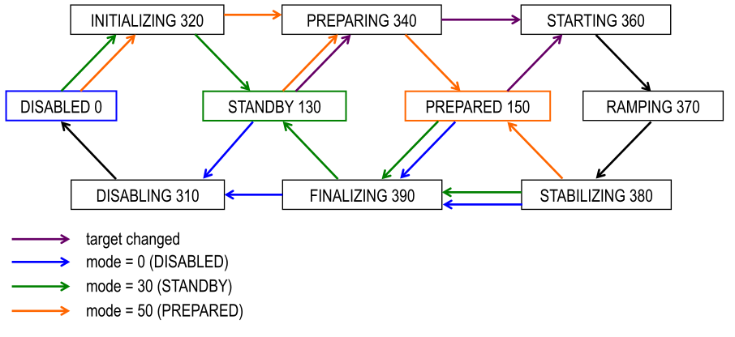

Parameters and commands
=======================

A typical module has several accessibles associated with it.  An accessible is
addressed by the combination of module and accessible name.  There are two basic
types of accessibles: parameters and commands.

Module names have to be unique within an SEC node, accessible names have to be
unique within a module.  Module and accessible names should be in English
(incl. acronyms), using only ASCII letters and digits and some additional
characters (see :ref:`naming`).  The maximum name length is 63 characters.

The following section describes the currently predefined parameters and
commands.  This list will be extended continuously in new SECoP versions.

Basic parameters
~~~~~~~~~~~~~~~~

.. parameter:: value

    A parameter representing the *main* value of a readable module.

.. parameter:: status

    A :ref:`tuple <tuple>` of two elements:

    - A predefined value from an :ref:`enum <enum>`.  The possible values for
      each module are given by the `datainfo` for the status parameter.

      The integer values for the enum must conform to the assignments given in
      :ref:`status-codes`, while the name are free.  However, it is recommended
      to use the given group names if there is only one possible state from the
      given group.

      For example, ``{"IDLE": 100, "BUSY": 300, "ERROR": 400}`` is sufficient
      for most typical modules.

    - A free form descriptive text.

.. parameter:: pollinterval

    A hint to the module for the polling interval in seconds, type is always a
    :ref:`double <double>`.

.. parameter:: target

    Present, if the module's main value is to be changeable remotely, i.e. it
    is at least a `Writable`.

Basic commands
~~~~~~~~~~~~~~

.. command:: stop

    Mandatory command on a drivable.  When a module's target is changed (or, if
    present, when the `go` command is sent), it is 'driving' to a new value
    until the target is reached or until its stop command is sent.

    When the `stop` command is sent, the SEC node SHOULD set the target
    parameter to a value close to the present one.  Then it SHOULD act as if
    this value had been the initial target.

    On an `AcquisitionController`, stops the data acquisition if running.

.. command:: go

    Optional command for starting an action.  If the `go` command is present,
    changing any parameter (especially the 'target' parameter) does not yet
    initiate any action leading to a ``BUSY`` state.

    In contrast, if no `go` command is present, changing the target will start
    an action trying to change the value to get closer to the target, which
    usually leads to a ``BUSY`` state.  Changing any parameter, which has an
    impact on measured values, should be executed immediately.

    On an `AcquisitionController`, starts the data acquisition if not running.

.. command:: hold

    Optional command on a `Drivable`.  Stay more or less where you are, cease
    movement, be ready to continue soon, target value is kept.  Continuation can
    be triggered with `go`, or if not present, by putting the target parameter
    to its present value.

    On an `AcquisitionController`, pauses the data acquisition if running.

.. command:: prepare

    On an `AcquisitionController`, prepares for the following data acquisition
    so that a `go` can be executed immediately.

.. command:: shutdown

    Optional command for shutting down the hardware.  When this command is sent,
    and the status is DISABLED, it is safe to switch off the related device.

Ramping
~~~~~~~

.. parameter:: ramp

    Writable parameter, desired ramp.  Units: main units/min.

.. parameter:: setpoint

    Ramping setpoint, read only.

.. parameter:: time_to_target

    Read only :ref:`double <double>`, expected time to reach target in seconds.

Modes
~~~~~

.. parameter:: mode

    A parameter of datatype :ref:`enum <enum>`, for selecting the operation mode
    of a module.  The available operation modes can not be predefined in the
    specification, since they depend on the specific module.

    The meaning of the operation modes SHOULD be described in the description.

.. _status-codes:

Status codes
~~~~~~~~~~~~

The status code is an integer, obtained as a combination of very general groups
(multiples of 100), sub states (multiples of 10) and custom distinctions if
really needed (single digits).

.. table:: Assignment of status code groups

    ============= ============== =========================================
     Status code   Group name     Meaning
    ============= ============== =========================================
       0           DISABLED       Module is not enabled
     100           IDLE           Module is not performing any action
     200           WARN           The same as IDLE, but something may not
                                  be alright, though it is not a problem (yet)
     300           BUSY           Module is performing some action
     400           ERROR          Module is in an error state, something
                                  turned out to be a problem
    ============= ============== =========================================

For the SEC node, it is recommended to use the given names (second column) for
the status :ref:`enum <enum>` type.  For the ECS, the codes (and not the names)
of the status enum are relevant for the meaning.

.. dropdown:: Sub-states

    .. table:: Assignment of sub states (state within the generic state machine)

        ============= ============== =========================================
         Subcode       Variant name   Meaning
        ============= ============== =========================================
          0            Generic        Used for generic modules not having a state machine
         10            Disabling      Intermediate state: Standby -> **Disabling** -> Disabled
         20            Initializing   Intermediate state: Disabled -> **Initializing** -> Standby
         30            Standby        Stable, steady state, needs some preparation steps,
                                      before a target change is effective
         40            Preparing      Intermediate state: Standby -> **Preparing** -> Prepared
         50            Prepared       Ready for immediate target change
         60            Starting       Target has changed, but continuous change has not yet started
         70            Ramping        Continuous change, which might be used for measuring
         80            Stabilizing    Continuous change has ended, but target value is not yet reached
         90            Finalizing     Value has reached the target and any leftover cleanup operation
                                      is in progress. If the ECS is waiting for the value of this module
                                      being stable at target, it can continue
        ============= ============== =========================================

    Since not all combinations are sensible, the following list shows the so far
    foreseen codes:

    .. table:: Useful statuscodes

        ====== ================ ========== ============== =========================================
         Code   Name             Group      Variant        Meaning
        ====== ================ ========== ============== =========================================
            0   DISABLED         DISABLED   Generic        Module is not enabled
          100   IDLE             IDLE       Generic        Module is not performing any action
          130   STANDBY          IDLE       Standby        Stable, steady state, needs some preparation steps,
                                                           before a target change is effective
          150   PREPARED         IDLE       Prepared       Ready for immediate target change
          200   WARN             WARN       Generic        The same as IDLE, but something may not be alright,
                                                           though it is not a problem (yet)
          230   WARN_STANDBY     WARN       Standby        -''-
          250   WARN_PREPARED    WARN       Prepared       -''-
          300   BUSY             BUSY       Generic        Module is performing some action
          310   DISABLING        BUSY       Disabling      Intermediate state: Standby -> **DISABLING** -> Disabled
          320   INITIALIZING     BUSY       Initializing   Intermediate state: Disabled -> **INITIALIZING** -> Standby
          340   PREPARING        BUSY       Preparing      Intermediate state: Standby -> **PREPARING** -> PREPARED
          360   STARTING         BUSY       Starting       Target has changed, but continuous change has not yet started
          370   RAMPING          BUSY       Ramping        Continuous change, which might be used for measuring
          380   STABILIZING      BUSY       Stabilizing    Continuous change has ended, but target value is not
                                                           yet reached
          390   FINALIZING       BUSY       Finalizing     Value has reached the target and any leftover cleanup operation
                                                           is in progress. If the ECS is waiting for the value of this
                                                           module being stable at target, it can continue
          400   ERROR            ERROR      Generic        An error occurred, module is in an error state,
                                                           something turned out to be a problem
          430   ERROR_STANDBY    ERROR      Standby        An error occurred, module is still in Standby state,
                                                           even after `clear_errors`
          450   ERROR_PREPARED   ERROR      Prepared       An error occurred, module is still in Prepared state,
                                                           even after `clear_errors`
        ====== ================ ========== ============== =========================================

    The distinction between the status values 360 to 380 is important if during a
    target change there is a period when the value changes in a continuous way and
    measurements might be useful.  If there is no such period, for example because
    the value performs some damped oscillation from the beginning of the movement,
    generic BUSY or STABILIZING should be used instead.

Any undefined status code has to be treated like a generic subcode of the given
code number, i.e. 376 should be treated as a BUSY_Ramping until it is defined
otherwise in the specification.

.. note:: A module only needs to declare the status values which it implements,
          i.e. a Readable module does not need a BUSY status.

.. dropdown:: Related issues

    | :issue:`037 Clarification of status`
    | :issue:`059 set_mode and mode instead of some commands`

The interplay between a typical `mode` parameter and the status codes can be
visualized in the following graph:

.. note:: Going to the DISABLED state may also be triggered by changing the mode
          to DISABLED.  If the implementor for security reason wants to prohibit
          any action after a shutdown, this should only be achieved by a
          shutdown command, as disabling the module should be reversible.

Error handling
~~~~~~~~~~~~~~

.. command:: reset

    Optional command for putting the module into a state predefined by the
    implementation.

.. command:: clear_errors

    Optional command to try and clear an error state.  It may be called when
    status is ERROR, and the command will try to transform status to IDLE or
    WARN.  If it can not do it, the status should not change or change to an
    other ERROR state before returning ``done <module>:clear_errors``.

Coupled modules
~~~~~~~~~~~~~~~

.. parameter:: controlled_by

    The control mechanism of a module might be coupled to another module (both
    modules are Drivable or Writable).  This coupling is indicated by the
    `controlled_by` parameter (readonly).  The datatype of the `controlled_by`
    parameter must be an :ref:`enum <enum>`, with the names being module names
    or ``"self"``.  The :ref:`enum <enum>` value of ``"self"`` must be 0.  A
    module with a `controlled_by` parameter indicates that it may be controlled
    by one of the named modules.

    This coupling of two modules influences in particular the behavior of the
    parameters `target` and `value`.  For example a module B (e.g.
    representing the power output of a temperature controller) might be
    controlled by an other module A (e.g. the temperature module related to the
    same temperature controller), linking the behavior of the `value`
    parameter of module B to the `target` of the module A.

    The coupling to the `target` parameter of module B can be realized in two
    ways:

    1) Module A is (constantly) altering the `target` parameter of module B.

    2) The `target` parameter of module B is not updated and the functional
       control of the `target` parameter of module B is switched off.

    Any coupling of this kind must be signaled by the `control_active`
    parameter (see next section).

    Taking over control by a module is done by changing the `target` parameter
    or sending a `go` command to a module.  I.e. module A takes over control
    when a `target` change or a `go` command is sent to the module A. In
    this case, before sending the reply, the `controlled_by` parameter of the
    module B must be set to the controlling module A.  However, when the
    `target` change or a `go` command is sent to module B, the control
    switches over to module B and the `controlled_by` parameter of module B
    has to be set to ``"self"``.  Please notice that in addition, the
    `control_active` parameters of module A and module B have to be set
    correctly (see next section) before sending the reply to a `target` change
    or a `go` command as stated before.

    .. admonition:: Remark

        In case a module A controls several other modules, e.g. a temperature
        module of a liquid helium cryostat controlling the power output
        (module B) and the helium pressure for cooling (module C), additional
        parameters may be needed for selecting the control mode of module A. See
        for example the parameter ``_automatic_nv_pressure_mode`` in the
        example of a liquid helium cooled cryostat.

.. parameter:: control_active

    A readonly flag indicating whether a drivable or writable module is
    currently actively controlling.  On a drivable without `control_active`
    parameter or with ``control_active=true``, the system is trying to bring the
    `value` parameter to the `target` value.  When ``control_active=false``,
    this control mechanism is switched off, and the `target` value is not
    considered any more.  In a typical example we have a module A controlling
    module B (e.g. temperature (A) and power output (B) as stated above) and
    with two possible states, as in the following example:

    =================== ====================== ======================
     state               module A               module B
    =================== ====================== ======================
     A controlling B     control_active=true    controlled_by="A",
                                                control_active=false
     B self controlled   control_active=false   controlled_by="self",
                                                control_active=true
    =================== ====================== ======================

    In another example we have two Writable modules (for example 'I' and 'V' in
    a power supply), which depend on each other in a system where not both may
    be active at the same time.

    =================== ====================== ======================
     state               module I               module V
    =================== ====================== ======================
     constant current    controlled_by="self",  controlled_by="I",
                         control_active=true    control_active=false
     constant voltage    controlled_by="V",     controlled_by="self",
                         control_active=false   control_active=true
    =================== ====================== ======================

    The module with ``control_active=false`` acts like a Readable, its
    `target` parameter is ignored. Changing the `target` value of the latter
    would switch control from one module to the other, toggling the
    `control_active` parameter of both modules.

.. command:: control_off

    A command to turn off active control (i.e setting the parameter
    `control_active` to false).  This command is needed for turning off
    control, when there is no controlled module, e.g. when there is no heater
    module for a temperature loop, or when the heater module is not a Writable.

    In a more general way, `control_off` puts the module into an 'energy
    saving state', switching off active heating and cooling for a temperature
    loop or in case of a motor switching current off.

    Setting the target of a module always turns on active control. It is
    explicitly allowed for a module to have a `control_off` command when a
    controlled module is available (i.e. a module with a `controlled_by`
    parameter with the name of the controlling module).

Parameter postfixes
~~~~~~~~~~~~~~~~~~~

In addition to the static ``"min"`` and ``"max"`` data properties given in the `datainfo` property of a parameter, a SEC
node might offer dynamic limits restricting the allowed range even more.
These limits can be specified in two mutually exclusive ways, either by
individual ``<parameter_name>_min`` and/or ``<parameter_name>_max`` parameters, 
or by a single ``<parameter_name>_limits`` parameter.

.. note:: These dynamic limits are only allowed for parameters with scalar numeric datatypes.

.. parameter:: <parameter_name>_min

    An individual minimum value (of the same type as ``<parameter_name>``)
    specifying the dynamic accepted minimum of a parameter. The SEC node must reply with
    an error in case a given parameter value is below this minimum.

.. parameter:: <parameter_name>_max

    An individual maximum value (of the same type as ``<parameter_name>``)
    specifying the dynamic accepted maximum of a parameter. The SEC node must reply with
    an error in case a given parameter value is above this maximum.

.. parameter:: <parameter_name>_limits

    A :ref:`tuple <tuple>` with two numeric members indicating the lower and
    upper end of a valid interval.  The `datainfo` property of
    ``<parameter_name>`` must match the members of the `datainfo` property of
    ``<parameter_name>_limits``.  The SEC node must reply with an error in case
    a given parameter value does not fit into the interval.

    .. note:: ``<parameter_name>_limits`` and the pair ``<parameter_name>_min`` /
              ``<parameter_name>_max`` are mutually exclusive and may not coexist at the same
              time on the same module.

.. parameter:: <parameter_name>_enable

    An Enum ``{0: "OFF", 1: "ON"}``, allowing to enable or disable the effect of ``<parameter_name>`` where applicable.

.. dropdown:: Related issues

    | :issue:`0073 HasLimits and HasOffset` 
    | :issue:`077 predefined parameter name prefixes` 

Feature related parameters
~~~~~~~~~~~~~~~~~~~~~~~~~~

.. _offset:

.. parameter:: offset

    A storage for an offset to be applied when converting SECoP values to ECS
    values.  See feature `HasOffset`.

Communication
~~~~~~~~~~~~~

.. command:: communicate

    Used for direct communication with hardware, with proprietary commands.  It
    is useful for debugging purposes, or if the implementor wants to give access
    to parameters not supported by the driver.  The datatype might be
    :ref:`string <string>`, or any other datatype suitable to the protocol of the device.
    The `communicate` command is meant to be used in modules with the
    `Communicator` interface class.

Data acquisition
~~~~~~~~~~~~~~~~

.. parameter:: goal

    In an `AcquisitionChannel`, this optional parameter is is the `value` that,
    when reached, stops the data acquisition.

    It is useful to combine this with a ``goal_enable`` parameter that can be
    used to make the channel insensitive to a goal value.

.. parameter:: roi

    In an `AcquisitionChannel` that yields a matrix, this optional parameter can
    be present to restrict the returned data to a subset of the data originally
    acquired by the hardware.

.. command:: get_data

    In an `AcquisitionChannel` that yields a matrix, if this command is present,
    it is used to retrieve the full matrix data.  The `value` parameter then
    returns a reduced form of the data instead, which is suitable for sending in
    frequent `update` events, while the return value of `get_data` can be large.
