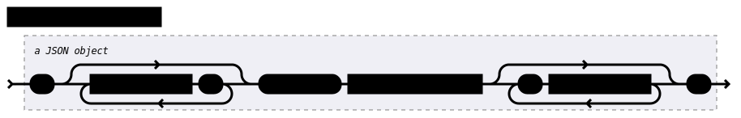

.. _descriptive-data:

Descriptive Data
================

This section explains the "descriptive data", also called "structure report",
i.e. the completely self-describing metadata sent by the SEC node in response to
a ``describe`` message.

The format is JSON, as all other data in SECoP.

.. note:: All names on each hierarchy level need to unique (i.e. not repeated)
          when lowercased.

SEC Node Description
--------------------

.. compound::

    Property:

    .. image:: images/property.svg

Mandatory SEC Node Properties
~~~~~~~~~~~~~~~~~~~~~~~~~~~~~

``"modules"``
    A JSON object with names of modules as key and JSON-objects as values,
    see `Module Description`_.

    .. note:: Be aware that some JSON libraries may not be able to keep the
              order of the items in a JSON objects.  This is not required by the
              JSON standard, and not needed for the functionality of SECoP.
              However, it might be an advantage to use a JSON library which
              keeps the order of JSON object items.

``"equipment_id"``
     Worldwide unique id of an equipment as string.  Should contain the name of
     the owner institute or provider company as prefix in order to guarantee
     worldwide uniqueness.

     Example: ``"MLZ_ccr12"`` or ``"HZB-vm4"``.

``"description"``
     Text describing the node, in general.

     The formatting should follow the 'git' standard, i.e. a short headline (max
     72 chars), followed by ``\n\n`` and then a more detailed description, using
     ``\n`` for linebreaks.

Optional SEC Node Properties
~~~~~~~~~~~~~~~~~~~~~~~~~~~~

``"firmware"``
     Short string naming the version of the SEC node software.

     Example: ``"frappy-0.6.0"``

``"implementor"``
     An optional string.  The implementor of a SEC node, defining the meaning of
     custom modules, status values, custom properties and custom accessibles.
     The implementor **must** be globally unique, for example 'sinq.psi.ch'.
     This may be achieved by including a domain name, but it does not need to be
     a registered name, and other means of assuring a globally unique name are
     also possible.

``"timeout"``
     A time in seconds.  The SEC node should be able to respond within a time
     well below this value, i.e. this is a reply-timeout.  Default: 10 sec,
     *see* :issue:`004 The Timeout SEC Node Property`.

.. _module-description:

Module Description
------------------

.. image:: images/module-description.svg
   :alt: module_description ::= '{' ( property ',' )* '"accessibles":' accessibles ( ',' property )* '}'

Mandatory Module Properties
~~~~~~~~~~~~~~~~~~~~~~~~~~~

``"accessibles"``
    A JSON object describing all the module's accessibles and their properties,
    see `Accessible Description`_.

    .. note:: Be aware that some JSON libraries may not be able to keep the
              order of the items in a JSON objects.  This is not required by the
              JSON standard, and not needed for the functionality of SECoP.
              However, it might be an advantage to use a JSON library which
              keeps the order of JSON object items.

``"description"``
    Text describing the module, formatted like the node property description.

``"interface_classes"``
    List of matching interface classes for the module, for example ``["Magnet",
    "Drivable"]``.

Optional Module Properties
~~~~~~~~~~~~~~~~~~~~~~~~~~

``"visibility"``
    String giving a hint for UIs for which user roles the module should be
    display or hidden.  MUST be one of "expert", "advanced" or "user"
    (default).

    .. note:: This does not imply that the access is controlled.  It is just a
              hint to the UI for the amount of exposed modules.  A visibility of
              "advanced" means that the UI should hide the module for users, but
              show it for experts and advanced users.

``"group"``
    A string identifier for grouping modules in the ECS.  It may contain ":"
    which may be interpreted as path separator between path components.  The
    lowercase version of a path component must not match the lowercase version
    of any module name on the same SEC node.

    Related issue: :issue:`008 Groups and Hierarchy`

``"meaning"``
   A struct with data regarding the module meaning. It provides metadata that is useful for interpreting measurement data in an automatic fashion. It can have the keys ``function``, ``importance``, ``belongs_to``, ``link`` and ``key``, all of which are optional, with some restrictions. A meaning property can also be added on the :ref:`parameter-meaning <paremeter level>`.

   .. note::
      In order for the meaning dictionary to be valid, it must contain at least a ``"link"`` or a ``"function"`` field.

   - ``"function"`` a string from an extensible list of predefined functions.

      Predefined ``"functions"``:
         * ``"temperature"``
         * ``"temperature_regulation"`` (to be specified only if different from 'temperature')
         * ``"magneticfield"``
         * ``"electricfield"``
         * ``"pressure"``
         * ``"rotation_z"`` (counter clockwise when looked at 'from sky to earth')
         * ``"humidity"``
         * ``"viscosity"``
         * ``"flowrate"``
         * ``"concentration"``
         * ``"ph"``
         * ``"conductivity"``
         * ``"voltage"``
         * ``"surfacepressure"``
         * ``"stress"``
         * ``"strain"``
         * ``"shear"``
         * ``"heliumlevel"``

        This list may be extended later.

        ``_regulation`` may be postfixed, if the quantity generating module is different from the relevant measuring device. A regulation device MUST have an
        :ref:`interface class <interface-classes>` of at least ``Writable``.

        :related issue: :issue:`026 More Module Meanings`

   - ``"importance"``  an integer value in the range ``[0,50]`` describing the importance. It allows ordering elements of the same tuple of ``"function"`` and ``"belongs_to"`` by importance.

      Predefined values:
        * 10 means the instrument/beamline (Example: room temperature sensor always present)
        * 20 means the surrounding sample environment (Example: VTI temperature)
        * 30 means an insert (Example: sample stick of dilution insert)
        * 40 means an addon added to an insert (Example: a device mounted inside a dilution insert)

      Intermediate values might be used. The range for each category starts at the indicated value minus 5 and ends below the indicated value plus 5.

      .. note::
         - This field can only be present, if and only if there is an entry for ``"function"``

      :related issue: :issue:`009 Module Meaning`

   - ``"belongs_to"`` a string identifying the entity to which the module is linked. Setting this field forms a relation between the entity and the ``"function"`` field.

      Predefined entities:
         * ``"sample"``
         * ``"other"``
      .. note::
         - If not present, the default value ``"belongs_to":"other"`` is assumed.
         - This field can only be present, if there is an entry for ``"function"``

   - ``"link"`` a link to a vocabulary, glossary or ontology. Preferably a PID (Persistent Identifier) pointing to a specific entry.

   - ``"key"`` a key (string) that selects an entry from the knowledge representation that ``"link"`` points to. This mainly serves human readability if ``"link"`` already points to a specific entry.

      .. note::
         - This field must not be present if there is no ``"link"``
         - If ``"link"`` does not point directly to an entry, the ``"key"`` field is mandatory

    Example:

    .. code::

    "meaning": {
        "function": "temperature_regulation",
        "importance": 20,
        "belongs_to": "sample",
        "link": "https://w3id.org/nfdi4cat/voc4cat_0000051",
        "key": "synthesis temperature"
    }

    This reads as:
    Regulation of the sample (``belongs_to``) temperature (``function``) in the surrounding sample environment (``importance``).The ``key`` and ``link`` give additional metadata, saying that the regulated temperature is also the ``synthesis temperature`` of the experiment.

    Allowed key combinations in valid meaning dictionaries:

    .. code::

    {function, importance,belongs_to}
    {function, importance}
    {key,link}
    {link}
    {function, importance,link}
    {function, importance,key,link}
    {function, importance,belongs_to,link}
    {function, importance,belongs_to,key,link}

.. _implementor:

``"implementor"``
    An optional string giving the implementor of a module, defining the meaning
    of custom status values, custom properties and custom accessibles.  The
    implementor must be globally unique, for example 'sinq.psi.ch'.  This may
    be achieved by including a domain name, but it does not need to be a
    registered name, and other means of assuring a global unique name are also
    possible.

Accessible Description
----------------------

.. image:: images/accessible-description.svg
   :alt: accessible_description ::= '{' property+ '}'

Mandatory Accessible Properties
~~~~~~~~~~~~~~~~~~~~~~~~~~~~~~~

``"description"``
    A string describing the accessible, formatted as for module description or
    node description.

Mandatory Parameter Properties
~~~~~~~~~~~~~~~~~~~~~~~~~~~~~~

.. _prop-readonly:

``"readonly"``
    A boolean value.  Indicates whether this parameter may be changed by an ECS,
    or not.

``"datainfo"``
    Contains information on the type of data provided by the accessible and
    associated metadata, such as units.

    See :ref:`data-types`.

    .. note:: Parameters and commands can be distinguished by the ``datainfo``;
              the latter have a datainfo of ``{"type": "command", ...}``.

Optional Accessible Properties
~~~~~~~~~~~~~~~~~~~~~~~~~~~~~~

``"group"``
    A string identifier for grouping accessibles in the ECS.  It may contain ":"
    which may be interpreted as path separator between path components.  The
    lowercase version of a path component must not match the lowercase version
    of any module name or accessible on the same SEC node.

    Related issue: :issue:`008 Groups and Hierarchy`

    .. note:: The accessible property ``group`` is used for grouping of
              accessibles within a module, the module property ``group`` is used
              for grouping of modules within a node.

``"visibility"``
    A string indicating a hint for a GUI about the visibility of the accessible.
    Values and meaning are interpreted as for the module visibility above.

    .. note:: Setting an accessible's visibility equal or higher than its
              module's visibility has the same effect as omitting the
              visibility.  For example, a client respecting visibility in 'user'
              mode, will not show modules with 'advanced' visibility, and
              therefore also not their accessibles.

Optional Parameter Properties
~~~~~~~~~~~~~~~~~~~~~~~~~~~~~

``"constant"``
    Optional, contains the constant value of a constant parameter.  If given,
    the parameter is constant and has the given value.  Such a parameter can
    neither be read nor written, and it will **not** be transferred after the
    activate command.

    The value given here must conform to the data type of the accessible.

.. _parameter-meaning:
``"meaning"``
   A dictionary regarding the parameter meaning. It has the same specification as the :ref:`module-meaning <module meaning>`.

Custom Properties
-----------------

Custom properties may further augment accessibles, modules or the SEC node
description.

As for all custom extensions, their names must be prefixed with an underscore.
The meaning of custom properties depends on the implementor, given by the
`implementor`_ module property.  An ECS that doesn't know the meaning of a
custom property MUST ignore it.  The data type of a custom property is not
pre-defined, an ECS should be prepared to handle anything here.
