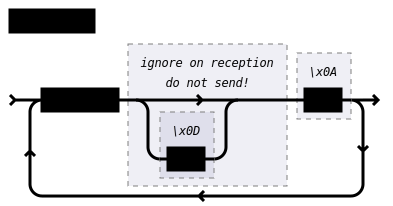

Messages
========

This section specifies the structure of the transmissions that happen over a
connection with SECoP ("on the wire").  This is primarily relevant for
implementors of clients and/or servers, users in general will find
:doc:`modules` more relevant.

Data transfer
-------------

SECoP relies on a stream transport of 8-bit bytes.  Most often this will be a
TCP conection.  In those cases the SEC node SHOULD support as many parallel
simultaneous connections as technically feasible.

"Serial port" style connections may also be used.  Here, only a single
connection can be used.  If several connections are needed, a 'multiplexer' is
needed.  This should offer multiple TCP connections and contain the necessary
logic to map requests/replies from/to those network connections onto/from the
serial connection to the actual SEC node.

Transfer modes
--------------

Essentially the connections between an ECS and a SEC node can operate in one of
two modes:

Synchronous mode:
   where a strict request/reply pattern is used.

Async mode:
   where an update may arrive any time (even between requests and replies).

In both cases, a request from the ECS to the SEC node must be followed by an
reply from the SEC node to the ECS, either indicating success of the request or
flag an error.

.. note::

    An ECS may try to send a request before it received the reply to an earlier
    request.  This has two implications:

    - A SEC node may serialize requests and fulfill them strictly in order.  In
      that case the ECS should not overflow the input buffer of the SEC node.
    - The second implication is that an ECS which sends multiple requests before
      the replies arrive, MUST be able to handle the replies arriving
      out-of-order.  Unfortunately there is currently no indication if a SEC
      node is operating strictly in order or if it can work on multiple requests
      simultaneously.

Messages
--------

The received byte stream is split into messages, which are the smallest unit of
communication for SECoP.

A message is essentially one line of text, coded in ASCII (may be extended to
UTF-8 later if needed).  A message ends with a line feed character (ASCII 10),
which may be preceded by a carriage return character (ASCII 13), which must be
ignored.

All messages share the same basic structure:

i.e. a message starts with an action keyword, followed optionally by one space
and a specifier (not containing spaces), followed optionally by one space and a
JSON value (see :rfc:`8259`) called data, which absorbs the remaining characters
up to the final LF.

.. note:: Numerical values and strings appear 'naturally' formatted in
   JSON values, i.e. ``5.0`` or ``"a string"``.

The specifier consists of a module identifier, and for most actions, followed by
a colon as separator and an accessible identifier.  In special cases
(e.g. ``describe``, ``ping``), the specifier is just a token or may be empty:

All identifiers (for properties, accessibles and modules) are composed of ASCII
letters, digits and underscores, where a digit may not appear as the first
character.

Identifiers starting with underscore ('custom-names') are reserved for custom
extensions, e.g. messages or parameters not specified by the standard.  The
identifier length is limited (<=63 characters).

.. note::

    Although names MUST be compared/stored case sensitive, names in each scope
    need to be unique when lowercased.  The scopes are:

    - module names on a SEC node (including the group entries of those modules)
    - accessible names of a module (including the group entries of those
      parameters) - each module has its own scope
    - properties
    - names of elements in a :ref:`struct` (each struct has its own scope)
    - names of variants in an :ref:'enum` (each enum has its own scope)
    - names of qualifiers

SECoP defined names are usually lowercase, though that is not a restriction
(esp. not for module names).

A SEC node might implement custom messages for debugging purposes, which are not
part of the standard.  Custom messages start with an underscore or might just be
an empty line.  The latter might be used as a request for a help text, when
logged in from a command line client like telnet or netcat.  Messages not
starting with an underscore and not defined in the following list are reserved
for future extensions.

When implementing SEC nodes or ECS clients, a 'MUST-ignore' policy should be
applied to unknown or additional parts.  Unknown or malformed messages are to be
replied with an appropriate ``ProtocolError`` by a SEC node.  An ECS-client must
ignore the extra data in such messages.  See also section
:ref:`future-compatibility`.

.. _messages:

Message overview
----------------

To clarify optionality of some messages, the following table is split into two:
basic messages (which MUST be implemented like specified) and extended messages
which SHOULD be implemented.

.. note:: For clarification, the symbol "``␣``" is used here instead of a space
          character.  ``<elem>`` refers to the element elem which is defined in
          another section.

.. table:: Basic messages (implementation is mandatory).

    ======================= ============== ==================
     Message intent          Message kind   Message elements
    ======================= ============== ==================
     `identification`_       request        ``*IDN?``
          \                  reply          ``ISSE&SINE2020,SECoP,<version>,<add-info>``
     `description`_          request        ``describe``
          \                  reply          ``describing␣.␣<structure-report>``
     `activate updates`_     request        ``activate``
          \                  reply          ``active``
     `deactivate updates`_   request        ``deactivate``
          \                  reply          ``inactive``
     `heartbeat`_            request        ``ping␣<identifier>``
          \                  reply          ``pong␣<identifier>␣<data-report>``
     `read request`_         request        ``read␣<module>:<parameter>``
        \                    reply          ``reply␣<module>:<parameter>␣<data-report>``
     `change value`_         request        ``change␣<module>:<parameter>␣<value>``
          \                  reply          ``changed␣<module>:<parameter>␣<data-report>``
     `execute command`_      request        ``do␣<module>:<command>`` (argumentless commands)
          \                       \         ``do␣<module>:<command>␣<value>``
          \                  reply          ``done␣<module>:<command>␣<data-report>``
     value update_  event    event          ``update␣<module>:<parameter>␣<data-report>``
     `error reply`_          reply          ``error_<action>␣<specifier>␣<error-report>``
    ======================= ============== ==================

All these messages must be implemented.  For example, ``change`` is mandatory,
even if only readonly accessibles are present.  In this case, a ``change``
message will naturally be replied with an ``error_change`` message with an
:ref:`Error class <error-classes>` of "ReadOnly" and not with a "ProtocolError".

.. table:: Extended messages (implementation is optional).

    ======================= ============== ==================
     Message intent          Message kind   Message elements
    ======================= ============== ==================
     `logging`_              request        ``logging␣<module>␣<loglevel>``
         \                   reply          ``logging␣<module>␣<loglevel>``
         \                   event          ``log␣<module>:<loglevel>␣<message-string>``
     `activate updates`_,    request        ``activate␣<module>``
       module-wise           reply          ``active␣<module>``
     `deactivate updates`_,  request        ``deactivate␣<module>``
       module-wise           reply          ``inactive␣<module>``
     `heartbeat`_,           request        ``ping``
      with empty identifier  reply          ``pong␣␣<data-report>``
    ======================= ============== ==================

Theory of operation:
    After a connection between an ECS and a SEC node is established, the client
    must verify that the SEC node is speaking a supported protocol by sending an
    identification_ request and checking the answer from the SEC node to comply.
    If this check fails, the connection is to be closed and an error reported.

    The second step is to query the structure of the SEC node by an exchange of
    description_ messages.  After this step, the ECS knows all it needs to know
    about this SEC node and can continue to either stick to a request/reply
    pattern or `activate updates`_.  In any case, an ECS should correctly handle
    updates, even if it didn't activate them, as that may have been performed by
    another client on a shared connection.

Message intents
---------------

.. _message-identification:

Identification
~~~~~~~~~~~~~~

The syntax of the identification message differs a little from other messages,
as it is meant to be compatible with IEEE 488.2. The identification request
``*IDN?`` is meant to be sent as the first message after establishing a
connection.  The reply consists of 4 comma separated fields, where the second
and third field determine the used protocol.

In this and in the following examples, messages sent to the SEC node are marked
with "> ", and messages sent to the ECS are marked with "< ".

Example:

.. code::

    > *IDN?
    < ISSE&SINE2020,SECoP,V2019-09-16,v1.0

So far the SECoP version is given like ``V2019-09-16``, i.e. a capital "V"
followed by a date in ``year-month-day`` format with 4 and 2 digits
respectively.  The ``add-info`` field was used to differentiate between draft,
release candidates and final.  It is now used to indicate a release name.

.. _message-describe:

Description
~~~~~~~~~~~

The next messages normally exchanged are the description request and reply.  The
reply contains the "structure report", i.e. a JSON object describing the name of
modules exported and their parameters, together with the corresponding
properties.  This is explained in detail in :ref:`descriptive-data`.

Example:

.. code::

    > describe
    < describing . {"modules":{"t1":{"interface_classes":["TemperatureSensor","Readable"],"accessibles":{"value": ...

The dot (second item in the reply message) is a placeholder for extensibility
reasons and may be changed in a later revision.  A client implementing the
current specification MUST ignore it.

.. note:: This reply might be a very long line, no raw line breaks are allowed
          in the JSON part.  Clients MUST implement a reasonable buffer size for
          these replies or use a streaming JSON decoder.

.. _message-activate:

Activate Updates
~~~~~~~~~~~~~~~~

The parameterless "activate" request triggers the SEC node to send the values of
all its modules and parameters as update messages (initial updates).  When this
is finished, the SEC node must send an "active" reply (*global activation*).

This initial update is to help the ECS establish a copy of the
'assumed-to-be-current' values.  The values transferred are not necessarily read
fresh from the hardware, check the timestamps!

.. note:: An ECS MUST be able to handle the case of an extra update occurring
          during the initial phase, i.e. it must handle the case of receiving
          more than one update for any valid specifier.

A SEC node might accept a module name as second item of the message
(*module-wise activation*), activating only updates on the parameters of the
selected module.  In this case, the "active" reply also contains the module
name.

A SEC node not implementing module-wise activation MUST NOT send the module name
in its reply to an module-wise activation request, and MUST activate all modules
(*fallback mode*).

.. _message-update:

Update
~~~~~~

When activated, update messages are delivered without explicit request from the
client.  The value is a `data-report`, i.e. a JSON array with the value as its
first element, and an JSON object containing the :ref:`qualifiers` as its second
element.

If an error occurs while determining a parameter, an ``error_update`` message
has to be sent, which includes an <:ref:`error-report`> stating the problem.

Example:

.. code::

  > activate
  < update t1:value [295.13,{"t":150539648.188388,"e":0.01}]
  < update t1:status [[400,"heater broken or disconnected"],{"t":1505396348.288388}]
  < active
  < error_update t1:_heaterpower ["HardwareError","heater broken or disconnected",{"t":1505396349.20}]
  < update t1:value [295.14,{"t":1505396349.259845,"e":0.01}]
  < update t1:value [295.13,{"t":1505396350.324752,"e":0.01}]

The example shows an ``activate`` request triggering an initial update of two
values: ``t1:value`` and ``t1:status``, followed by the ``active`` reply.  Also,
an ``error_update`` for a parameter ``_heaterpower`` is shown.  After this, two
more updates on the ``t1:value`` show up with roughly 1 second between each.

.. note:: It is vital that all initial updates are sent, **before** the 'active'
          reply is sent!  An ECS may rely on having gotten all values.

To speed up the activation process, polling and caching of all parameters on the
SEC node is advised, i.e. the parameters should not just be read from hardware
for activation, as this may take a long time.

Another example with a broken sensor:

.. code::

    > activate
    < error_update t1:value ["HardwareError","Sensor disconnected", {"t":1505396348.188388}]}]
    < update t1:status [[400,"Sensor broken or disconnected"],{"t":1505396348.288388}]
    < active

Here the current temperature can not be obtained.  An ``error_update`` message
is used instead of ``update``.

.. _message-deactivate:

Deactivate Updates
~~~~~~~~~~~~~~~~~~

A parameterless message.  After the "inactive" reply no more updates are
delivered if not triggered by a read message.

Example:

.. code::

    > deactivate
    < update t1:value [295.13,{"t":1505396348.188388}]
    < inactive

.. admonition:: Remark

    The update message in the second line was sent before the deactivate message
    was treated.  After the "inactive" message, the client can expect that no
    more untriggered update message are sent, though it MUST still be able to
    handle (or ignore) them, if they still occur.

The deactivate message might optionally accept a module name as second item of
the message for module-wise deactivation.  If module-wise deactivation is not
supported, the SEC node should ignore a deactivate message which contains a
module name and send an ``error_deactivate`` reply.  This requires the ECS being
able to handle update events at any time!

It is not clear if module-wise deactivation is really useful.  A SEC node
supporting module-wise activation does not necessarily need to support
module-wise deactivation.

.. _message-read:

Read Request
~~~~~~~~~~~~

With the read request message, the ECS may ask the SEC node about a reasonable
recent 'current' value.  In most cases this means that the hardware is read to
give a fresh value.  However, there are use cases where either an internal
control loop is running anyway in which case it is perfectly fine to return the
internally cached value.  When it can take a long time to actually obtain a
fresh value, it is also acceptable to return the most recently obtained value.
In any way, the timestamp qualifier should indicate the time the value was
**obtained**.

Example:

.. code::

    > read t1:value
    < reply t1:value [295.13,{"t":1505396348.188}]
    > read t1:status
    > reply t1:status [[100,"OK"],{"t":1505396348.548}]

.. _message-change:

Change Value
~~~~~~~~~~~~

The change value message contains the name of the module or parameter and the
value to be set.  The value is JSON formatted.  As soon as the set-value is read
back from the hardware, all clients, having activated the parameter/module in
question, get an "update" message.  After all side-effects are communicated, a
"changed" reply is then send, containing a `data-report` of the read-back value.

.. admonition:: Remarks

    * If the value is not stored in hardware, the "update" message can be sent
      immediately.
    * The read-back value should always reflect the value actually used.
    * A client in async mode may get an ``update`` message before the
      ``changed`` message, both containing the same data report.

Example on a connection with activated updates.  Qualifiers are replaced by
``{...}`` for brevity here.

.. code::

    > read mf:status
    < reply mf:status [[100,"OK"],{...}]
    > change mf:target 12
    < update mf:status [[300,"ramping field"],{...}]
    < update mf:target [12,{...}]
    < changed mf:target [12,{...}]
    < update mf:value [0.01293,{...}]

The status changes from "idle" (100) to "busy" (300).  The ECS will be informed
with a further update message on ``mf:status``, when the module has finished
ramping.  Until then, it will get regular updates on the current main value (see
last update above).

.. note:: It is vital that all 'side-effects' are realized (i.e. stored in
          internal variables) and be communicated **before** the 'changed' reply
          is sent!

.. XXX move this below!

Correct handling of side-effects:
    To avoid difficult to debug race conditions, the following sequence of
    events should be followed whenever the ECS wants to initiate an action:

    1) ECS sends the initiating message request (either ``change`` or ``do``)
       and awaits the response.

    2) SEC node checks the request and if it can be performed. If not, SEC node
       sends an error-reply (sequence done).  If nothing is actually to be done,
       continue to point 4.

    3) If the action is fast-finishing, it should be performed and the sequence
       should continue to point 4.  Otherwise the SEC node 'sets' the status
       code to ``BUSY`` and instructs the hardware to execute the requested
       action.  Also an ``update`` status event (with the new BUSY status-code)
       MUST be sent to **ALL** activated clients (if any).  From now on, all
       read requests will also reveal a BUSY status-code.  If additional
       parameters are influenced, their updated values should be communicated as
       well.

    4) SEC node sends the reply to the request of point 2 indicating the success
       or failure of the request.

       .. note:: An error may be replied after the status was set to BUSY if
          triggering the intended action failed (communication problems?).

    5) When the action is finally finished and the module no longer to be
       considered ``BUSY``, an ``update`` status event to ``IDLE`` MUST be sent,
       also subsequent status queries should reflect the now no longer BUSY
       state. Of course, all other parameters influenced by this should also
       communicate their new values.

    An ECS establishing more than one connection to the same SEC node and which
    **may** process the ``update`` event message from point 3 after the reply of
    point 4 MUST query the status parameter synchronously to avoid the
    race-condition of missing the (possible) BUSY status-code.

    Temporal order should be kept wherever possible!

.. _message-do:

Execute Command
~~~~~~~~~~~~~~~

Actions can be triggered with a command.  If an action needs significant time to
complete (i.e. longer than a fraction of a second), the information about the
duration and success of such an action has to be transferred via the ``status``
parameter.

If a command is specified with an argument, the actual argument is given in the
data part as a JSON value.  This may be also a JSON object if the datatype of
the argument specifies that (i.e. the type of the single argument can also be a
struct, tuple or an array, see :ref:`data-types`).  The types of arguments must
conform to the declared datatypes from the datatype of the command argument.

A command may have a return value, which may also be structured.  The "done"
reply always contains a `data-report` with the return value.  If no value is
returned, the data part is set to "null".  The "done" message should be returned
quickly, the time scale should be in the order of the time needed for
communications.  Still, all side-effects need to be realized and communicated
before sending the ``done`` message.

.. note::

    If a command does not require an argument, an argument MAY still be
    transferred as JSON null.  A SEC node MUST accept and treat the following
    two messages the same:

    - ``do <module>:<command>``
    - ``do <module>:<command> null``

    An ECS SHOULD only generate the shorter version.

Example:

.. code::

    > do t1:stop
    < done t1:stop [null,{"t":1505396348.876}]

    > do t1:stop null
    < done t1:stop [null,{"t":1505396349.743}]

.. _error-reply:

Error Reply
~~~~~~~~~~~

Contains an error class from the list below as its second item (the specifier).
The third item of the message is an :ref:`error-report`, containing the request
message (minus line endings) as a string in its first element, a (short) human
readable text as its second element.  The third element is a JSON object,
containing possibly implementation specific information about the error (stack
dump etc.).

Example:

.. code::

    > read tx:target
    < error_read tx:target ["NoSuchModule","tx is not configured on this SEC node", {}]
    > change ts:target 12
    < error_change ts:target ["NoSuchParameter","ts has no parameter target", {}]
    > change t:target -9
    < error_change t:target ["BadValue","requested value (-9) is outside limits (0..300)", {}]
    > meas:volt?
    < error_meas:volt?  ["ProtocolError","unknown action", {}]

.. _error-classes:

_`Error Classes`:
    Error classes are divided into two groups: persisting errors and retryable
    errors.  Persisting errors will yield the exact same error message if the
    exact same request is sent at any later time.  A retryable error may give
    different results if the exact same message is sent at a later time, i.e.
    depends on state information internal to either the SEC node, the module or
    the connected hardware.

    .. list-table:: Persisting errors
        :widths: 20 80

        * - ``ProtocolError``
          - A malformed Request or on unspecified message was sent.  This
            includes non-understood actions and malformed specifiers.  Also if
            the message exceeds an implementation defined maximum size.  *Note:
            this may be retryable if induced by a noisy connection.*

        * - ``NoSuchModule``
          - The action can not be performed as the specified module is
            non-existent.

        * - ``NoSuchParameter``
          - The action can not be performed as the specified parameter is
            non-existent.

        * - ``NoSuchCommand``
          - The specified command does not exist.

        * - ``ReadOnly``
          - The requested write can not be performed on a readonly value.

        * - ``WrongType``
          - The requested parameter change or command can not be performed as
            the argument has the wrong type, e.g. a string where a number is
            expected, or a struct doesn't have all required members.

        * - ``RangeError``
          - The requested parameter change or command can not be performed as
            the argument value is not in the allowed range specified by the
            ``datainfo`` property.  This also happens if an unspecified enum
            variant is tried to be used, the size of a blob or string does not
            match the limits given in the descriptive data, or if the number of
            elements in an array does not match the limits given in the
            descriptive data.

        * - ``BadJSON``
          - The data part of the message can not be parsed, i.e. the JSON data
            is not valid JSON.

        * - ``NotImplemented``
          - A (not yet) implemented action or combination of action and
            specifier was requested.  This should not be used in productive
            setups, but is very helpful during development.

        * - ``HardwareError``
          - The connected hardware operates incorrectly or may not operate at
            all due to errors inside or in connected components.

    .. list-table:: Retryable errors
        :widths: 20 80

        * - ``CommandRunning``
          - The command is already executing.  The request may be retried after
            the module is no longer BUSY.

        * - ``CommunicationFailed``
          - Some communication (with hardware controlled by this SEC node)
            failed.

        * - ``TimeoutError``
          - Some initiated action took longer than the maximum allowed time.

        * - ``IsBusy``
          - The requested action can not be performed while the module is BUSY
            or the command still running.

        * - ``IsError``
          - The requested action can not be performed while the module is in
            error state.

        * - ``Disabled``
          - The requested action can not be performed while the module is
            disabled.

        * - ``Impossible``
          - The requested action can not be performed at the moment.

        * - ``ReadFailed``
          - The requested parameter can not be read just now.

        * - ``OutOfRange``
          - The value read from the hardware is out of sensor or calibration
            range.

        * - ``InternalError``
          - Something that should never happen just happened.

    .. note:: This list may be extended, if needed.  Clients should treat
              unknown error classes as generic errors.

.. _message-log:

Logging
~~~~~~~

Logging is an optional message, i.e. a SEC node is not forced to implement it.

``logging``
    followed by a specifier of ``<modulename>`` and a string in the JSON part
    which is either "debug", "info", "error" or "off".  This is supposed to set
    the 'logging level' of the given module (or the whole SEC node if the
    specifier is empty) to the given level:

    This scheme may also be extended to configure logging only for selected
    parameters of selected modules.

    "off"
        Remote logging is completely turned off.
    "error"
        Only errors are logged remotely.
    "info"
        Only 'info' and 'error' messages are logged remotely.
    "debug"
        All log messages are logged remotely.

    A SEC node should reply with an :ref:`error-report` (``ProtocolError``) if
    it doesn't implement this message.  Otherwise it should mirror the request,
    which may be updated with the logging-level actually in use.  I.e. if an SEC
    node does not implement the "debug" level, but "error" and "info" and an ECS
    requests "debug" logging, the reply should contain "info" (as this is
    'closer' to the original request than "error") or "off".  Similarly, if
    logging of a too specific item is requested, the SEC node should activate
    the logging on the least specific item where logging is supported.  E.g. if
    logging for ``<module>:<param>`` is requested, but the SEC node only
    supports logging of the module, this should be reflected in the reply and
    the logging of the module is to be influenced.

    .. note:: It is not foreseen to query the currently active logging level.
              It is supposed to default to ``"off"``.

``log``
    followed by a specifier of ``<modulename>:<loglevel>`` and the message to
    be logged as JSON string in the datapart.  This is an asynchronous event
    only to be sent by the SEC node to the ECS which activated logging.

Example::

    # note: empty specifier -> select all modules
    > logging  "error"
    # SEC node confirms
    < logging  "error"
    < log mod1:debug "polling value"
    < log mod1:debug "sending request..."
    ...

Another example::

    # enable full logging of mod1
    > logging mod1 "debug"
    # SEC node can only log errors, logging of errors of mod1 is now active
    < logging mod1 "error"
    < log mod1:error "value par1 can not be determined, please refill read-out liquid"
    ...
    > logging mod1 false
    < logging mod1 false

.. _message-heartbeat:

Heartbeat
~~~~~~~~~

In order to detect that the other end of the communication is not dead, a
heartbeat may be sent.  The second part of the message (the id) must not contain
a space and should be short and not be re-used.  It may be omitted. The reply
will contain exactly the same id.

A SEC node replies with a ``pong`` message with a `data-report` of a null value.
The :ref:`qualifiers` part SHOULD only contain the timestamp (as member "t") if
the SEC node supports timestamping.  This can be used to synchronize the time
between ECS and SEC node.

.. note:: The qualifiers could also be an empty JSON-object, indicating lack of
          timestamping support.

For debugging purposes, when *id* in the ``ping`` request is omitted, in the
``pong`` reply there are two spaces after ``pong``.  A client SHOULD always send
an id.  However, the client parser MUST treat two consecutive spaces as two
separators with an empty string in between.

Example:

.. code::

  > ping 123
  < pong 123 [null, {"t": 1505396348.543}]

.. admonition:: Related Issues

   | :issue:`003 Timestamp Format`
   | :issue:`007 Time Synchronization`

.. _message-overview:

Compatibility
-------------

This specification defines a set of requests and replies above.  Only those
messages are ALLOWED to be generated by any software complying to this
specification:

.. compound::
    Any ECS is allowed to generate the following messages:

    .. image:: images/defined-requests.svg
       :alt: defined_requests

.. compound::
    Any SEC node is allowed to generate the following messages:

    .. image:: images/defined-replies.svg
       :alt: defined_replies

The specification is intended to grow and adopt to new needs. (Related issue:
:issue:`038 Extension mechanisms`.) To futureproof the the communication, the
following messages MUST be parsed and treated correctly (i.e. the ignored_value
part is to be ignored).

.. compound::
    Any SEC node **MUST** accept the following messages and handle them properly:

    .. image:: images/must-accept-requests.svg
       :alt: must_accept_requests

.. compound::
    Any ECS **MUST** accept the following messages and handle them accordingly:

    .. image:: images/must-accept-replies.svg
       :alt: must_accept_replies

As a special case, an argumentless command may also by called without specifying
the data part.  In this case an argument of null is to be assumed.  Also, an
argumentless ping is to be handled as a ping request with an empty token string.
The corresponding reply then contains a double space.  This MUST also be parsed
correctly.

Similarly, the reports need to be handled like this:

.. _`data-report`:

.. compound::
    Data report:

    .. image:: images/data-report.svg
       :alt: data_report ::= "[" JSON-value "," qualifiers ("," ignored_value)* "]"

.. _`error-report`:

.. compound::
    Error report:

    .. image:: images/error-report.svg
       :alt: error_report ::= '["' errorclass '","' error_msg '",' error_info ("," ignored_value)* "]"

Essentially this boils down to:

1) ignore additional entries in the list-part of reports
#) ignore extra keys in the qualifiers, structure report and error report
   mappings
#) ignore message fields which are not used in the definition of the messages
   (i.e. for `describe`)
#) treat needed, but missing data as null (or an empty string, depending on
   context)
#) if a specifier contains more ":" than you can handle, use the part you
   understand, ignore the rest (i.e. treat ``activate module:parameter`` as
   ``activate module``, ignoring the ``:parameter`` part)
#) same for error class (i.e. treat ``WrongType:MustBeInt`` as ``WrongType``,
   ignoring the ``:MustBeInt`` part)
#) upon parsing a value, when you know it should be one element from an
   :ref:`enum` (which SHOULD be transported as integer), if you find a string
   instead and that string is one of the names from the Enum, use that entry.
#) check newer versions of the specification and check the issues as well, as
   the above may change

Complying to these rules maximizes the possibility of future + backwards
compatibility.

.. note:: Also check :issue:`036 Dynamic units` *as it may have implications for
          a certain implementation.*

Handling Timeout Issues
~~~~~~~~~~~~~~~~~~~~~~~

If a timeout happens, it is not easy for the ECS to decide on the best strategy.
Also there are several types of timeout: idle-timeout, reply-timeout, etc...
Generally speaking: both ECS and SEC side need to be aware that the other side
may close the connection at any time!  On reconnect, it is recommended that the
ECS sends a ``*IDN?`` and a ``describe`` message.  If the responses match the
responses from the previous connection, the ECS should continue without any
internal reconfiguring, as if no interruption happened.  If the response of the
description does not match, it is up to the ECS to handle this.

Naturally, if the previous connection was activated, an ``activate`` message has
to be sent before it can continue as before.

.. admonition:: Related Issues

   | :issue:`004 The Timeout SEC Node Property`
   | :issue:`006 Keep Alive`
