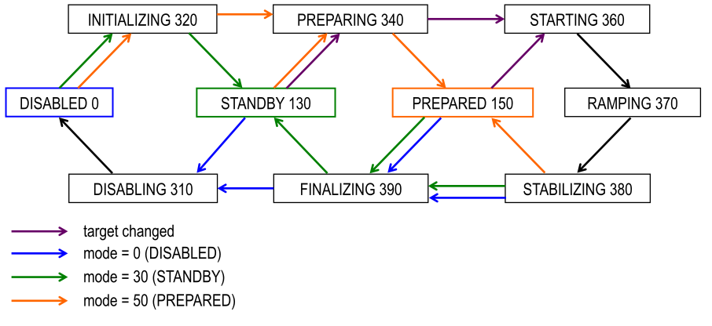

.. _modules:

Modules
=======

Definition: Module
    A named logical component of an abstract view of the equipment.

    We intentionally avoid the term "device", which might be misleading, as
    "device" is often used for an entire apparatus, like a cryomagnet or
    humidity cell.  In the context of SECoP, an apparatus in general is composed
    of several modules.  For example different temperature sensors in one
    apparatus are to be seen as different modules.

    Most modules should correspond to one independently measurable physical
    quantity and use one of the interface classes Readable_, Writable_ or
    Drivable_.  However, more specialized modules like Communicator_ can be
    implemented where appropriate.

A SEC node controls a set of named modules.  Modules are fully specified by the
descriptive data, see :ref:`module-description`.

.. _accessibles:

Accessibles
-----------

A typical module has several accessibles associated with it.  An accessible is
addressed by the combination of module and accessible name.  Module names have
to be unique within an SEC node, accessible names have to be unique within a
module.  There are two basic types of accessibles: parameters and commands.

Module and accessible names should be in English (incl. acronyms), using only
ASCII letters and digits and some additional characters (see :ref:`messages`).
The maximum name length is 63 characters.

Definition: Parameter
    A piece of data associated with a module, typically in one of three
    categories:

    - physical or hardware defined, e.g. ``value`` or ``pid``
    - informational, e.g. ``status``
    - controlling the operation of the module, e.g. ``pollinterval``

    The main parameter of a module is its value.  Writable parameters may
    influence the measurement (like PIDs).  Additional parameters may give more
    information about its state (running, target reached), or details about its
    functioning (heater power) for diagnostics purposes.  Parameters with a
    predefined meaning are listed in the standard, they must always be used in
    the same way.  Custom parameters are defined by the implementation of the
    SEC node and their name must start with an underscore.  The ECS can use
    unknown parameters only in a generic way, as their meaning is not known.

Definition: Command
    Commands are provided to initiate specified actions of the module.
    They should generate an appropriate reply immediately after that action is
    initiated, i.e. should not wait until some other state is reached.

    However, if the command triggers side-effects, they MUST be communicated
    before the reply is sent.  Commands may use an possibly structured argument
    and may return a possibly structured result.  Commands with a predefined
    meaning are listed in the standard, they must always be used in the same
    way. Custom commands are defined by the implementation of the SEC node, the
    ECS can use them only in a general way, as their meaning is not known.

The following section describes the currently predefined accessibles, this list
will be extended continuously.

Basic Parameters
~~~~~~~~~~~~~~~~

Parameter ``"value"``:
    A parameter representing the *main* value of a readable module.

Parameter ``"status"``:
    A :ref:`tuple` of two elements:

    - A predefined value from an :ref:`enum`.  The possible values for each
      module are given by the ``datainfo`` for the status parameter.

      The integer values for the enum must conform to the assignments given in
      :ref:`status-codes`, while the name are free.  However, it is recommended
      to use the given group names if there is only one possible state from the
      given group.

      For example, ``{"IDLE": 100, "BUSY": 300, "ERROR": 400}`` is sufficient
      for most typical modules.

    - A free form descriptive text.

Parameter ``"pollinterval"``:
    A hint to the module for the polling interval in seconds, type is always a
    :ref:`double`.

Parameter ``"target"``:
    Present, if the module's main value is to be changeable remotely, i.e. it
    is at least a Writable_.

Command ``"stop"``:
    Mandatory command on a drivable.  When a module's target is changed (or, if
    present, when the ``go`` command is sent), it is 'driving' to a new value
    until the target is reached or until its stop command is sent.

    When the ``stop`` command is sent, the SEC node SHOULD set the target
    parameter to a value close to the present one.  Then it SHOULD act as if
    this value had been the initial target.

Command ``"go"``:
    Optional command for starting an action.  If the ``go`` command is present,
    changing any parameter (especially the 'target' parameter) does not yet
    initiate any action leading to a BUSY state.  In contrast, if no 'go'
    command is present, changing the target will start an action trying to
    change the value to get closer to the target, which usually leads to a BUSY
    state.  Changing any parameter, which has an impact on measured values,
    should be executed immediately.

command ``"hold"``:
    Optional command on a drivable.  Stay more or less where you are, cease
    movement, be ready to continue soon, target value is kept.  Continuation can
    be triggered with ``go``, or if not present, by putting the target parameter
    to its present value.

Command ``"shutdown"``:
    Optional command for shutting down the hardware.  When this command is sent,
    and the status is DISABLED, it is safe to switch off the related device.

Ramping
~~~~~~~

Parameter ``"ramp"``:
    Writable parameter, desired ramp.  Units: main units/min.

Parameter ``"setpoint"``:
    Ramping setpoint, read only.

Parameter ``"time_to_target"``:
    Read only :ref:`double`, expected time to reach target in seconds.

Modes
~~~~~

Parameter ``"mode"``:
    A parameter of datatype :ref:`enum`, for selecting the operation mode of a
    module.  The available operation modes can not be predefined in the
    specification, since they depend on the specific module.

    The meaning of the operation modes SHOULD be described in the description.

.. _status-codes:

Status codes
~~~~~~~~~~~~

The status code is an integer, obtained as a combination of very general groups
(multiples of 100), sub states (multiples of 10) and custom distinctions if
really needed (single digits).

.. table:: Assignment of status code groups

    ============= ============== =========================================
     Status code   Group name     Meaning
    ============= ============== =========================================
       0           DISABLED       Module is not enabled
     100           IDLE           Module is not performing any action
     200           WARN           The same as IDLE, but something may not
                                  be alright, though it is not a problem (yet)
     300           BUSY           Module is performing some action
     400           ERROR          Module is in an error state, something
                                  turned out to be a problem
    ============= ============== =========================================

.. table:: Assignment of sub states (state within the generic state machine)

    ============= ============== =========================================
     Subcode       Variant name   Meaning
    ============= ============== =========================================
      0            Generic        Used for generic modules not having a state machine
     10            Disabling      Intermediate state: Standby -> **Disabling** -> Disabled
     20            Initializing   Intermediate state: Disabled -> **Initializing** -> Standby
     30            Standby        Stable, steady state, needs some preparation steps,
                                  before a target change is effective
     40            Preparing      Intermediate state: Standby -> **Preparing** -> Prepared
     50            Prepared       Ready for immediate target change
     60            Starting       Target has changed, but continuous change has not yet started
     70            Ramping        Continuous change, which might be used for measuring
     80            Stabilizing    Continuous change has ended, but target value is not yet reached
     90            Finalizing     Value has reached the target and any leftover cleanup operation
                                  is in progress. If the ECS is waiting for the value of this module
                                  being stable at target, it can continue
    ============= ============== =========================================

Since not all combinations are sensible, the following list shows the so far
foreseen codes:

.. table:: Useful statuscodes

    ====== ================ ========== ============== =========================================
     Code   Name             Group      Variant        Meaning
    ====== ================ ========== ============== =========================================
        0   DISABLED         DISABLED   Generic        Module is not enabled
      100   IDLE             IDLE       Generic        Module is not performing any action
      130   STANDBY          IDLE       Standby        Stable, steady state, needs some preparation steps,
                                                       before a target change is effective
      150   PREPARED         IDLE       Prepared       Ready for immediate target change
      200   WARN             WARN       Generic        The same as IDLE, but something may not be alright,
                                                       though it is not a problem (yet)
      230   WARN_STANDBY     WARN       Standby        -''-
      250   WARN_PREPARED    WARN       Prepared       -''-
      300   BUSY             BUSY       Generic        Module is performing some action
      310   DISABLING        BUSY       Disabling      Intermediate state: Standby -> **DISABLING** -> Disabled
      320   INITIALIZING     BUSY       Initializing   Intermediate state: Disabled -> **INITIALIZING** -> Standby
      340   PREPARING        BUSY       Preparing      Intermediate state: Standby -> **PREPARING** -> PREPARED
      360   STARTING         BUSY       Starting       Target has changed, but continuous change has not yet started
      370   RAMPING          BUSY       Ramping        Continuous change, which might be used for measuring
      380   STABILIZING      BUSY       Stabilizing    Continuous change has ended, but target value is not
                                                       yet reached
      390   FINALIZING       BUSY       Finalizing     Value has reached the target and any leftover cleanup operation
                                                       is in progress. If the ECS is waiting for the value of this
                                                       module being stable at target, it can continue
      400   ERROR            ERROR      Generic        An error occurred, module is in an error state,
                                                       something turned out to be a problem
      430   ERROR_STANDBY    ERROR      Standby        An error occurred, module is still in Standby state,
                                                       even after ``clear_errors``
      450   ERROR_PREPARED   ERROR      Prepared       An error occurred, module is still in Prepared state,
                                                       even after ``clear_errors``
    ====== ================ ========== ============== =========================================

For the SEC node, it is recommended to use above names (second column) for the
status :ref:`enum` type.  For the ECS, the codes (and not the names) of the
status :ref:`enum` are relevant for the meaning.

The distinction between the status values 360 to 380 is important if during a
target change there is a period when the value changes in a continuous way and
measurements might be useful.  If there is no such period, for example because
the value performs some damped oscillation from the beginning of the movement,
generic BUSY or STABILIZING should be used instead.

Any undefined status code has to be treated like a generic subcode of the given
code number, i.e. 376 should be treated as a BUSY_Ramping until it is defined
otherwise in the specification.

Related issues:

| :issue:`037 Clarification of status`
| :issue:`059 set_mode and mode instead of some commands`

.. note:: A module only needs to declare the status values which it implements,
          i.e. a Readable module does not need a BUSY status.

The interplay between a typical ``mode`` parameter and the status codes can be
visualized in the following graph:

.. note:: Going to the DISABLED state may also be triggered by changing the mode
          to DISABLED.  If the implementor for security reason wants to prohibit
          any action after a shutdown, this should only be achieved by a
          shutdown command, as disabling the module should be reversible.

Error handling
~~~~~~~~~~~~~~

Command ``"reset"``:
    Optional command for putting the module into a state predefined by the
    implementation.

Command ``"clear_errors"``:
    Optional command to try and clear an error state.  It may be called when
    status is ERROR, and the command will try to transform status to IDLE or
    WARN.  If it can not do it, the status should not change or change to an
    other ERROR state before returning ``done <module>:clear_errors``.

Coupled Modules
~~~~~~~~~~~~~~~

Parameter ``"controlled_by"``:
    The control mechanism of a module might be coupled to another module (both
    modules are Drivable or Writable).  This coupling is indicated by the
    ``controlled_by`` parameter (readonly).  The datatype of the
    ``controlled_by`` parameter must be an :ref:`enum`, with the names being
    module names or ``self``.  The :ref:`enum` value of ``self`` must be 0.  A
    module with a ``controlled_by`` parameter indicates that it may be
    controlled by one of the named modules.

    This coupling of two modules influences in particular the behavior of the
    parameters ``target`` and ``value``.  For example a module B (e.g.
    representing the power output of a temperature controller) might be
    controlled by an other module A (e.g. the temperature module related to the
    same temperature controller), linking the behavior of the ``value``
    parameter of module B to the ``target`` of the module A.

    The coupling to the ``target`` parameter of module B can be realized in two
    ways:

    1) Module A is (constantly) altering the ``target`` parameter of module B.

    2) The ``target`` parameter of module B is not updated and the functional
       control of the ``target`` parameter of module B is switched off.

    Any coupling of this kind must be signaled by the ``control_active``
    parameter (see next section).

    Taking over control by a module is done by changing the ``target`` parameter
    or sending a ``go`` command to a module.  I.e. module A takes over control
    when a ``target`` change or a ``go`` command is sent to the module A. In
    this case, before sending the reply, the ``controlled_by`` parameter of the
    module B must be set to the controlling module A.  However, when the
    ``target`` change or a ``go`` command is sent to module B, the control
    switches over to module B and the ``controlled_by`` parameter of module B
    has to be set to ``self``.  Please notice that in addition, the
    ``control_active`` parameters of module A and module B have to be set
    correctly (see next section) before sending the reply to a ``target`` change
    or a ``go`` command as stated before.

    .. admonition:: Remark

        In case a module A controls several other modules, e.g. a temperature
        module of a liquid helium cryostat controlling the power output
        (module B) and the helium pressure for cooling (module C), additional
        parameters may be needed for selecting the control mode of module A. See
        for example the parameter ``"_automatic_nv_pressure_mode"`` in the
        example of a liquid helium cooled cryostat.

Parameter ``"control_active"``:

    A readonly flag indicating whether a drivable or writable module is
    currently actively controlling.  On a drivable without ``control_active``
    parameter or with ``control_active=true``, the system is trying to bring the
    ``value`` parameter to the ``target`` value.  When ``control_active=false``,
    this control mechanism is switched off, and the ``target`` value is not
    considered any more.  In a typical example we have a module A controlling
    module B (e.g. temperature (A) and power output (B) as stated above) and
    with two possible states, as in the following example:

    =================== ====================== ======================
     state               module A               module B
    =================== ====================== ======================
     A controlling B     control_active=true    controlled_by="A",
                                                control_active=false
     B self controlled   control_active=false   controlled_by="self",
                                                control_active=true
    =================== ====================== ======================

    In another example we have two Writable modules (for example 'I' and 'V' in
    a power supply), which depend on each other in a system where not both may
    be active at the same time.

    =================== ====================== ======================
     state               module I               module V
    =================== ====================== ======================
     constant current    controlled_by="self",  controlled_by="I",
                         control_active=true    control_active=false
     constant voltage    controlled_by="V",     controlled_by="self",
                         control_active=false   control_active=true
    =================== ====================== ======================

    The module with ``control_active=false`` acts like a Readable, its
    ``target`` parameter is ignored. Changing the ``target`` value of the latter
    would switch control from one module to the other, toggling the
    ``control_active`` parameter of both modules.

Command ``"control_off"``:
   A command to turn off active control (i.e setting the parameter
   ``control_active`` to false).  This command is needed for turning off
   control, when there is no controlled module, e.g. when there is no heater
   module for a temperature loop, or when the heater module is not a Writable.

   In a more general way, ``"control_off"`` puts the module into an 'energy
   saving state', switching off active heating and cooling for a temperature
   loop or in case of a motor switching current off.

   Setting the target of a module always turns on active control. It is
   explicitly allowed for a module to have a ``"control_off"`` command when a
   controlled module is available (i.e. a module with a ``"controlled_by"``
   parameter with the name of the controlling module).

Limits and Offset
~~~~~~~~~~~~~~~~~

Parameter ``"target_limits"``:

    In addition to the range given in the ``datainfo`` property of the
    ``target`` parameter, a SEC node might offer changeable limits restricting
    the allowed range even more.  ``target_limits`` is structured as a
    :ref:`tuple` with two numeric members indicating the lower and upper end of
    a valid interval for the setting of the ``target`` parameter.  The
    ``datainfo`` property of the ``target`` parameter must match the members of
    the ``datainfo`` property of ``target_limits``.  The SEC node must reply
    with an error in case a given target value does not fit into the interval.

.. _offset:

Parameter ``"offset"``:
    A storage for an offset to be applied when converting SECoP values to ECS
    values.  See feature `HasOffset`_.

Communication
~~~~~~~~~~~~~

Command ``"communicate"``:
    Used for direct communication with hardware, with proprietary commands.  It
    is useful for debugging purposes, or if the implementor wants to give access
    to parameters not supported by the driver.  The datatype might be
    :ref:`string`, or any other datatype suitable to the protocol of the device.
    The ``communicate`` command is meant to be used in modules with the
    ``Communicator`` interface class.

.. _properties:

Properties
----------

Definition: Properties
    The static information about parameters, modules and SEC nodes is
    constructed from properties with predefined names and meanings.

For a list of pre-defined properties see :ref:`descriptive-data`.

.. _prop-data-report:

Data report
-----------

A JSON array with the value of a parameter as its first element, and a JSON
object containing the Qualifiers_ for this value as its second element.

See also: :ref:`the syntax <data-report>`.

.. note:: Future revisions may add additional elements.  These are to be ignored
          for implementations of the current specification.

.. _prop-error-report:

Error report
------------

An error report is used in an :ref:`error-reply` indicating that the requested
action could not be performed as request or that other problems occurred.  The
error report is a JSON array containing the name of one of the :ref:`Error
classes <error-classes>`, a human readable string and as a third element a
JSON-object containing extra error information, which may include the timestamp
(as key "t") and possible additional implementation specific information about
the error (stack dump etc.).

See also :ref:`the syntax <error-report>`.

Structure report
----------------

The structure report is a structured JSON construct describing the structure of
the SEC node.  This includes the SEC node properties, the modules, their
module-properties and accessibles and the properties of the accessibles.  For
details see :ref:`descriptive-data`.

.. _value:

Value
-----

Values are transferred as a JSON value.

.. admonition:: Programming Hint

    Some JSON libraries do not allow all JSON values in their (de-)serialization
    functions.  Whether or not a JSON value is a valid JSON text, is
    controversial, see this `stackoverflow issue
    <https://stackoverflow.com/questions/19569221>`_ and :rfc:`8259`.

    (clarification: a *JSON document* is either a *JSON object* or a *JSON
    array*, a *JSON value* is any of a *JSON object*, *JSON array*, *JSON
    number* or *JSON string*.)

    If an implementation uses a library which can not (de-)serialize all JSON
    values, the implementation can add square brackets around a JSON value,
    decode it and take the first element of the result.  When encoding, the
    reverse action might be used as a workaround.  See also :RFC:`7493`.

.. _qualifiers:

Qualifiers
----------

Qualifiers optionally augment the value in a reply from the SEC node, and
present variable information about that parameter.  They are collected as named
values in a JSON object.

Currently 2 qualifiers are defined:

``"t"``:
    The timestamp when the parameter has changed or was verified/measured (when
    no timestamp is given, the ECS may use the arrival time of the update
    message as the timestamp).  It SHOULD be given, if the SEC node has a
    synchronized time.  The format is that of a UNIX time stamp, i.e. seconds
    since 1970-01-01T00:00:00+00:00Z, represented as a number, in general a
    floating point when the resolution is better than 1 second.

    .. note:: To check if a SEC node supports time stamping, a ``ping`` request
              can be sent (see also :ref:`message-heartbeat`).

``"e"``:
    The uncertainty of the quantity.  MUST be in the same units as the value.
    So far the interpretation of "e" is not fixed (sigma vs. RMS difference
    vs. other possibilities).

Other qualifiers might be added later to the standard.  If an unknown element is
encountered, it is to be ignored.

.. _interface-classes:

Interface Classes
-----------------

Interface classes let the ECS determine the functionality of a module from its
class or classes.

The standard contains a list of classes, and a specification of the
functionality for each of them.  The list might be extended over time.  Already
specified base classes may be extended in later releases of the specification,
but earlier definitions will stay intact, i.e. no removals or redefinitions will
occur.

The module class is in fact a list of classes (highest level class first) and is
stored in the module-property `interface_classes`.  The ECS chooses the first
class from the list which is known to it.  The last one in the list must be one
of the base classes listed below.

.. admonition:: Remark

    The list may also be empty, indicating that the module in question does not
    even conform to the Readable class.

Base classes
~~~~~~~~~~~~

.. _Communicator:

``"Communicator"``:
    The main purpose of the module is communication.  It may have none of the
    predefined parameters of the other classes.

    The ``communicate`` command should be used mainly for debugging reasons, or
    as a workaround for using hardware functionalities not implemented in the
    SEC node.

.. _Readable:

``"Readable"``:
    The main purpose is to represent readable values (i.e. from a Sensor).
    It has at least a ``value`` and a ``status`` parameter.

.. _Writable:

``"Writable"``:
    The main purpose is to represent fast settable values (i.e. a switch).
    It must have a ``target`` parameter in addition to what a `Readable`_ has.
    It does not have a ``stop`` command. A module which needs time to reach
    the target but cannot be stopped has also to be represented as a `Writable`_,
    with a `BUSY` item (code 300...389) in the status enum.

.. _Drivable:

``"Drivable"``:
    The main purpose is to represent slow settable values (i.e. a temperature or
    a motorized needle valve).  It must have a ``stop`` command in addition to
    what a `Writable`_ has.  Note that in case the ``stop`` command has no
    effect, a `Writable`_ SHOULD be used.  Also, the ``status`` parameter will
    indicate a BUSY state for a longer lasting operations.

.. _features:

Features
~~~~~~~~

Features allow the ECS to detect if a SECoP module supports a certain
functionality.  A feature typically needs some predefined accessibles and/or
module properties to be present.  However, it is not only a list of mandatory or
optional accessibles, but indicates to the ECS that it may handle this
functionality in a specific way.

.. _HasOffset:

``"HasOffset"``:
    This feature indicates that the ``value`` and ``target`` parameters of a
    module represent raw values, which need to be corrected by an offset.  A
    module with the feature ``"HasOffset"`` must have a parameter ``offset``,
    which indicates to all clients that the transmitted raw values for the
    parameters ``value`` and ``target`` are to be converted to corrected values
    (at the client side) by the following formulas:

    For reading the parameters ``value`` and ``target``:

    | corrected value (client) = value (transmitted) + offset
    | corrected target (client) = target (transmitted) + offset

    For changing the parameter ``target``:

    | target (transmitted) = corrected target (client) - offset

    Mandatory parameter: offset_
