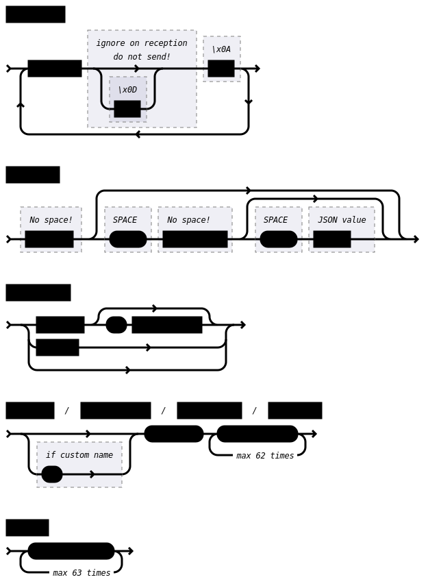
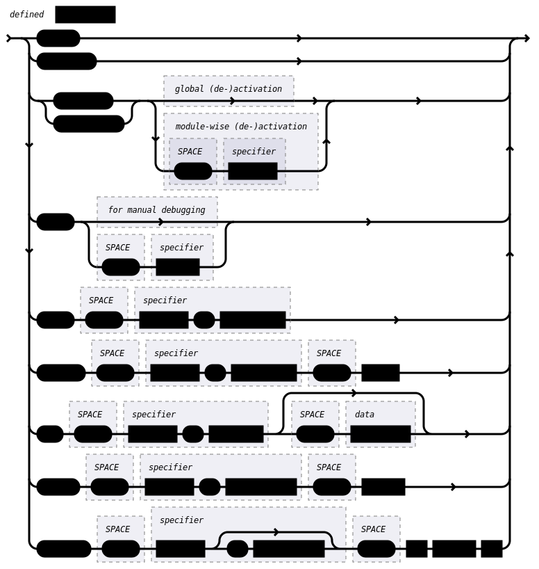
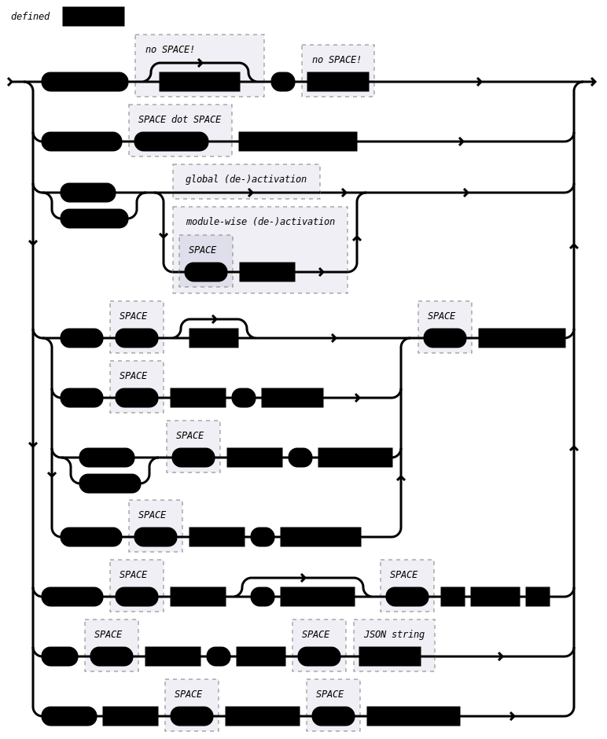
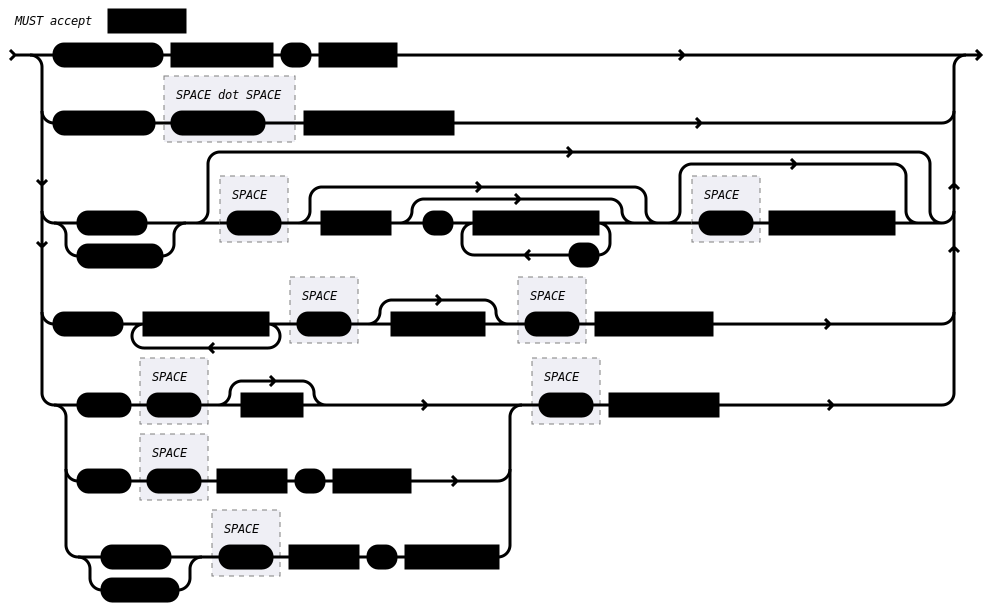

Complete message syntax
=======================

This section formally defines the syntax of SECoP messages with the use of
so-called "railroad diagrams".

.. rubric:: Basic grammar of messages

.. rubric:: Requests and replies

The specification defines a set of requests and replies.  Only those messages
are allowed to be generated by any software complying to this specification:

Any ECS is allowed to generate the following messages:

Any SEC node is allowed to generate the following messages:

.. _message-compat:

.. rubric:: Compatibility

The specification is intended to grow and adapt to new needs.  To futureproof
the the communication, the following messages MUST be parsed and treated
correctly (i.e. the ignored_value part is to be ignored).

.. dropdown:: Related issues

    | :issue:`038 Extension mechanisms`

Any SEC node **MUST** accept the following messages and handle them properly:

Any ECS **MUST** accept the following messages and handle them accordingly:

As a special case, an argumentless command may also by called without specifying
the data part.  In this case an argument of null is to be assumed.  Also, an
argumentless ping is to be handled as a ping request with an empty token string.
The corresponding reply then contains a double space.  This MUST also be parsed
correctly.

Similarly, the reports need to be handled like this:

Data report:

Error report:

Essentially this boils down to:

#) ignore additional entries in the list-part of reports
#) ignore extra keys in the qualifiers, structure report and error report
   mappings
#) ignore message fields which are not used in the definition of the messages
   (i.e. for `describe`)
#) treat needed, but missing data as null (or an empty string, depending on
   context)
#) if a specifier contains more ":" than you can handle, use the part you
   understand, ignore the rest (i.e. treat `activate module:parameter
   <activate>` as `activate module <activate>`, ignoring the ``:parameter``
   part)
#) same for error class (i.e. treat ``WrongType:MustBeInt`` as `WrongType`,
   ignoring the ``:MustBeInt`` part)
#) upon parsing a value, when you know it should be one element from an
   :ref:`enum <enum>` (which SHOULD be transported as integer), if you find a string
   instead and that string is one of the names from the Enum, use that entry.
#) check newer versions of the specification and check the issues as well, as
   the above may change

Complying to these rules maximizes the possibility of future and backwards
compatibility.
