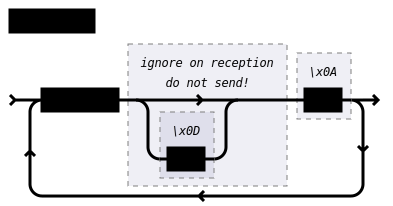
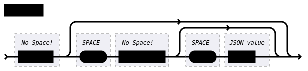
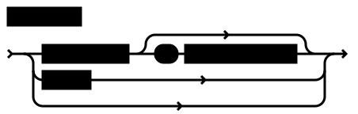
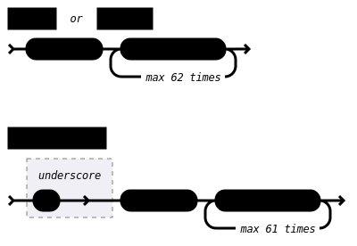
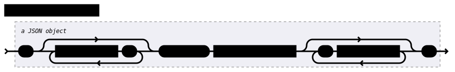
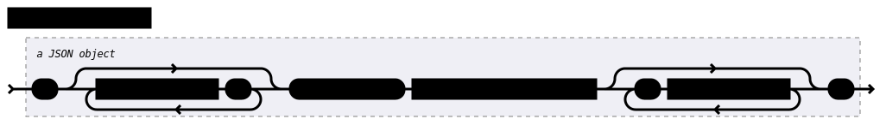
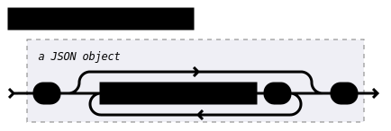

On-Wire Format
==============

This section specifies the structure of the transmissions that happen over a connection with SECoP.
This is primarily relevant for implementors of clients and/or servers, users in general will find :doc:`modules` more relevant.

Data transfer
-------------

SECoP relies on a stream transport of 8-bit bytes. Most often this will be TCP.
In those cases the SEC-node SHOULD support several simultaneous connections.

RS232 style connections may also be used. Here, only a single connection can be used.
If several connections are needed, a 'multiplexer' is needed.
This should offer multiple TCP connections and contain the necessary logic to map requests/replies from/to those
network connections onto/from the serial connection to the actual SEC-node.

.. _messagefmt:

Messages
--------

The received byte stream is split into messages, which are the smalles unit of communication for SECoP.

A message is essentially one line of text, coded in ASCII (may be extended to UTF-8
later if needed). A message ends with a line feed character (ASCII 10), which may be preceded
by a carriage return character (ASCII 13), which must be ignored.

All messages share the same basic structure:

i.e. message starts with an action keyword, followed optionally by one space and a specifier
(not containing spaces), followed optionally by one space and a JSON-value (see :RFC:`8259`) called data,
which absorbs the remaining characters up to the final LF.

.. note::
    numerical values and strings appear 'naturally' formatted in JSON-value, i.e. 5.0 or "a string".

The specifier consists of a module identifier, and for most actions, followed by a colon as separator
and an accessible identifier. In special cases (e.g. ``describe``, ``ping``), the specifier is just a token or may be empty:

All identifiers (for properties, accessibles and modules) are composed by
ASCII letters, digits and underscore, where a digit may not
appear as the first character.

Identifiers starting with underscore ('custom-names') are
reserved for special purposes like internal use for debugging. The
identifier length is limited (<=63 characters).

.. note::
    Albeit names MUST be compared/stored case sensitive, names in each scope need to be unique when lowercased.
    The scopes are:

    - module names on a SEC Node (including the group entries of those modules)
    - accessible names of a module (including the group entries of those parameters) (each module has its own scope)
    - properties
    - names of elements in a :ref:`struct` (each struct has its own scope)
    - names of variants in an :ref:'enum` (each enum has its own scope)
    - names of qualifiers

SECoP defined names are usually lowercase, though that is not a restriction (esp. not for module names).

A SEC node might implement custom messages for debugging purposes, which are not
part of the standard. Custom messages start with an underscore or might just be
an empty line. The latter might be used as a request for a help text, when logged
in from a command line client like telnet or netcat. Messages not starting with
an underscore and not defined in the following list are reserved for future extensions.

When implementing SEC nodes or ECS-clients, a 'MUST-ignore' policy should be applied to unknown
or additional parts.
Unknown or malformed messages are to be replied with an appropriate ``ProtocolError`` by a SEC node.
An ECS-client must ignore the extra data in such messages. See also section :ref:`future-compatibility`.

.. _descriptive-data-format:

Format of Descriptive Data
--------------------------

The format of the descriptive data is JSON, as all other data in SECoP.

.. note::
    all names on each hierarchy level needs to unique (i.e. not repeated) when lowercased.

SEC Node Description
~~~~~~~~~~~~~~~~~~~~

.. compound::

    property:

    .. image:: images/property.svg

Module Description
~~~~~~~~~~~~~~~~~~

Accessible Description
~~~~~~~~~~~~~~~~~~~~~~

